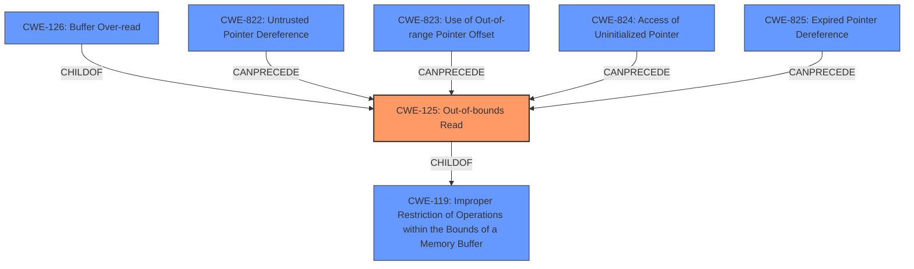

# Analysis Report for CVE-2025-27438

# Vulnerability Analysis Report: CVE-2025-27438

## Description

A vulnerability has been identified in Teamcenter Visualization V14.3 (All versions < V14.3.0.13), Teamcenter Visualization V2312 (All versions < V2312.0009), Teamcenter Visualization V2406 (All versions < V2406.0007), Teamcenter Visualization V2412 (All versions < V2412.0002), Tecnomatix Plant Simulation V2302 (All versions < V2302.0021), Tecnomatix Plant Simulation V2404 (All versions < V2404.0010). The affected applications contain an **out of bounds read past the end of an allocated structure** while parsing specially crafted WRL files. This could allow an attacker to execute code in the context of the current process.

## Vulnerability Description Key Phrases

- **Weakness:** out of bounds read past the end of an allocated structure
- **Impact:** execute code in the context of the current process
- **Vector:** specially crafted WRL files
- **Attacker:** attacker
- **Product:** ["'Tecnomatix Plant Simulation']", "'Tecnomatix Plant Simulation'", "['Teamcenter Visualization'", "'Teamcenter Visualization'"]
- **Version:** ["'All versions < V2404.0010']", "['All versions < V14.3.0.13'", "'All versions < V2302.0021'", "'All versions < V2312.0009'", "'All versions < V2406.0007'", "'All versions < V2412.0002'"]

## Analysis (with Relationship Data)

# Summary
| CWE ID | CWE Name | Confidence | CWE Abstraction Level | CWE Vulnerability Mapping Label | CWE-Vulnerability Mapping Notes |
|---|---|---|---|---|---|
| CWE-125 | Out-of-bounds Read | 1.0 | Base | Allowed | Primary CWE |
| CWE-94 | Improper Control of Generation of Code ('Code Injection') | 0.3 | Base | Allowed-with-Review | Secondary Candidate |

## Evidence and Confidence

*   **Confidence Score:** 1.0
*   **Evidence Strength:** HIGH

## Relationship Analysis
The primary relationship is that CWE-125 is a base-level weakness, which makes it a strong candidate for directly representing the vulnerability. CWE-119 is a class that can be caused by a variety of more specific weaknesses like CWE-125. The graph relationships show that CWE-125 can be preceded by weaknesses such as CWE-822, CWE-823, CWE-824, and CWE-825, which deal with pointer issues. CWE-126 is a variant of CWE-125, but the description doesn't contain enough information to make that distinction.



## Vulnerability Chain
The vulnerability chain starts with a specially crafted WRL file. The application then attempts to parse this file, leading to an **out-of-bounds read**. This **out-of-bounds read** allows for potential code execution.

## Summary of Analysis
The primary assessment is based on the clear description of the vulnerability as an **out-of-bounds read** in the vulnerability description and CVE reference links: "The vulnerability is an **out-of-bounds read past the end of an allocated structure** while parsing specially crafted WRL files." The selection of CWE-125 is further supported by the CVE reference links content summary, which lists CWE-125 as a present weakness.

CWE-94 was considered because the impact of the vulnerability is code execution. However, code execution is an impact and not a root cause. The retriever information notes that CWE-94 is frequently misused for vulnerabilities with a technical impact of "code execution," which does not by itself indicate a root cause weakness.

The chosen CWE, CWE-125, is at the base level, providing an appropriate level of specificity for this vulnerability.

Relevant CWE Information:

# Enhanced Context (25 CWEs)

## CWE-824: Access of Uninitialized Pointer
**Abstraction Level**: Base
**Similarity Score**: 0.76
**Source**: dense

**Description**:
The product accesses or uses a pointer that has not been initialized.

**Mapping Guidance**:
- Usage: Allowed
- Rationale: This CWE entry is at the Base level of abstraction, which is a preferred level of abstraction for mapping to the root causes of vulnerabilities.

## CWE-125: Out-of-bounds Read
**Abstraction Level**: Base
**Similarity Score**: 0.74
**Source**: dense

**Description**:
The product reads data past the end, or before the beginning, of the intended buffer.

**Mapping Guidance**:
- Usage: Allowed
- Rationale: This CWE entry is at the Base level of abstraction, which is a preferred level of abstraction for mapping to the root causes of vulnerabilities.

## CWE-497: Exposure of Sensitive System Information to an Unauthorized Control Sphere
**Abstraction Level**: Base
**Similarity Score**: 0.74
**Source**: dense

**Description**:
The product does not properly prevent sensitive system-level information from being accessed by unauthorized actors who do not have the same level of access to the underlying system as the product does.

**Mapping Guidance**:
- Usage: Allowed
- Rationale: This CWE entry is at the Base level of abstraction, which is a preferred level of abstraction for mapping to the root causes of vulnerabilities.

## CWE-668: Exposure of Resource to Wrong Sphere
**Abstraction Level**: Class
**Similarity Score**: 0.73
**Source**: dense

**Description**:
The product exposes a resource to the wrong control sphere, providing unintended actors with inappropriate access to the resource.

**Mapping Guidance**:
- Usage: Discouraged
- Rationale: CWE-668 is high-level and is often misused as a catch-all when lower-level CWE IDs might be applicable. It is sometimes used for low-information vulnerability reports [REF-1287]. It is a level-1 Class (i.e., a child of a Pillar). It is not useful for trend analysis.

## CWE-755: Improper Handling of Exceptional Conditions
**Abstraction Level**: Class
**Similarity Score**: 0.73
**Source**: dense

**Description**:
The product does not handle or incorrectly handles an exceptional condition.

**Mapping Guidance**:
- Usage: Discouraged
- Rationale: This CWE entry is a level-1 Class (i.e., a child of a Pillar). It might have lower-level children that would be more appropriate

## CWE-119: Improper Restriction of Operations within the Bounds of a Memory Buffer
**Abstraction Level**: Class
**Similarity Score**: 0.73
**Source**: dense

**Description**:
The product performs operations on a memory buffer, but it reads from or writes to a memory location outside the buffer's intended boundary. This may result in read or write operations on unexpected memory locations that could be linked to other variables, data structures, or internal program data.

**Mapping Guidance**:
- Usage: Discouraged
- Rationale: CWE-119 is commonly misused in low-information vulnerability reports when lower-level CWEs could be used instead, or when more details about the vulnerability are available.

## CWE-303: Incorrect Implementation of Authentication Algorithm
**Abstraction Level**: Base
**Similarity Score**: 0.73
**Source**: dense

**Description**:
The requirements for the product dictate the use of an established authentication algorithm, but the implementation of the algorithm is incorrect.

**Mapping Guidance**:
- Usage: Allowed
- Rationale: This CWE entry is at the Base level of abstraction, which is a preferred level of abstraction for mapping to the root causes of vulnerabilities.

## CWE-131: Incorrect Calculation of Buffer Size
**Abstraction Level**: Base
**Similarity Score**: 0.73
**Source**: dense

**Description**:
The product does not correctly calculate the size to be used when allocating a buffer, which could lead to a buffer overflow.

**Mapping Guidance**:
- Usage: Allowed
- Rationale: This CWE entry is at the Base level of abstraction, which is a preferred level of abstraction for mapping to the root causes of vulnerabilities.

## CWE-789: Memory Allocation with Excessive Size Value
**Abstraction Level**: Variant
**Similarity Score**: 0.72
**Source**: dense

**Description**:
The product allocates memory based on an untrusted, large size value, but it does not ensure that the size is within expected limits, allowing arbitrary amounts of memory to be allocated.

**Mapping Guidance**:
- Usage: Allowed
- Rationale: This CWE entry is at the Variant level of abstraction, which is a preferred level of abstraction for mapping to the root causes of vulnerabilities.

## CWE-345: Insufficient Verification of Data Authenticity
**Abstraction Level**: Class
**Similarity Score**: 0.72
**Source**: dense

**Description**:
The product does not sufficiently verify the origin or authenticity of data, in a way that causes it to accept invalid data.

**Mapping Guidance**:
- Usage: Discouraged
- Rationale: This CWE entry is a level-1 Class (i.e., a child of a Pillar). It might have lower-level children that


## CWE Relationship Analysis

Current CWEs represent these abstraction levels: .


### Vulnerability Chain Analysis

**Chain starting from CWE-823:**
- 823 (Use of Out-of-range Pointer Offset) - ROOT


**Chain starting from CWE-94:**
- 94 (Improper Control of Generation of Code ('Code Injection')) - ROOT


### CWE Relationship Diagram

```mermaid
graph TD
    classDef primary fill:#f96,stroke:#333,stroke-width:2px
    classDef secondary fill:#69f,stroke:#333
    classDef tertiary fill:#9e9,stroke:#333
```


*Report generated on 2025-07-14 15:16:20*
