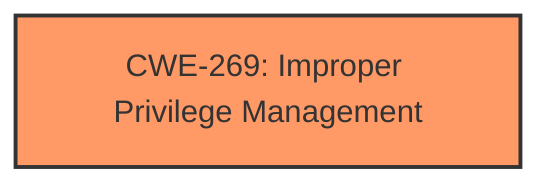

# Raw Analyzer Response for CVE-2025-27468

# Summary
| CWE ID | CWE Name | Confidence | CWE Abstraction Level | CWE Vulnerability Mapping Label | CWE-Vulnerability Mapping Notes |
|---|---|---|---|---|---|
| CWE-269 | Improper Privilege Management | 0.75 | Class | Primary | Discouraged |

## Evidence and Confidence

*   **Confidence Score:** 0.75
*   **Evidence Strength:** MEDIUM

## Relationship Analysis
The primary focus is on identifying the root cause of the **improper privilege management**. While several CWEs relate to privilege and permission issues, CWE-269 is a Class-level CWE and the best fit based on the evidence provided. The relationship analysis considered more specific Base-level CWEs, but the lack of detailed information in the description makes it difficult to pinpoint the exact flaw.

## Vulnerability Chain
The vulnerability chain starts with **improper privilege management** (CWE-269) leading to local privilege escalation.

## Summary of Analysis
The initial analysis focused on identifying the root cause of the vulnerability, which is stated as **improper privilege management**. The vulnerability description key phrases section confirms this as the root cause. The Retriever Results also suggest CWE-269 as the top candidate.

The final decision to assign CWE-269 is primarily based on the vulnerability description explicitly stating "**Improper privilege management**". While it's a Class-level CWE and discouraged, the lack of specific details prevents a more precise mapping to a Base or Variant level CWE. The evidence is not strong enough to map to more specific weaknesses related to privilege assignment.

Relevant CWE Information:

# Enhanced Context (25 CWEs)
The following CWEs were identified as potentially relevant to this vulnerability:

## CWE-266: Incorrect Privilege Assignment
**Abstraction Level**: Base
**Similarity Score**: 0.79
**Source**: dense

**Description**:
A product incorrectly assigns a privilege to a particular actor, creating an unintended sphere of control for that actor.

**Mapping Guidance**:
- Usage: Allowed
- Rationale: This CWE entry is at the Base level of abstraction, which is a preferred level of abstraction for mapping to the root causes of vulnerabilities.

## CWE-269: Improper Privilege Management
**Abstraction Level**: Class
**Similarity Score**: 1243.29
**Source**: sparse

**Description**:
The product does not properly assign, modify, track, or check privileges for an actor, creating an unintended sphere of control for that actor.

**Mapping Guidance**:
- Usage: Discouraged
- Rationale: CWE-269 is commonly misused. It can be conflated with "privilege escalation," which is a technical impact that is listed in many low-information vulnerability reports [REF-1287]. It is not useful for trend analysis.

## CWE-285: Improper Authorization
**Abstraction Level**: Class
**Similarity Score**: 1205.06
**Source**: sparse

**Description**:
The product does not perform or incorrectly performs an authorization check when an actor attempts to access a resource or perform an action.

**Mapping Guidance**:
- Usage: Discouraged
- Rationale: CWE-285 is high-level and lower-level CWEs can frequently be used instead. It is a level-1 Class (i.e., a child of a Pillar).

## CWE-269: Improper Privilege Management:
CWE-269 [Improper Privilege Management](https://cwe.mitre.org/data/definitions/269.html) is a Class-level CWE that describes a product not properly assigning, modifying, tracking, or checking privileges for an actor, creating an unintended sphere of control for that actor. This aligns with the "**Improper privilege management**" description. Although CWE-269 is discouraged, the vulnerability description lacks specific details and the **rootcause** matches the weakness.
*   **Security Implications:** An attacker with some level of authorization can elevate privileges to gain more control over the system.
*   **Impact:** Local privilege escalation.
*   **Relationship:** Class-level CWE.
*   **Mapping Guidance:** Although discouraged, the description directly matches the identified weakness.

CWE-266 [Incorrect Privilege Assignment](https://cwe.mitre.org/data/definitions/266.html) was considered, but rejected because the vulnerability description is too generic. The vulnerability doesn't mention how the privilege was incorrectly assigned.

CWE-285 [Improper Authorization](https://cwe.mitre.org/data/definitions/285.html) was considered, but rejected because the vulnerability description is too generic and the authorization is implied from the privilege management itself.