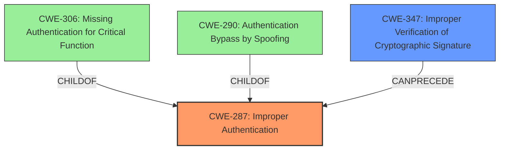

# Enhanced Analysis for CVE-2025-27509

# Summary
| CWE ID | CWE Name | Confidence | CWE Abstraction Level | CWE Vulnerability Mapping Label | CWE-Vulnerability Mapping Notes |
|---|---|---|---|---|---|
| CWE-287 | Improper Authentication | 0.9 | Class | Primary | Discouraged |
| CWE-347 | Improper Verification of Cryptographic Signature | 0.7 | Base | Secondary | Allowed |

## Evidence and Confidence

*   **Confidence Score:** 0.8
*   **Evidence Strength:** HIGH

## Relationship Analysis
The primary relationship is that CWE-287 [Improper Authentication] is a parent Class of CWE-306 [Missing Authentication for Critical Function] and CWE-290 [Authentication Bypass by Spoofing]. CWE-347 [Improper Verification of Cryptographic Signature] relates to the root cause of the **improper authentication** by highlighting the specific mechanism failure: signature validation. The relationship between CWE-287 and CWE-347 is that the **improper authentication** (CWE-287) can be due to a failure in verifying cryptographic signatures (CWE-347).



## Vulnerability Chain
The vulnerability chain starts with a **failure to properly validate the SAML response** (**improper verification of cryptographic signature**), leading to the ability to forge authentication assertions and potentially provision new administrative user accounts.
  - Root Cause: **Improper SAML response validation** (CWE-347)
  - Weakness: **Forging of authentication assertions** (CWE-287)
  - Impact: Unauthorized access and potential administrative privilege escalation.

## Summary of Analysis
The analysis identified that the root cause of the vulnerability is **improper SAML response validation**, which leads to **improper authentication**. The vulnerability description and CVE details clearly indicate a **failure in validating the SAML response**, allowing attackers to forge authentication assertions.

The primary CWE is CWE-287 [Improper Authentication], as the core issue involves the product's failure to properly authenticate users based on SAML responses. The "Vulnerability Description" mentions the ability to "forge authentication assertions."

The secondary CWE is CWE-347 [Improper Verification of Cryptographic Signature], which is the root cause for the authentication bypass. The "CVE Reference Links Content Summary" specifies "Improper SAML response validation in Fleet" and the issue was addressed by changes to improve SAML validation workflow and specifically addresses the validation of the Assertion element within the SAML response.

The classification is based on the evidence of **improper validation** leading to **forged authentication**. The relationship graph shows how these CWEs are interconnected, with CWE-347 potentially leading to CWE-287. The selection of CWE-287 and CWE-347 provides a specific and accurate representation of the vulnerability, capturing both the high-level authentication failure and the underlying cause.

Relevant CWE Information:
- The vulnerability involves **improper authentication** due to **improper verification** of a cryptographic signature.
- The impact includes unauthorized access and potential privilege escalation.
- The root cause is the **improper SAML response validation**.

I am overriding the general mapping guidance for CWE-287 because while it is discouraged as a Class, the evidence points to an authentication bypass which makes it the most applicable.

Other CWEs Considered:

*   CWE-306 [Missing Authentication for Critical Function]: Considered but not selected because authentication is happening, but is based on a forged assertion.
*   CWE-290 [Authentication Bypass by Spoofing]: Considered but not selected because the root cause is not specifically spoofing but rather the **improper validation** of the SAML response.
*   CWE-863 [Incorrect Authorization]: Considered but not selected because the core issue is with authentication, not authorization.
*   CWE-639 [Authorization Bypass Through User-Controlled Key]: Not applicable as it involves user-controlled keys, which is not the case here.
*   CWE-90 [Improper Neutralization of Special Elements used in an LDAP Query ('LDAP Injection')]: Not applicable as it involves LDAP queries, which is not the case here.


## CWE Relationship Analysis

Current CWEs represent these abstraction levels: .


### Vulnerability Chain Analysis

**Chain starting from CWE-90:**
- 90 (Improper Neutralization of Special Elements used in an LDAP Query ('LDAP Injection')) - ROOT


**Chain starting from CWE-863:**
- 863 (Incorrect Authorization) - ROOT


### CWE Relationship Diagram

```mermaid
graph TD
    classDef primary fill:#f96,stroke:#333,stroke-width:2px
    classDef secondary fill:#69f,stroke:#333
    classDef tertiary fill:#9e9,stroke:#333
```