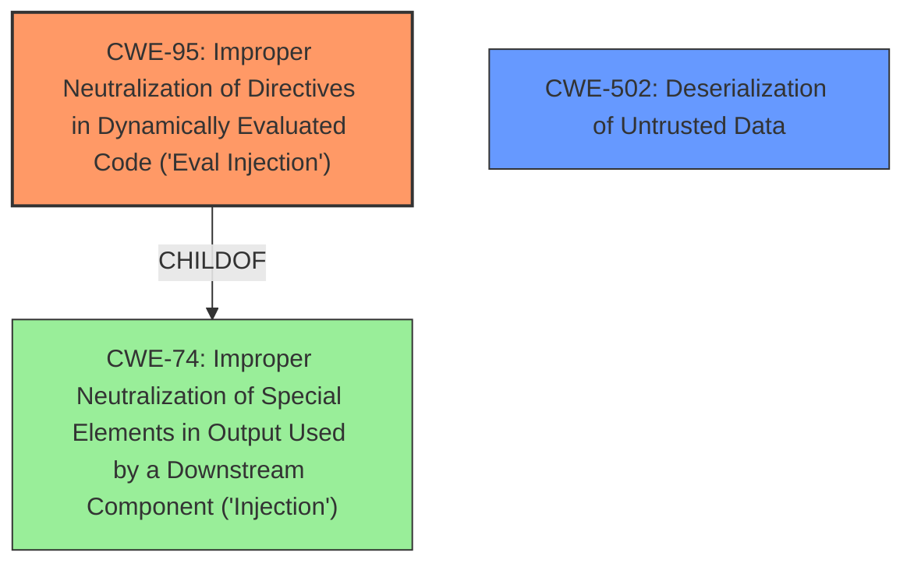

# Raw Analyzer Response for CVE-2025-27517

# Summary
| CWE ID | CWE Name | Confidence | CWE Abstraction Level | CWE Vulnerability Mapping Label | CWE-Vulnerability Mapping Notes |
|---|---|---|---|---|---|
| CWE-95 | Improper Neutralization of Directives in Dynamically Evaluated Code ('Eval Injection') | 0.8 | Variant | Primary | Allowed |
| CWE-502 | Deserialization of Untrusted Data | 0.6 | Base | Secondary | Allowed |

## Evidence and Confidence

*   **Confidence Score:** 0.7
*   **Evidence Strength:** MEDIUM

## Relationship Analysis
The primary CWE selected is CWE-95, which is a Variant of CWE-74 (Improper Neutralization of Special Elements in Output Used by a Downstream Component ('Injection')), a Class. CWE-95 is at a lower level of abstraction, making it more specific. CWE-502 is a base CWE and is related to the vulnerability as a possible attack vector.

## Vulnerability Chain
The vulnerability chain starts with **user-crafted request payloads**. If these payloads are not properly neutralized and are used in a dynamic evaluation call, it leads to **remote code execution**. Therefore:
1.  **Root Cause:** CWE-95 Improper Neutralization of Directives in Dynamically Evaluated Code ('Eval Injection')
2.  **Impact:** Remote Code Execution (RCE)

CWE-502 is a candidate because deserialization could be one way that user-crafted payloads are delivered, but the evidence is not strong enough to select it as the primary cause.

## Summary of Analysis
The initial assessment considered the Retriever Results, particularly CWE-95, and the vulnerability description. The primary focus was on the root cause, which is the **improper neutralization** of user-crafted request payloads leading to remote code execution.

The selection of CWE-95 is based on the following evidence:

*   **Vulnerability Description Key Phrases:** "user-crafted request payloads" suggests that the input is maliciously crafted. The phrase "**remote code execution**" indicates that the crafted payload leads to code execution.
*   **CVE Reference Links Content Summary:** The summary states, "Root cause of vulnerability: Malicious, user-crafted request payloads." and "Weaknesses/vulnerabilities present: Remote Code Execution (RCE)".

CWE-95's description, "The product receives input from an upstream component, but it does not neutralize or incorrectly neutralizes code syntax before using the input in a dynamic evaluation call (e.g. "eval")," aligns well with the vulnerability, supporting its selection as the primary CWE.

CWE-502 (Deserialization of Untrusted Data) was considered because **user-crafted request payloads** could potentially involve deserialization. However, the description doesn't explicitly mention deserialization as the attack vector, so this is a secondary candidate.

The selected CWEs are at the optimal level of specificity because CWE-95 is a Variant, providing a more detailed classification than its parent Class CWE-74.

Relevant CWE Information:

# Enhanced Context (25 CWEs)
The following CWEs were identified as potentially relevant to this vulnerability:

## CWE-95: Improper Neutralization of Directives in Dynamically Evaluated Code ('Eval Injection')
**Abstraction Level**: Variant
**Similarity Score**: 0.69
**Source**: dense

**Description**:
The product receives input from an upstream component, but it does not neutralize or incorrectly neutralizes code syntax before using the input in a dynamic evaluation call (e.g. "eval").

**Mapping Guidance**:
- Usage: Allowed
- Rationale: This CWE entry is at the Variant level of abstraction, which is a preferred level of abstraction for mapping to the root causes of vulnerabilities.