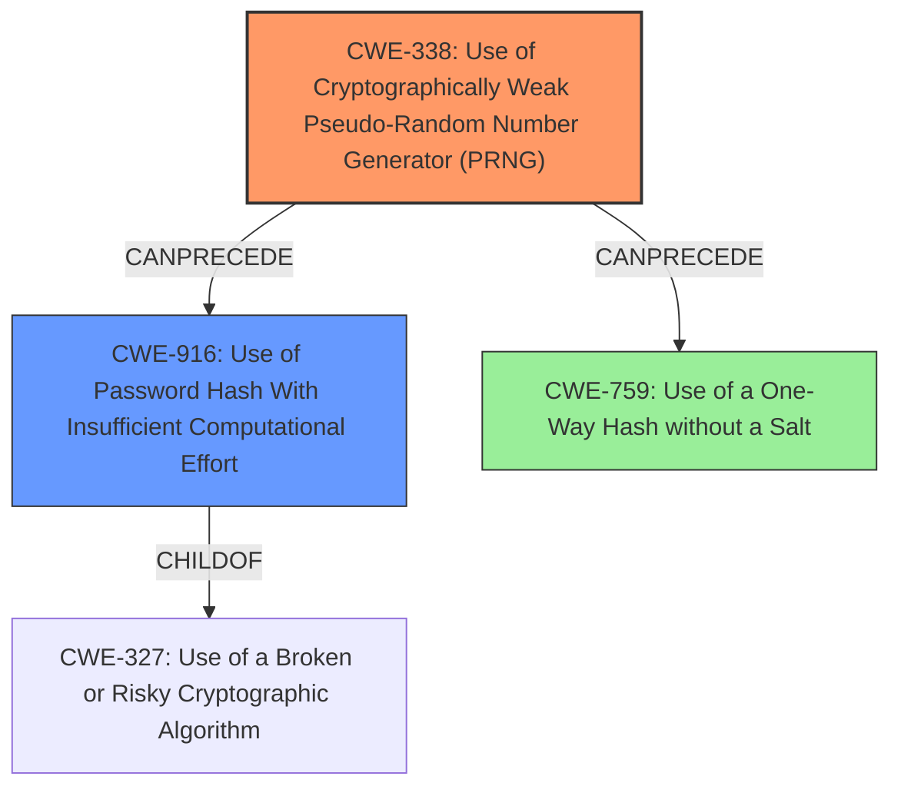

# Raw Analyzer Response for CVE-2025-27551

# Summary
| CWE ID | CWE Name | Confidence | CWE Abstraction Level | CWE Vulnerability Mapping Label | CWE-Vulnerability Mapping Notes |
|---|---|---|---|---|---|
| CWE-338 | Use of Cryptographically Weak Pseudo-Random Number Generator (PRNG) | 0.9 | Base | Allowed | Primary CWE. The **use of `rand()` which is not cryptographically secure** to salt password hashes is a classic example of using a weak PRNG. |
| CWE-916 | Use of Password Hash With Insufficient Computational Effort | 0.7 | Base | Allowed | Secondary CWE. Using `rand()` as a salt is computationally inexpensive and can be cracked. |
| CWE-759 | Use of a One-Way Hash without a Salt | 0.6 | Variant | Allowed | The vulnerability description mentions salting, so this is not an exact match, but it indicates that the salting method is broken and may be similar to a missing salt. |

## Evidence and Confidence

*   **Confidence Score:** 0.8
*   **Evidence Strength:** MEDIUM

## Relationship Analysis
The primary weakness is the **use of a weak PRNG** (CWE-338). This leads to using password hashes with insufficient computational effort (CWE-916) because the salt generated by `rand()` is easily predictable.

## Vulnerability Chain
1.  **Root Cause:** **Use of `rand()` function** which is not cryptographically secure (CWE-338).
2.  **Weakness:** Password hashes are salted with predictable values.
3.  **Impact:** Password hashes can be cracked easily (CWE-916), leading to potential account compromise.

## Summary of Analysis
The vulnerability description clearly states that the `rand()` function, which is not cryptographically secure, is used to salt password hashes. This points to **CWE-338 (Use of Cryptographically Weak Pseudo-Random Number Generator (PRNG))** as the primary weakness. The subsequent result is the use of password hashes that can be cracked with relative ease, which aligns with **CWE-916 (Use of Password Hash With Insufficient Computational Effort)**.

The retriever results also suggest other CWEs, but CWE-338 and CWE-916 are the most relevant based on the description. The graph relationships show how CWE-338 can precede CWE-916, as a weak PRNG can lead to weak password hashing.

*   **CWE-330 (Use of Insufficiently Random Values):** While related, CWE-338 is more specific as it directly addresses the use of a cryptographically weak PRNG. CWE-330 is a Class, and CWE-338 is a Base.
*   **CWE-328 (Use of Weak Hash):** This CWE refers to the hashing algorithm itself being weak, not the salt. So it's less relevant.
*   **CWE-759 (Use of a One-Way Hash without a Salt):** The vulnerability description mentions salting, so this is not an exact match. However, because the salting method is broken and may be similar to a missing salt, it could be a secondary issue.
*   **CWE-1204 (Generation of Weak Initialization Vector (IV)):** This CWE is related to cryptographic primitives using IVs, which is not the core issue here.
*   **CWE-760 (Use of a One-Way Hash with a Predictable Salt):** Similar to CWE-759, but more accurate since the salt is predictable due to the `rand()` function. However, CWE-916 encompasses this at a more appropriate level of abstraction.

I am confident in my assessment, as the evidence directly supports the use of a weak PRNG for salting password hashes, which leads to insufficient computational effort in protecting the passwords.