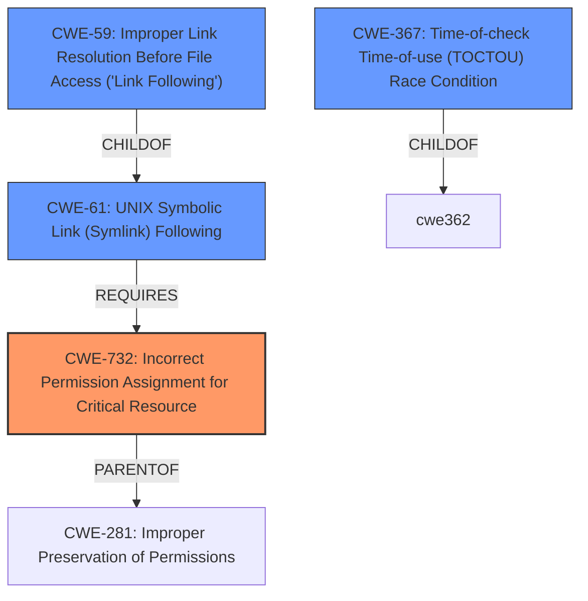

# Enhanced Analysis for CVE-2025-27591

# Summary
| CWE ID | CWE Name | Confidence | CWE Abstraction Level | CWE Vulnerability Mapping Label | CWE-Vulnerability Mapping Notes |
|---|---|---|---|---|---|
| CWE-732 | Incorrect Permission Assignment for Critical Resource | 0.9 | Class | Allowed-with-Review | Primary CWE: The **world-writable directory creation** at `/var/log/below` constitutes an incorrect permission assignment for a critical resource, enabling local users to manipulate files and potentially escalate privileges. |
| CWE-59 | Improper Link Resolution Before File Access ('Link Following') | 0.8 | Base | Allowed | Secondary Candidate: This CWE addresses the specific attack vector where an attacker leverages symlinks to manipulate files outside the intended directory. |
| CWE-367 | Time-of-check Time-of-use (TOCTOU) Race Condition | 0.6 | Base | Allowed | Secondary Candidate: This CWE might be applicable if the symlink attack involves a race condition where the state of the file changes between the permission check and the file access. |

## Evidence and Confidence

*   **Confidence Score:** 0.8
*   **Evidence Strength:** HIGH

## Relationship Analysis
The primary CWE, CWE-732, is a Class-level CWE, and one of its children is CWE-281, Improper Preservation of Permissions, which is a Base-level CWE. While 732 is a good start, it's important to consider the specific attack vector made possible by the incorrect permission, which is addressed by CWE-59, Improper Link Resolution Before File Access ('Link Following'). CWE-59 is related to CWE-367, Time-of-check Time-of-use (TOCTOU) Race Condition, because a race condition can be an attack vector in link following scenarios. CWE-61, UNIX Symbolic Link (Symlink) Following, is a compound CWE of CWE-59 and requires CWE-732. The graph shows the complex relationship of this family of CWEs and how symlink attacks that take advantage of incorrect permissions can result in privilege escalation.



## Vulnerability Chain
The vulnerability chain starts with the **world-writable directory creation** (CWE-732), which allows an attacker to create a symlink (CWE-59). If a race condition exists, it could be exploited (CWE-367), leading to the modification of sensitive files like `/etc/shadow` and ultimately resulting in privilege escalation.

## Summary of Analysis
The primary weakness is the **incorrect permission assignment** that allows unprivileged users to create a **world-writable directory**. The evidence from the "CVE Reference Links Content Summary" clearly states that the directory `/var/log/below` receives 0777 permissions. This aligns directly with the description of CWE-732, Incorrect Permission Assignment for Critical Resource. The vulnerability description also highlights the possibility of symlink attacks, which are covered by CWE-59, Improper Link Resolution Before File Access ('Link Following'). The potential for a race condition during the symlink attack suggests the relevance of CWE-367, Time-of-check Time-of-use (TOCTOU) Race Condition. The selection of CWE-732 is at the optimal level of specificity, as it directly addresses the root cause of the vulnerability. CWE-59 and CWE-367 are added as contributing factors based on the attack vector described in the vulnerability.

Relevant CWE Information:
- CWE-732: Addresses the root cause of the incorrect permission assignment.
- CWE-59: Covers the specific attack vector using symlinks.
- CWE-367: Addresses the potential race condition during the symlink attack.


## CWE Relationship Analysis

Current CWEs represent these abstraction levels: .


### Vulnerability Chain Analysis

**Chain starting from CWE-732:**
- 732 (Incorrect Permission Assignment for Critical Resource) - ROOT


**Chain starting from CWE-59:**
- 59 (Improper Link Resolution Before File Access ('Link Following')) - ROOT


### CWE Relationship Diagram

```mermaid
graph TD
    classDef primary fill:#f96,stroke:#333,stroke-width:2px
    classDef secondary fill:#69f,stroke:#333
    classDef tertiary fill:#9e9,stroke:#333
```