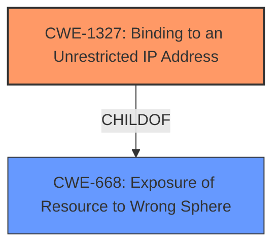

# Analysis for CVE-2025-27615

# Summary
| CWE ID | CWE Name | Confidence | CWE Abstraction Level | CWE Vulnerability Mapping Label | CWE-Vulnerability Mapping Notes |
|---|---|---|---|---|---|
| **CWE-1327** | Binding to an Unrestricted IP Address | 0.9 | Base | Allowed | Primary CWE: The root cause is that the application binds to an unrestricted IP address, making it publicly accessible. |
| CWE-668 | Exposure of Resource to Wrong Sphere | 0.6 | Class | Discouraged | Secondary Candidate: The unrestricted IP address binding leads to exposure of the user interface to the wrong sphere. |

## Evidence and Confidence

*   **Confidence Score:** 0.9
*   **Evidence Strength:** HIGH

## Relationship Analysis
The primary CWE is CWE-1327 (Binding to an Unrestricted IP Address), which is a base-level CWE and a child of CWE-668 (Exposure of Resource to Wrong Sphere). The vulnerability stems directly from this incorrect binding, making the user interface accessible from unintended networks. CWE-668 is a higher-level class that describes the broader problem of exposing a resource to the wrong sphere, but CWE-1327 provides a more specific description of the actual coding error. The relationship between these CWEs influenced the decision to select CWE-1327 as the primary weakness, as it more accurately reflects the root cause.

## Vulnerability Chain
The vulnerability chain starts with the **incorrect** configuration where the application binds to an unrestricted IP address (0.0.0.0) instead of localhost (127.0.0.1). This leads to the exposure of the user interface to the network. Finally, unauthorized users can view and alter configurations.

Root Cause: CWE-1327
Impact: Exposure of User Interface
Impact: View and Alter Configurations

## Summary of Analysis
The analysis is based on the provided vulnerability description and the CVE Reference Links Content Summary. The **root cause** is the **weakness** of binding to an unrestricted IP address. The evidence is clear: "The vulnerability stems from binding the UI to all interfaces (0.0.0.0) in the `docker-compose` file, making it publicly accessible."

The relationship between CWE-1327 and CWE-668 shows that CWE-1327 is a more specific instance of a broader class. While CWE-668 could be considered, CWE-1327 is preferred because it directly identifies the coding error, which is the unrestricted IP address binding. The selected CWEs are at the optimal level of specificity because CWE-1327 is a base-level CWE that accurately describes the vulnerability.

Other CWEs Considered:

*   CWE-923 (Improper Restriction of Communication Channel to Intended Endpoints): This CWE is related but more general. While the vulnerability involves a communication channel, the root cause is specifically the IP address binding rather than a broader restriction issue.
*   CWE-306 (Missing Authentication for Critical Function): Authentication is not missing, but the application's configuration interface is exposed due to the unrestricted binding.
*   CWE-918 (Server-Side Request Forgery (SSRF)): This is not applicable as there is no server-side request being forged.