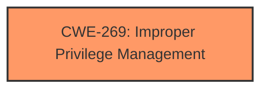

# Analysis Report for CVE-2025-27639

# Vulnerability Analysis Report: CVE-2025-27639

## Description

Vasion Print (formerly PrinterLogic) before Virtual Appliance Host 22.0.1002 Application 20.0.2614 allows Privilege Escalation V-2024-015.

## Vulnerability Description Key Phrases

- **Impact:** Privilege Escalation
- **Product:** Vasion Print (formerly PrinterLogic)
- **Version:** before Virtual Appliance Host 22.0.1002 Application 20.0.2614

## Analysis (with Relationship Data)

# Summary
| CWE ID | CWE Name | Confidence | CWE Abstraction Level | CWE Vulnerability Mapping Label | CWE-Vulnerability Mapping Notes |
|---|---|---|---|---|---|
| CWE-269 | Improper Privilege Management | 0.7 | Class | Primary CWE | Discouraged |

## Evidence and Confidence

*   **Confidence Score:** 0.7
*   **Evidence Strength:** MEDIUM

## Relationship Analysis
The primary relationship that influenced my decision was the parent-child relationship between CWE-269 and its potential children. While the description points to a privilege escalation, the lack of specific root cause information makes it difficult to pinpoint a more specific CWE. The Retriever results also highlighted several CWEs related to privilege and permission issues, but none provided a definitive match based on the available evidence.



## Vulnerability Chain
The vulnerability chain is relatively simple:
1.  **Improper Privilege Management (CWE-269):** The application **fails to properly manage privileges**, leading to...
2.  **Privilege Escalation:** The user gains higher privileges than intended.

## Summary of Analysis
Based on the provided information, the vulnerability is a Privilege Escalation in Vasion Print (formerly PrinterLogic). The available details are limited, focusing on the impact (Privilege Escalation) but not providing specifics about the root cause.

The **Vulnerability Description Key Phrases** highlights the impact as "Privilege Escalation." The **CVE Reference Links Content Summary** lists "V-2024-015 – Privilege Escalation (CVSS: 4.3, CWE: 784)".

Given the limited information and the guidance to avoid mapping directly to the impact, I considered the suggested CWEs from the Retriever Results and the Privilege vs. Permissions guidance.

CWE-269 "Improper Privilege Management" seems most appropriate because the vulnerability results in Privilege Escalation. However, the mapping guidance discourages this CWE because it is high-level and often misused. The Retriever returned a CWE assignment of CWE-784 for the same **V-2024-015** vulnerability. However, CWE-784 is not among the CWEs considered and is also not a valid CWE ID.

Therefore, I'm selecting CWE-269 despite the discouraged usage due to lack of more specific root cause information.

Relevant CWE Information:
# Enhanced Context (25 CWEs)
The following CWEs were identified as potentially relevant to this vulnerability:

## CWE-266: Incorrect Privilege Assignment
**Abstraction Level**: Base
**Similarity Score**: 0.78

## CWE-267: Privilege Defined With Unsafe Actions
**Abstraction Level**: Base
**Similarity Score**: 0.78

## CWE-280: Improper Handling of Insufficient Permissions or Privileges 
**Abstraction Level**: Base
**Similarity Score**: 0.77

## CWE-274: Improper Handling of Insufficient Privileges
**Abstraction Level**: Base
**Similarity Score**: 0.77

## CWE-668: Exposure of Resource to Wrong Sphere
**Abstraction Level**: Class
**Similarity Score**: 0.76

## CWE-41: Improper Resolution of Path Equivalence
**Abstraction Level**: Base
**Similarity Score**: 0.76

## CWE-59: Improper Link Resolution Before File Access ('Link Following')
**Abstraction Level**: Base
**Similarity Score**: 0.76

## CWE-754: Improper Check for Unusual or Exceptional Conditions
**Abstraction Level**: Class
**Similarity Score**: 0.75

## CWE-276: Incorrect Default Permissions
**Abstraction Level**: Base
**Similarity Score**: 0.75

## CWE-755: Improper Handling of Exceptional Conditions
**Abstraction Level**: Class
**Similarity Score**: 0.75

## CWE-22: Improper Limitation of a Pathname to a Restricted Directory ('Path Traversal')
**Abstraction Level**: Base
**Similarity Score**: 2134.04

## CWE-863: Incorrect Authorization
**Abstraction Level**: Class
**Similarity Score**: 2041.27

## CWE-285: Improper Authorization
**Abstraction Level**: Class
**Similarity Score**: 2008.28

## CWE-732: Incorrect Permission Assignment for Critical Resource
**Abstraction Level**: Class
**Similarity Score**: 1988.59

## CWE-269: Improper Privilege Management
**Abstraction Level**: Class
**Similarity Score**: 1987.99

## CWE-22: Improper Limitation of a Pathname to a Restricted Directory ('Path Traversal')
**Abstraction Level**: base
**Similarity Score**: 4.33

## CWE-770: Allocation of Resources Without Limits or Throttling
**Abstraction Level**: base
**Similarity Score**: 4.33

## CWE-41: Improper Resolution of Path Equivalence
**Abstraction Level**: Base
**Similarity Score**: 2.91

## CWE-73: External Control of File Name or Path
**Abstraction Level**: base
**Similarity Score**: 2.87

## CWE-942: Permissive Cross-domain Policy with Untrusted Domains
**Abstraction Level**: variant
**Similarity Score**: 2.68

## CWE-20: Improper Input Validation
**Abstraction Level**: class
**Similarity Score**: 2.55

## CWE-280: Improper Handling of Insufficient Permissions or Privileges 
**Abstraction Level**: Base
**Similarity Score**: 2.49

## CWE-274: Improper Handling of Insufficient Privileges
**Abstraction Level**: Base
**Similarity Score**: 2.49

## CWE-250: Execution with Unnecessary Privileges
**Abstraction Level**: base
**Similarity Score**: 2.47

## CWE-306: Missing Authentication for Critical Function
**Abstraction Level**: base
**Similarity Score**: 2.40


## CWE Relationship Analysis

Current CWEs represent these abstraction levels: .


### Vulnerability Chain Analysis

**Chain starting from CWE-274:**
- 274 (Improper Handling of Insufficient Privileges) - ROOT


**Chain starting from CWE-770:**
- 770 (Allocation of Resources Without Limits or Throttling) - ROOT


### CWE Relationship Diagram

```mermaid
graph TD
    classDef primary fill:#f96,stroke:#333,stroke-width:2px
    classDef secondary fill:#69f,stroke:#333
    classDef tertiary fill:#9e9,stroke:#333
```


*Report generated on 2025-07-14 15:30:53*
