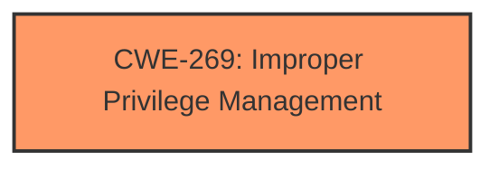

# Analysis Report for CVE-2025-27644

# Vulnerability Analysis Report: CVE-2025-27644

## Description

Vasion Print (formerly PrinterLogic) before Virtual Appliance Host 22.0.933 Application 20.0.2368 allows Local Privilege Escalation V-2024-007.

## Vulnerability Description Key Phrases

- **Product:** Vasion Print
- **Impact:** Privilege Escalation, privilege escalation
- **Version:** before Virtual Appliance Host 22.0.933 Application 20.0.2368

## Analysis (with Relationship Data)

# Summary
| CWE ID | CWE Name | Confidence | CWE Abstraction Level | CWE Vulnerability Mapping Label | CWE-Vulnerability Mapping Notes |
|---|---|---|---|---|---|
| CWE-269 | Improper Privilege Management | 0.4 | Class | Primary | Discouraged |

## Evidence and Confidence

*   **Confidence Score:** 0.4
*   **Evidence Strength:** LOW

## Relationship Analysis
The analysis focuses on the parent-child relationships to explore potential root causes and the chain relationships, which help in understanding how the vulnerability may be exploited. Given the limited information, a broader Class-level CWE is more appropriate.


## Vulnerability Chain
The vulnerability chain starts with the **improper privilege management** (CWE-269), which directly leads to local privilege escalation. This is a high-level understanding due to the lack of root cause details.

## Summary of Analysis
The initial assessment focuses on identifying the root cause of the privilege escalation vulnerability. Given the scarce details in the vulnerability description and the "PLACEHOLDER" CVE description, it's challenging to pinpoint the exact weakness. The primary indicator is "Local Privilege Escalation," suggesting a problem in how privileges are managed within the application.

The selection of CWE-269 (Improper Privilege Management) is based on the overall description indicating a **failure** in managing privileges, which resulted in local privilege escalation.

The confidence level is low because there is no "CVE Reference Links Content Summary" section and the "Vulnerability Description Key Phrases" don't have a rootcause or weakness entry.

Relevant CWE Information:

# Enhanced Context (25 CWEs)
The following CWEs were identified as potentially relevant to this vulnerability:

## CWE-266: Incorrect Privilege Assignment
**Abstraction Level**: Base
**Similarity Score**: 0.79
**Source**: dense

**Description**:
A product incorrectly assigns a privilege to a particular actor, creating an unintended sphere of control for that actor.

**Mapping Guidance**:
- Usage: Allowed
- Rationale: This CWE entry is at the Base level of abstraction, which is a preferred level of abstraction for mapping to the root causes of vulnerabilities.

## CWE-269: Improper Privilege Management
**Abstraction Level**: Class
**Similarity Score**: 2280.37
**Source**: sparse

**Description**:
The product does not properly assign, modify, track, or check privileges for an actor, creating an unintended sphere of control for that actor.

**Mapping Guidance**:
- Usage: Discouraged
- Rationale: CWE-269 is commonly misused. It can be conflated with "privilege escalation," which is a technical impact that is listed in many low-information vulnerability reports [REF-1287]. It is not useful for trend analysis.

## Complete CWE Specifications

CWE-269: Improper Privilege Management
CWE-269 is selected due to the vulnerability description clearly stating "Local Privilege Escalation" which suggests a problem in how privileges are managed within the application.

Technical Explanation:
- How the vulnerability's details match the CWE's characteristics: The vulnerability allows a local user to gain higher privileges than intended, which directly aligns with the definition of CWE-269 (Improper Privilege Management).
- The security implications and potential impact: This can lead to unauthorized access to sensitive data, modification of system settings, or even complete control over the affected system.
- Any parent-child relationships or chain patterns that influenced your mapping: There are no specific details provided, so it is difficult to determine a more specific child CWE.
- Whether the weakness is primary or secondary in the vulnerability: This is the primary weakness as it directly leads to the privilege escalation.
- How the official MITRE mapping guidance influenced your decision: The MITRE mapping guidance discourages the use of CWE-269 because it is commonly misused and can be conflated with "privilege escalation," which is a technical impact. However, given the limited information, it serves as the best high-level classification.


## CWE Relationship Analysis

Current CWEs represent these abstraction levels: .


### Vulnerability Chain Analysis

**Chain starting from CWE-266:**
- 266 (Incorrect Privilege Assignment) - ROOT


**Chain starting from CWE-269:**
- 269 (Improper Privilege Management) - ROOT


### CWE Relationship Diagram

```mermaid
graph TD
    classDef primary fill:#f96,stroke:#333,stroke-width:2px
    classDef secondary fill:#69f,stroke:#333
    classDef tertiary fill:#9e9,stroke:#333
```


*Report generated on 2025-07-14 15:31:36*
