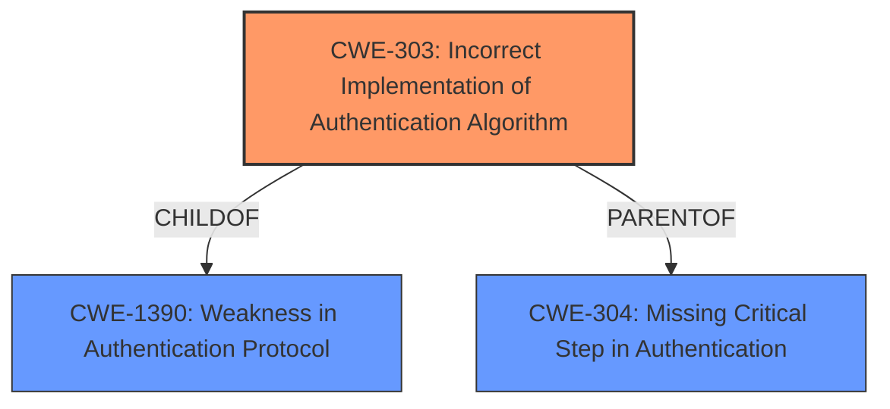

# Analysis Report for CVE-2025-27675

# Vulnerability Analysis Report: CVE-2025-27675

## Description

Vasion Print (formerly PrinterLogic) before Virtual Appliance Host 22.0.843 Application 20.0.1923 allows **Vulnerable OpenID Implementation** V-2023-004.

## Vulnerability Description Key Phrases

- **Rootcause:** Vulnerable OpenID Implementation
- **Product:** Vasion Print (formerly PrinterLogic)
- **Version:** before Virtual Appliance Host 22.0.843 Application 20.0.1923

## Analysis (with Relationship Data)

# Summary
| CWE ID | CWE Name | Confidence | CWE Abstraction Level | CWE Vulnerability Mapping Label | CWE-Vulnerability Mapping Notes |
|---|---|---|---|---|---|
| CWE-303 | Incorrect Implementation of Authentication Algorithm | 0.8 | Base | Primary | Allowed |

## Evidence and Confidence

*   **Confidence Score:** 0.8
*   **Evidence Strength:** MEDIUM

## Relationship Analysis
The primary CWE is CWE-303, which is a Base level CWE. There are parent and child relationships to consider, but none seem to be a better fit than CWE-303.



## Vulnerability Chain
The chain of root cause and weaknesses is as follows:
1.  Root Cause: CWE-303 (**Incorrect Implementation of Authentication Algorithm**) due to **Vulnerable OpenID Implementation**.

## Summary of Analysis
The vulnerability description states that the Vasion Print product has a "**Vulnerable OpenID Implementation**" which is classified as V-2023-004. The Retriever results listed CWE-303 (**Incorrect Implementation of Authentication Algorithm**) as a possible match with a high score when using the dense retriever. The vulnerability description key phrases also includes "**Vulnerable OpenID Implementation**" as the rootcause. Based on this information, CWE-303 is selected as the primary CWE. The confidence level is high, but could be higher if more information was provided about the specific implementation flaws.

Relevant CWE Information:
*   CWE-303 (**Incorrect Implementation of Authentication Algorithm**)


## CWE Relationship Analysis

Current CWEs represent these abstraction levels: .


### Vulnerability Chain Analysis

**Chain starting from CWE-1390:**
- 1390 (Weak Authentication) - ROOT


**Chain starting from CWE-304:**
- 304 (Missing Critical Step in Authentication) - ROOT


### CWE Relationship Diagram

```mermaid
graph TD
    classDef primary fill:#f96,stroke:#333,stroke-width:2px
    classDef secondary fill:#69f,stroke:#333
    classDef tertiary fill:#9e9,stroke:#333
```


*Report generated on 2025-07-14 15:34:19*
