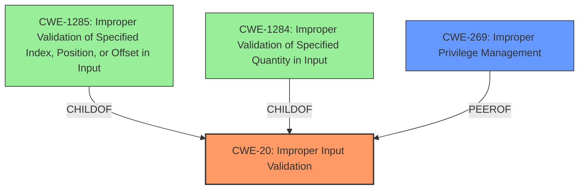

# Raw Analyzer Response for CVE-2025-27731

# Summary
| CWE ID  | CWE Name                                                                             | Confidence | CWE Abstraction Level | CWE Vulnerability Mapping Label | CWE-Vulnerability Mapping Notes |
|---------|--------------------------------------------------------------------------------------|------------|-----------------------|---------------------------------|---------------------------------|
| CWE-20  | Improper Input Validation                                                            | 0.8        | Class                 | Primary CWE                     | Discouraged                      |
| CWE-269 | Improper Privilege Management                                                            | 0.6        | Class                 | Secondary                       | Discouraged                      |

## Evidence and Confidence

*   **Confidence Score:** 0.7
*   **Evidence Strength:** LOW

## Relationship Analysis

The primary relationship influencing the decision is the hierarchical relationship where CWE-20 is a class-level CWE. While less specific than some potential base-level CWEs, it directly addresses the **improper input validation** **root cause** described in the vulnerability. Additionally, we considered the guidance for privileges versus permissions, which led to considering CWE-269 given the impact of privilege escalation.

## Vulnerability Chain

The vulnerability chain starts with **improper input validation**, which leads to the ability for an attacker to elevate privileges locally.
  - The **root cause** is the **improper input validation** (CWE-20).
  - The impact is local privilege escalation.

## Summary of Analysis

The initial analysis focused on identifying the **root cause** of the vulnerability, which is explicitly stated as **improper input validation**. While the retriever results suggested more specific CWEs like CWE-1285 and CWE-1284, the evidence is insufficient to pinpoint the exact type of input that is not being properly validated. Therefore, CWE-20 is chosen as the primary CWE because it directly reflects the described weakness, despite being a class-level CWE. The guidance on privileges versus permissions helped to include CWE-269 to describe the impact of privilege escalation. The selection is primarily based on the vulnerability description and the limited context provided by the CVE Reference Links Content Summary. My assessment is heavily influenced by the provided evidence, which is summarized in the "Vulnerability Description Key Phrases" section, specifically the "**rootcause:** **Improper input validation**" entry.

Relevant CWE Information:

*   **CWE-20: Improper Input Validation**

    *   **Technical Explanation:** The application fails to validate input, allowing an attacker to supply malicious data.
    *   **Security Implications:** This can lead to various impacts, including privilege escalation, code execution, and information disclosure.
    *   **Relationship Analysis:** CWE-20 is a class-level CWE.
    *   **Mapping Guidance Influence:** Discouraged because it's commonly misused. However, in this case, the vulnerability description explicitly mentions "**improper input validation**" as the **root cause**.
*   **CWE-269: Improper Privilege Management**

    *   **Technical Explanation:** The application does not properly manage privileges, leading to an unintended sphere of control for an actor.
    *   **Security Implications:** An attacker can gain elevated privileges, leading to unauthorized access and control.
    *   **Relationship Analysis:** This is a Class-level CWE related to privilege management.
    *   **Mapping Guidance Influence:** Discouraged, because it is a high level class and it is commonly misused when lower level CWEs can be used instead. However, in this case, privilege escalation is the impact which matches privilege management.

Other CWEs Considered:

*   CWE-1285 and CWE-1284 were considered due to their higher specificity related to input validation. However, the lack of details about the exact type of input validation issue (index, position, offset, or quantity) makes these CWEs less suitable.
*   CWE-250 was also considered since the vulnerability allows to elevate privileges locally. But, in this case, the **rootcause** is not due to unnecessary privileges but due to the **improper input validation** process.