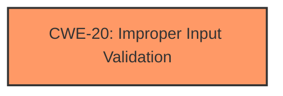

# Raw Analyzer Response for CVE-2025-27737

# Summary

| CWE ID | CWE Name | Confidence | CWE Abstraction Level | CWE Vulnerability Mapping Label | CWE-Vulnerability Mapping Notes |
|---|---|---|---|---|---|
| CWE-20 | Improper Input Validation | 0.75 | Class | Allowed | Primary CWE |

## Evidence and Confidence

*   **Confidence Score:** 0.75
*   **Evidence Strength:** MEDIUM

## Relationship Analysis
The primary CWE selected is CWE-20 **Improper Input Validation**, which is a Class-level CWE. While more specific Base or Variant level CWEs are generally preferred, the provided information is limited to the generic statement of **improper input validation**. Thus, a more specific CWE cannot be selected with confidence.

## Vulnerability Chain
The vulnerability chain starts with **improper input validation** (CWE-20), which leads to bypassing a security feature. The description lacks details on the specific input or the nature of the security feature being bypassed.

## Summary of Analysis
The vulnerability description explicitly states "**improper input validation**" as the root cause, making CWE-20 a relevant choice. However, the lack of specific details about the input being validated and the affected security feature limits the selection of a more specific CWE.

The Retriever Results show CWE-20 as the top candidate. While it's a Class-level CWE and thus generally discouraged, the limited information in the vulnerability description prevents a more specific mapping.

Other CWEs considered from the Retriever Results:
*   CWE-367: Time-of-check Time-of-use (TOCTOU) Race Condition - This is not applicable as there is no indication of a race condition.
*   CWE-1285: Improper Validation of Specified Index, Position, or Offset in Input - This is more specific than the general "improper input validation", but there is no mention of an index, position, or offset.
*   CWE-356: Product UI does not Warn User of Unsafe Actions - This is irrelevant to the vulnerability description.
*   CWE-1286: Improper Validation of Syntactic Correctness of Input - This is more specific than the general "improper input validation", but there is no mention of a syntactic error.

Based on the available information and the retriever results, CWE-20 is the most appropriate choice, despite its Class level abstraction. More information about the input validation process would be needed to refine this selection.

Relevant CWE Information:

# Enhanced Context (25 CWEs)

## CWE-20: Improper Input Validation
**Abstraction Level**: class
**Similarity Score**: 2.55
**Source**: graph

**Description**:
CWE-20: Improper Input Validation

**Mapping Guidance**:
- Usage: Discouraged
- Rationale: CWE-20 is commonly misused in low-information vulnerability reports when lower-level CWEs could be used instead, or when more details about the vulnerability are available [REF-1287]. It is not useful for trend analysis. It is also a level-1 Class (i.e., a child of a Pillar).

**Relationships**:
- CHILDOF -> CWE-707
- PEEROF -> CWE-345
- CANPRECEDE -> CWE-22
- CANPRECEDE -> CWE-41
- CANPRECEDE -> CWE-74