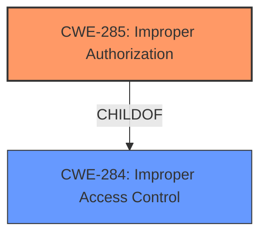

# Analysis for CVE-2025-27744

# Summary
| CWE ID | CWE Name | Confidence | CWE Abstraction Level | CWE Vulnerability Mapping Label | CWE-Vulnerability Mapping Notes |
|---|---|---|---|---|---|
| CWE-285 | Improper Authorization | 0.8 | Class | Primary | Allowed-with-Review |

## Evidence and Confidence

*   **Confidence Score:** 0.8
*   **Evidence Strength:** MEDIUM

## Relationship Analysis
The primary CWE, CWE-285, is a Class-level CWE. While it's desirable to have a more specific Base or Variant CWE, the evidence provided does not allow for a more precise classification. The guidance suggests that 285 is applicable when authorization logic is flawed.

## Vulnerability Chain
The vulnerability chain starts with **Improper access control** leading to privilege escalation. The **improper access control** stems from **improper authorization**, which allows an authorized attacker to elevate privileges locally. Thus, the chain is: Improper Authorization -> Privilege Escalation.

## Summary of Analysis
The vulnerability description indicates an **improper access control** issue leading to privilege escalation in Microsoft Office. The key phrase is "**Improper access control**".

The initial assessment considered CWE-284 (Improper Access Control) as a potential candidate since the description explicitly mentions "**Improper access control**." However, based on the guidance provided, CWE-284 is a high-level category that should be used when the root cause is unclear. Since privilege escalation is mentioned, indicating a problem with authorization, a more specific CWE is needed.

CWE-285 (Improper Authorization) is selected as the primary CWE because the vulnerability results in privilege escalation, suggesting a problem with authorization checks. The description states "**Improper access control** in Microsoft Office allows an authorized attacker to elevate privileges locally." The attacker is authorized, but can elevate privileges, which indicates the authorization is **incorrect**. This aligns with the definition of CWE-285, which is "The product does not perform or incorrectly performs an authorization check when an actor attempts to access a resource or perform an action."

Other CWEs considered but not chosen:

*   CWE-284 (Improper Access Control): This is a higher-level CWE and less specific than CWE-285. The description indicates a problem with authorization, making CWE-285 a better fit.
*   CWE-862 (Missing Authorization): The description states the attacker is 'authorized', indicating there is an attempt at authorization, so this CWE is not appropriate.
*   CWE-863 (Incorrect Authorization): This could be a fit, however, CWE-285 is a more general case of improper authorization, so it is the more appropriate choice.

Relevant CWE Information:

# Enhanced Context (25 CWEs)
The following CWEs were identified as potentially relevant to this vulnerability:

## CWE-285: Improper Authorization
**Abstraction Level**: Class
**Similarity Score**: 2056.53
**Source**: sparse

**Description**:
The product does not perform or incorrectly performs an authorization check when an actor attempts to access a resource or perform an action.

**Mapping Guidance**:
- Usage: Discouraged
- Rationale: CWE-285 is high-level and lower-level CWEs can frequently be used instead. It is a level-1 Class (i.e., a child of a Pillar).