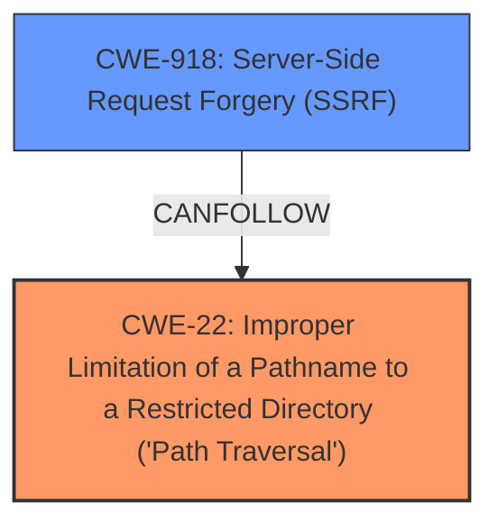

# Analysis for CVE-2025-27785

# Summary
| CWE ID | CWE Name | Confidence | CWE Abstraction Level | CWE Vulnerability Mapping Label | CWE-Vulnerability Mapping Notes |
|---|---|---|---|---|---|
| CWE-22 | Improper Limitation of a Pathname to a Restricted Directory ('Path Traversal') | 0.9 | Base | Primary | Allowed |
| CWE-918 | Server-Side Request Forgery (SSRF) | 0.7 | Base | Secondary | Allowed |

## Evidence and Confidence

*   **Confidence Score:** 0.8
*   **Evidence Strength:** HIGH

## Relationship Analysis
The primary weakness is **Improper Limitation of a Pathname to a Restricted Directory ('Path Traversal') (CWE-22)**, because the application does not properly restrict the file path provided by the user, allowing access to unauthorized files. There is a potential secondary weakness, **Server-Side Request Forgery (SSRF) (CWE-918)**, which can be used in conjunction with the **arbitrary file read** to access internal resources.

## Vulnerability Chain
The vulnerability chain starts with the user providing a file path to the `index_dropdown_export` function. The `export_index` function then checks if the file exists and returns it to the user without proper validation, leading to **arbitrary file read**. This can then be chained with **Server-Side Request Forgery (SSRF)** to read internal files.

## Summary of Analysis
The primary weakness identified is **CWE-22**, based on the **improper limitation of a pathname** provided by the user. The vulnerability description states that the application takes arbitrary user input and passes it to the `export_index` function, which checks if the provided path exists and, if so, returns it to the user without any restrictions. This allows an attacker to read arbitrary files on the Applio server.

The description also mentions that this can be used in conjunction with blind **Server-Side Request Forgery (SSRF)**, which indicates a secondary weakness, **CWE-918**. This allows an attacker to read files from servers on the internal network that the Applio server has access to.

The retriever results also support **CWE-22** and **CWE-918** as potential weaknesses.

**CWE-23 (Relative Path Traversal)** was considered, but **CWE-22** is a better fit because it is a more general case of path traversal. **CWE-23** specifically refers to the use of ".." sequences, while **CWE-22** covers all cases where the pathname is not properly limited to a restricted directory.

The selected CWEs are at the optimal level of specificity because they accurately represent the weaknesses present in the vulnerability description.

Relevant CWE Information:
- "Arbitrary file read in train.py `export_index` function"
- "This issue may lead to reading arbitrary files on the Applio server."
- "It can also be used in conjunction with blind server-side request forgery to read files from servers on the internal network that the Applio server has access to."
- "The `index_dropdown_export` function in `tabs/train/train.py` takes arbitrary user input and passes it to the `export_index` function. This function checks if the provided path exists and, if so, returns it to the user without any restrictions."