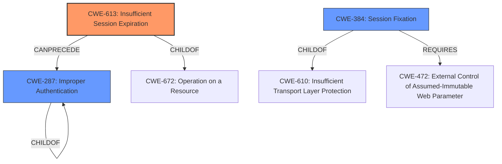

# Raw Analyzer Response for CVE-2025-27794

# Summary
| CWE ID  | CWE Name                                                                 | Confidence | CWE Abstraction Level | CWE Vulnerability Mapping Label | CWE-Vulnerability Mapping Notes |
| :-------- | :----------------------------------------------------------------------- | :----------- | :---------------------- | :------------------------------ | :-------------------------------- |
| CWE-613   | Insufficient Session Expiration                                        | 0.9          | Base                    | Allowed                         | Primary CWE                       |
| CWE-287   | Improper Authentication                                                  | 0.7          | Class                   | Discouraged                     | Secondary Candidate               |
| CWE-384   | Session Fixation                                                         | 0.6          | Compound                | Allowed                         | Secondary Candidate               |

## Evidence and Confidence

*   **Confidence Score:** 0.8
*   **Evidence Strength:** HIGH

## Relationship Analysis

The primary relationship influencing the choice of CWE-613 is its connection to session management and the **non-existent session token rotation after authenticating**, which effectively extends the session indefinitely. The other CWEs considered, such as CWE-287 and CWE-384, relate to broader authentication issues but do not specifically capture the session expiration aspect. While CWE-287 (Improper Authentication) is a parent of CWE-306 (Missing Authentication for Critical Function) and CWE-290 (Authentication Bypass by Spoofing), it's less specific than CWE-613. CWE-384 is a compound weakness related to session fixation, which involves more than just the lack of session expiration.

## Vulnerability Chain

The vulnerability chain begins with the **root cause**, which is the **non-existent session token rotation after authenticating**. This leads to a session hijacking vulnerability because once a session is established, the token remains valid indefinitely (or until the user explicitly logs out), making it vulnerable to theft and reuse. The chain can be summarized as follows:

1.  **Root Cause:** **Non-existent session token rotation after authenticating**. (CWE-613)
2.  **Weakness:** Persistent session token.
3.  **Impact:** Session hijacking, leading to potential account takeover and data exposure.

## Summary of Analysis

The primary focus of this vulnerability is the **non-existent session token rotation after authenticating**, which means the session is vulnerable due to the session tokens not expiring. The analysis is based on the provided vulnerability description, which explicitly mentions this **rootcause**.

The graph relationships and retriever results helped narrow down the options, but the final decision hinged on the specific details in the vulnerability description. While other CWEs like CWE-287 (Improper Authentication) and CWE-384 (Session Fixation) are related, they don't precisely capture the core issue of session tokens not expiring or being rotated.

CWE-613 (Insufficient Session Expiration) is at the optimal level of specificity because it directly addresses the **rootcause** identified in the description which is the **non-existent session token rotation after authenticating**.

Relevant CWE Information:

# Enhanced Context (25 CWEs)

## CWE-1390: Weak Authentication
**Abstraction Level**: Class
**Similarity Score**: 0.77
**Source**: dense

**Description**:
The product uses an authentication mechanism to restrict access to specific users or identities, but the mechanism does not sufficiently prove that the claimed identity is correct.

**Mapping Guidance**:
- Usage: Allowed-with-Review
- Rationale: This CWE entry is a Class and might have Base-level children that would be more appropriate

*This CWE was not selected because the primary issue isn't about the strength of the authentication mechanism itself, but rather the session management after authentication.*

## CWE-472: External Control of Assumed-Immutable Web Parameter
**Abstraction Level**: Base
**Similarity Score**: 0.76
**Source**: dense

**Description**:
The web application does not sufficiently verify inputs that are assumed to be immutable but are actually externally controllable, such as hidden form fields.

**Mapping Guidance**:
- Usage: Allowed
- Rationale: This CWE entry is at the Base level of abstraction, which is a preferred level of abstraction for mapping to the root causes of vulnerabilities.

*This CWE was not selected because it focuses on the control of parameters, which isn't the primary issue. The vulnerability stems from the **non-existent session token rotation after authenticating**.*

## CWE-1391: Use of Weak Credentials
**Abstraction Level**: Class
**Similarity Score**: 0.76
**Source**: dense

**Description**:
The product uses weak credentials (such as a default key or hard-coded password) that can be calculated, derived, reused, or guessed by an attacker.

**Mapping Guidance**:
- Usage: Allowed-with-Review
- Rationale: This CWE entry is a Class and might have Base-level children that would be more appropriate

*This CWE was not selected because the issue is not about weak credentials, but **non-existent session token rotation after authenticating**.*

## CWE-639: Authorization Bypass Through User-Controlled Key
**Abstraction Level**: Base
**Similarity Score**: 0.76
**Source**: dense

**Description**:
The system's authorization functionality does not prevent one user from gaining access to another user's data or record by modifying the key value identifying the data.

**Mapping Guidance**:
- Usage: Allowed
- Rationale: This CWE entry is at the Base level of abstraction, which is a preferred level of abstraction for mapping to the root causes of vulnerabilities.

*This CWE was not selected because the **rootcause** is the **non-existent session token rotation after authenticating**, not an authorization bypass.*

## CWE-212: Improper Removal of Sensitive Information Before Storage or Transfer
**Abstraction Level**: Base
**Similarity Score**: 0.76
**Source**: dense

**Description**:
The product stores, transfers, or shares a resource that contains sensitive information, but it does not properly remove that information before the product makes the resource available to unauthorized actors.

**Mapping Guidance**:
- Usage: Allowed
- Rationale: This CWE entry is at the Base level of abstraction, which is a preferred level of abstraction for mapping to the root causes of vulnerabilities.

*This CWE was not selected because the vulnerability is not related to sensitive information exposure directly but related to the **non-existent session token rotation after authenticating**.*

## CWE-330: Use of Insufficiently Random Values
**Abstraction Level**: Class
**Similarity Score**: 0.75
**Source**: dense

**Description**:
The product uses insufficiently random numbers or values in a security context that depends on unpredictable numbers.

**Mapping Guidance**:
- Usage: Discouraged
- Rationale: This CWE entry is a level-1 Class (i.e., a child of a Pillar). It might have lower-level children that would be more appropriate

*This CWE was not selected because the vulnerability is not related to randomness of values.*

## CWE-923: Improper Restriction of Communication Channel to Intended Endpoints
**Abstraction Level**: Class
**Similarity Score**: 0.75
**Source**: dense

**Description**:
The product establishes a communication channel to (or from) an endpoint for privileged or protected operations, but it does not properly ensure that it is communicating with the correct endpoint.

**Mapping Guidance**:
- Usage: Allowed-with-Review
- Rationale: This CWE entry is a Class and might have Base-level children that would be more appropriate

*This CWE was not selected because the vulnerability is not related to communication channel restrictions.*

## CWE-74: Improper Neutralization of Special Elements in Output Used by a Downstream Component ('Injection')
**Abstraction Level**: Class
**Similarity Score**: 0.75
**Source**: dense

**Description**:
The product constructs all or part of a command, data structure, or record using externally-influenced input from an upstream component, but it does not neutralize or incorrectly neutralizes special elements that could modify how it is parsed or interpreted when it is sent to a downstream component.

**Mapping Guidance**:
- Usage: Discouraged
- Rationale: CWE-74 is high