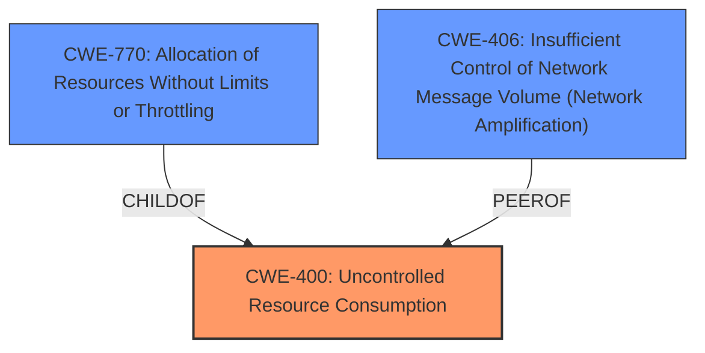

# Raw Analyzer Response for CVE-2025-27829

# Summary
| CWE ID | CWE Name | Confidence | CWE Abstraction Level | CWE Vulnerability Mapping Label | CWE-Vulnerability Mapping Notes |
|---|---|---|---|---|---|
| CWE-400 | Uncontrolled Resource Consumption | 0.75 | Class | Primary | Allowed-with-Review |
| CWE-770 | Allocation of Resources Without Limits or Throttling | 0.60 | Base | Secondary | Allowed |
| CWE-406 | Insufficient Control of Network Message Volume (Network Amplification) | 0.50 | Class | Secondary | Allowed-with-Review |

## Evidence and Confidence

*   **Confidence Score:** 0.70
*   **Evidence Strength:** MEDIUM

## Relationship Analysis
The primary CWE selected is CWE-400, which is a Class that has CWE-770 as a child. CWE-770 is considered a Base level CWE, which is a preferred level of abstraction. CWE-406 is also a Class level CWE. The relationship between these CWEs helps to understand how the lack of limits on resource allocation (CWE-770) can lead to uncontrolled resource consumption (CWE-400), potentially exacerbated by network amplification issues (CWE-406).

## Vulnerability Chain
The vulnerability chain starts with a configuration issue where multicast streams are enabled on different interfaces. The lack of proper control or limits on these multicast streams can lead to excessive resource consumption on the firewall (CWE-770), ultimately resulting in a denial of the multicast routing service (CWE-400). A potential factor that could amplify the impact is related to network amplification (CWE-406).

## Summary of Analysis
The initial assessment pointed towards a denial-of-service vulnerability due to interruption of multicast traffic. The analysis considered several CWEs, but focused on those related to resource consumption and network traffic control. The evidence from the CVE description and summary indicates a potential **lack of control over multicast traffic**, which can **exhaust resources** on the firewall, leading to **denial of service**.

CWE-400 [Uncontrolled Resource Consumption] is the most relevant because the vulnerability results in a denial of the multicast routing service, which aligns with the impact described in CWE-400. This is further supported by the **weakness** being a denial of service (DoS) of multicast routing.

CWE-770 [Allocation of Resources Without Limits or Throttling] is considered as a potential contributing factor, as the **interruption of multicast traffic** on some interfaces indicates a potential **lack of limits on resource allocation**.

CWE-406 [Insufficient Control of Network Message Volume (Network Amplification)] is considered because uncontrolled multicast streams could potentially amplify the network traffic.

These selections are at an adequate level of specificity, with CWE-400 being a Class and CWE-770, CWE-406 being Base Level.

Relevant CWE Information:

*   **CWE-400: Uncontrolled Resource Consumption**
    *   The vulnerability leads to a denial of the multicast routing service, which is a direct consequence of uncontrolled resource consumption.
*   **CWE-770: Allocation of Resources Without Limits or Throttling**
    *   The potential interruption of multicast traffic indicates a **lack of limits on resource allocation**.
*   **CWE-406: Insufficient Control of Network Message Volume (Network Amplification)**
    *   Uncontrolled multicast streams could potentially amplify the network traffic, exacerbating the denial-of-service condition.

Several other CWEs were considered but ultimately not selected as primary mappings:

*   CWE-184 [Incomplete List of Disallowed Inputs], CWE-923 [Improper Restriction of Communication Channel to Intended Endpoints], CWE-362 [Concurrent Execution using Shared Resource with Improper Synchronization ('Race Condition')], CWE-835 [Loop with Unreachable Exit Condition ('Infinite Loop')], CWE-306 [Missing Authentication for Critical Function], CWE-287 [Improper Authentication], CWE-401 [Missing Release of Memory after Effective Lifetime], CWE-941 [Incorrectly Specified Destination in a Communication Channel]: These CWEs were considered, but they did not directly address the root cause of the resource consumption issue leading to the denial of service.