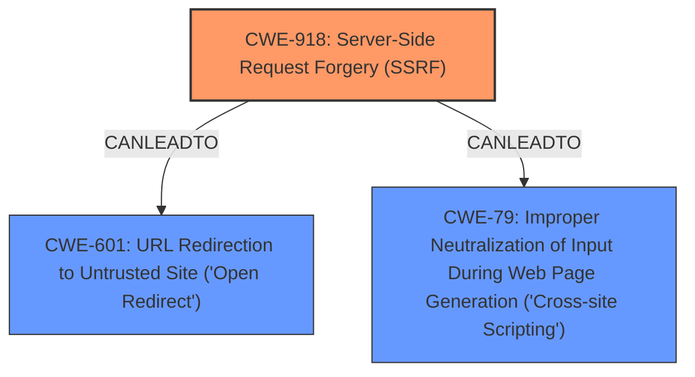

# Raw Analyzer Response for CVE-2025-27888

# Summary
| CWE ID  | CWE Name  | Confidence | CWE Abstraction Level | CWE Vulnerability Mapping Label | CWE-Vulnerability Mapping Notes |
|---|---|---|---|---|---|
| CWE-918 | Server-Side Request Forgery (SSRF) | 0.9 | Base | Primary | Allowed |
| CWE-601 | URL Redirection to Untrusted Site ('Open Redirect') | 0.8 | Base | Secondary | Allowed |
| CWE-79 | Improper Neutralization of Input During Web Page Generation ('Cross-site Scripting') | 0.7 | Base | Secondary | Allowed |

## Evidence and Confidence

*   **Confidence Score:** 0.8
*   **Evidence Strength:** HIGH

## Relationship Analysis
The primary relationship to consider is the chain of events that leads to the vulnerability. The **Server-Side Request Forgery** (SSRF) vulnerability (CWE-918) can lead to an **Open Redirect** (CWE-601) if the server blindly redirects the user to a URL fetched from an external source. Additionally, if the server fails to neutralize input used in generating web pages, it could lead to **Cross-Site Scripting** (XSS) (CWE-79). CWE-601 is a child of CWE-610 (Externally Controlled Reference to a Resource in Another Sphere), but CWE-601 is more specific and thus more appropriate.

## Vulnerability Chain
The vulnerability chain starts with the **Server-Side Request Forgery (SSRF)** (CWE-918) where a specially crafted URL is used to redirect the request to an arbitrary server. This can then lead to:
1.  **URL Redirection to Untrusted Site ('Open Redirect')** (CWE-601): If the application redirects the user to the untrusted site specified in the crafted URL.
2.  **Improper Neutralization of Input During Web Page Generation ('Cross-site Scripting')** (CWE-79): If the response from the arbitrary server is not properly neutralized when included in a web page, it can lead to XSS.

The root cause is the **improper handling of URLs** which allows for the **Server-Side Request Forgery**. The impacts are the **Open Redirect** and **Cross-site Scripting**.

## Summary of Analysis
The primary vulnerability is **Server-Side Request Forgery (SSRF)** (CWE-918), as the application **does not sufficiently ensure that the request is being sent to the expected destination**. This allows for a specially crafted URL to redirect requests to arbitrary servers.

The secondary vulnerabilities are **URL Redirection to Untrusted Site ('Open Redirect')** (CWE-601) and **Improper Neutralization of Input During Web Page Generation ('Cross-site Scripting')** (CWE-79). The **Open Redirect** occurs when the server redirects the user to the URL obtained through the **SSRF**. The **Cross-site Scripting** occurs when the response from the arbitrary server is included in a web page without proper neutralization.

The evidence supporting this analysis is the vulnerability description: "**a request that has a specially crafted URL could be used to redirect the request to an arbitrary server instead. This has the potential for XSS or XSRF**".

The hierarchical relationships support choosing the more specific CWE-601 over CWE-610.

The selected CWEs are at the optimal level of specificity because they directly represent the weaknesses described in the vulnerability. CWE-918 captures the root cause, while CWE-601 and CWE-79 represent the potential impacts.

Relevant CWE Information:
*   **CWE-79: Improper Neutralization of Input During Web Page Generation ('Cross-site Scripting')** - The product does not neutralize or incorrectly neutralizes user-controllable input before it is placed in output that is used as a web page that is served to other users.
*   **CWE-601: URL Redirection to Untrusted Site ('Open Redirect')** - The web application accepts a user-controlled input that specifies a link to an external site, and uses that link in a redirect.
*   **CWE-610: Externally Controlled Reference to a Resource in Another Sphere** - The product uses an externally controlled name or reference that resolves to a resource that is outside of the intended control sphere.
*   **CWE-918: Server-Side Request Forgery (SSRF)** - The web server receives a URL or similar request from an upstream component and retrieves the contents of this URL, but it does not sufficiently ensure that the request is being sent to the expected destination.
*   **CWE-113: Improper Neutralization of CRLF Sequences in HTTP Headers ('HTTP Request/Response Splitting')** - The product receives data from an HTTP agent/component (e.g., web server, proxy, browser, etc.), but it does not neutralize or incorrectly neutralizes CR and LF characters before the data is included in outgoing HTTP headers.
*   **CWE-352: Cross-Site Request Forgery (CSRF)** - The web application does not, or can not, sufficiently verify whether a well-formed, valid, consistent request was intentionally provided by the user who submitted the request.
*   **CWE-89: Improper Neutralization of Special Elements used in an SQL Command ('SQL Injection')** - The product constructs all or part of an SQL command using externally-influenced input from an upstream component, but it does not neutralize or incorrectly neutralizes special elements that could modify the intended SQL command when it is sent to a downstream component.
*   **CWE-863: Incorrect Authorization** - The product performs an authorization check when an actor attempts to access a resource or perform an action, but it does not correctly perform the check.