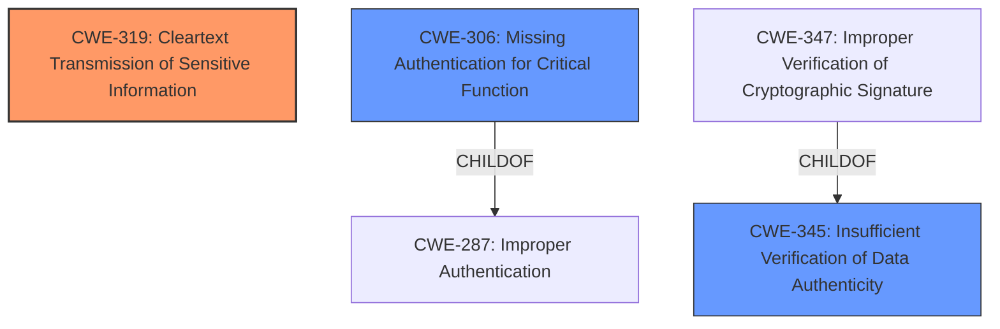

# Raw Analyzer Response for CVE-2025-28169

# Summary
| CWE ID | CWE Name | Confidence | CWE Abstraction Level | CWE Vulnerability Mapping Label | CWE-Vulnerability Mapping Notes |
|---|---|---|---|---|---|
| CWE-319 | Cleartext Transmission of Sensitive Information | 1.0 | Base | Allowed | Primary CWE. The root cause is transmitting data without encryption. |
| CWE-306 | Missing Authentication for Critical Function | 0.7 | Base | Allowed | Secondary CWE. The broadcast not being system-protected suggests a lack of authentication for a critical function. |
| CWE-345 | Insufficient Verification of Data Authenticity | 0.6 | Class | Discouraged | Secondary CWE. The vulnerability potentially involves a lack of data authenticity verification. |

## Evidence and Confidence

*   **Confidence Score:** 0.8
*   **Evidence Strength:** MEDIUM

## Relationship Analysis
The primary CWE, CWE-319, stands alone as the most direct representation of the vulnerability. CWE-306 and CWE-345 are related to the broader context of security failures that could enable or exacerbate the vulnerability. While CWE-306 is a child of the broader CWE-287 (Improper Authentication), the missing system protection on the broadcast highlights the absence of authentication for a critical function. Similarly, CWE-347 (Improper Verification of Cryptographic Signature) is a child of CWE-345 (Insufficient Verification of Data Authenticity), but the unencrypted transmission is more directly captured by CWE-319.

## Vulnerability Chain
The vulnerability chain starts with the **root cause** of unencrypted broadcast transmissions (CWE-319). The **lack of system protection** (indicated by the unprotected broadcast receiver) can be considered **Missing Authentication for a Critical Function** (CWE-306) or perhaps **Insufficient Verification of Data Authenticity** (CWE-345), which facilitates the man-in-the-middle attack. The impact is the potential for attackers to intercept and analyze sensitive vehicle data.

## Summary of Analysis
The initial assessment focused on identifying the **root cause** of the vulnerability. The primary evidence is the description of the vulnerability in BYD QIN PLUS DM-i Dilink OS, specifically that it "cend broadcasts to the manufacturer's cloud server unencrypted, allowing attackers to execute a man-in-the-middle attack."

The retriever results and complete CWE specifications were then analyzed. CWE-319 (Cleartext Transmission of Sensitive Information) was identified as the best fit for the **root cause**. This is further supported by the CVE Reference Links Content Summary, which highlights the unprotected broadcast receiver that allows modification of the CAN traffic upload URL. This unprotected broadcast implies a **Missing Authentication for Critical Function** (CWE-306), making it a relevant secondary CWE. The possibility of **Insufficient Verification of Data Authenticity** (CWE-345) is also considered, as the vulnerability might also involve a lack of integrity checks.

The abstraction level of CWE-319 is Base, which is the preferred level. Other considered CWEs, such as CWE-287 (Improper Authentication), are Class level and less specific. The final selection is based on direct evidence and the MITRE mapping guidance, favoring specific Base level CWEs over broader Class level CWEs when applicable.

Relevant CWE Information:
- Vulnerability Description Key Phrases:
  - **impact:** cend broadcasts to the manufacturers cloud server unencrypted
- CVE Reference Links Content Summary:
  - **Weaknesses/vulnerabilities present:**
    - Unprotected broadcast receiver allowing modification of CAN traffic upload URL.