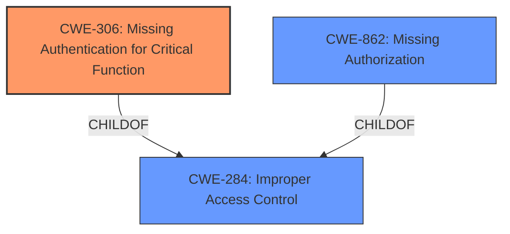

# Raw Analyzer Response for CVE-2025-28232

# Summary
| CWE ID | CWE Name | Confidence | CWE Abstraction Level | CWE Vulnerability Mapping Label | CWE-Vulnerability Mapping Notes |
|---|---|---|---|---|---|
| CWE-306 | Missing Authentication for Critical Function | 1.0 | Base | Primary CWE | Allowed |
| CWE-862 | Missing Authorization | 0.7 | Base | Secondary Candidate | Allowed |
| CWE-284 | Improper Access Control | 0.5 | Pillar | Secondary Candidate | Discouraged |

## Evidence and Confidence

*   **Confidence Score:** 0.9
*   **Evidence Strength:** HIGH

## Relationship Analysis
The primary relationship that influenced my decision was the hierarchical relationship between CWE-284 (Improper Access Control) and its children, CWE-306 (Missing Authentication for Critical Function) and CWE-862 (Missing Authorization). Since the vulnerability description explicitly states that the Admin panel can be accessed **without authentication**, CWE-306 is a more specific and appropriate choice than the general CWE-284. However, if authentication was present but authorization was **incorrect**, then CWE-862 would be a better choice.

## Vulnerability Chain
The vulnerability chain begins with the **missing authentication** (**CWE-306**) for the HOME.php endpoint, which allows attackers to bypass the authentication mechanism and directly access the Admin panel. The impact of this vulnerability is unauthorized access to sensitive administrative functionalities.

## Summary of Analysis
The initial analysis strongly points to **CWE-306 (Missing Authentication for Critical Function)** as the primary weakness. The vulnerability description explicitly mentions that attackers can access the Admin panel **without authentication**, indicating a complete lack of authentication for a critical function. The guidance provided also reinforces this choice, stating that CWE-306 is appropriate when "no identity validation is enforced for sensitive functionality."
The relevant phrase is: "**Incorrect access control** in the HOME.php endpoint of JMBroadcast JMB0150 Firmware v1.0 allows attackers to access the Admin panel **without authentication**."

CWE-862 (Missing Authorization) was considered as a secondary candidate, but it is less appropriate because it applies to scenarios where authentication is present, but authorization checks are missing. In this case, the vulnerability description emphasizes the absence of authentication.

CWE-284 (Improper Access Control) is a higher-level category that encompasses both authentication and authorization issues. While it could be used, it is less specific than CWE-306 and CWE-862. Therefore, it is not the optimal choice.

The selected CWEs are at the optimal level of specificity because they accurately reflect the root cause of the vulnerability, which is the **missing authentication** for a critical function.

Relevant CWE Information:

# Enhanced Context (25 CWEs)
The following CWEs were identified as potentially relevant to this vulnerability:

## CWE-306: Missing Authentication for Critical Function
**Abstraction Level**: Base
**Similarity Score**: 1107.35
**Source**: sparse

**Description**:
The product does not perform any authentication for functionality that requires a provable user identity or consumes a significant amount of resources.

**Mapping Guidance**:
- Usage: Allowed
- Rationale: This CWE entry is at the Base level of abstraction, which is a preferred level of abstraction for mapping to the root causes of vulnerabilities.