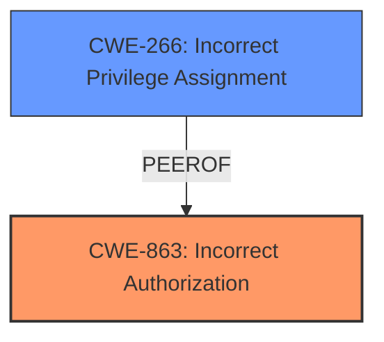

# Analysis for CVE-2025-28399

# Summary
| CWE ID | CWE Name | Confidence | CWE Abstraction Level | CWE Vulnerability Mapping Label | CWE-Vulnerability Mapping Notes |
|---|---|---|---|---|---|
| CWE-863 | Incorrect Authorization | 0.9 | Class | Primary | Allowed-with-Review |
| CWE-266 | Incorrect Privilege Assignment | 0.7 | Base | Secondary | Allowed |

## Evidence and Confidence

*   **Confidence Score:** 0.8
*   **Evidence Strength:** MEDIUM

## Relationship Analysis
The primary relationship influencing the selection is the hierarchical relationship between CWE-863 and its potential base-level children. The vulnerability description indicates a failure in authorization logic, making CWE-863 a strong candidate. Additionally, CWE-266 is considered due to the privilege escalation aspect.

## Vulnerability Chain
The vulnerability chain involves a failure in authorization logic that leads to privilege escalation.
1.  **Root Cause:** Incorrect Authorization (CWE-863) in the `updateAddress` method.
2.  **Impact:** Privilege escalation, allowing a remote attacker to perform actions beyond their intended privileges. This can be linked to Incorrect Privilege Assignment (CWE-266) as a consequence of the authorization failure.

## Summary of Analysis
The initial analysis identified several potential CWEs based on the vulnerability description and retriever results. The primary focus was on identifying the root cause of the privilege escalation. The analysis considered both the sparse and dense retriever results, as well as the graph-based results.

The final decision was based on the following:

*   The vulnerability description explicitly states that a remote attacker can escalate privileges via the `updateAddress` method.
*   CWE-863 (Incorrect Authorization) aligns with the flawed logic in the authorization check performed by the `updateAddress` method.
*   CWE-266 (Incorrect Privilege Assignment) is a reasonable secondary mapping since the **impact** is privilege escalation.

The selected CWEs are at the optimal level of specificity because they directly address the root cause and impact of the vulnerability. The selection is based on the evidence provided in the vulnerability description, as well as the CWE specifications and mapping guidance.

Relevant CWE Information:

# Enhanced Context (25 CWEs)
The following CWEs were identified as potentially relevant to this vulnerability:

## CWE-266: Incorrect Privilege Assignment
**Abstraction Level**: Base
**Similarity Score**: 0.79
**Source**: dense

**Description**:
A product incorrectly assigns a privilege to a particular actor, creating an unintended sphere of control for that actor.

**Mapping Guidance**:
- Usage: Allowed
- Rationale: This CWE entry is at the Base level of abstraction, which is a preferred level of abstraction for mapping to the root causes of vulnerabilities.

## CWE-863: Incorrect Authorization
**Abstraction Level**: Class
**Similarity Score**: 1295.27
**Source**: sparse

**Description**:
The product performs an authorization check when an actor attempts to access a resource or perform an action, but it does not correctly perform the check.

**Mapping Guidance**:
- Usage: Allowed-with-Review
- Rationale: This CWE entry is a Class and might have Base-level children that would be more appropriate

## CWE-863: Incorrect Authorization
*   **CWE-863: Incorrect Authorization** is selected as the primary CWE. The vulnerability description refers to a privilege escalation, which implies a flaw in the authorization process. CWE-863 describes a situation where an authorization check is performed, but it's done incorrectly. This aligns well with the scenario described in the vulnerability.
    *   How the vulnerability's details match the CWE's characteristics: The `updateAddress` method is intended to be protected by authorization checks to ensure only authorized users can update addresses. However, the vulnerability allows a remote attacker to bypass these checks, indicating an incorrect authorization process.
    *   The security implications and potential impact: The security implication is privilege escalation, allowing an attacker to modify data they should not have access to.
    *   Any parent-child relationships or chain patterns that influenced your mapping: CWE-863 is a Class-level CWE, and there might be more specific Base-level children that could be applicable. However, without further information, CWE-863 is the most appropriate choice.
    *   Whether the weakness is primary or secondary in the vulnerability: Primary
    *   How the official MITRE mapping guidance influenced your decision: The "Allowed-with-Review" mapping guidance was followed, acknowledging that a more specific Base-level CWE might exist.
    *   Confidence Score: 0.9

*   **CWE-266: Incorrect Privilege Assignment** is a potential secondary CWE. Since the impact is privilege escalation, it is reasonable to include this.
    *   How the vulnerability's details match the CWE's characteristics: The attacker is able to gain unauthorized privileges to perform actions they should not be able to.
    *   The security implications and potential impact: The attacker can perform actions on behalf of other users.
    *   Any parent-child relationships or chain patterns that influenced your mapping: This is a secondary mapping because the **rootcause** is the authorization bypass.
    *   Whether the weakness is primary or secondary in the vulnerability: Secondary
    *   How the official MITRE mapping guidance influenced your decision: The "Allowed" mapping guidance was followed.
    *   Confidence Score: 0.7

CWEs Considered But Not Used:

*   CWE-285 (Improper Authorization), CWE-269 (Improper Privilege Management), CWE-284 (Improper Access Control): These CWEs were considered but not chosen because they are either too high-level or do not specifically address the authorization flaw in the `updateAddress` method.
*   CWE-306 (Missing Authentication for Critical Function): Not selected because the function does have authentication, but the authorization is flawed.
*   CWE-79 (Improper Neutralization of Input During Web Page Generation ('Cross-site Scripting')), CWE-94 (Improper Control of Generation of Code ('Code Injection')): These CWEs were not relevant because the vulnerability does not involve code injection or XSS.
*   CWE-732 (Incorrect Permission Assignment for Critical Resource): This CWE is more about the file system permissions, and does not fit the vulnerability described.