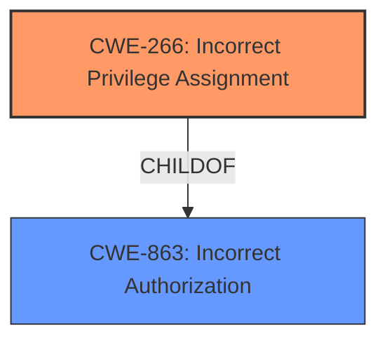

# Analysis for CVE-2025-28400

# Summary
| CWE ID | CWE Name | Confidence | CWE Abstraction Level | CWE Vulnerability Mapping Label | CWE-Vulnerability Mapping Notes |
|---|---|---|---|---|---|
| CWE-266 | Incorrect Privilege Assignment | 0.9 | Base | Allowed | Primary CWE |
| CWE-863 | Incorrect Authorization | 0.7 | Class | Allowed-with-Review | Secondary Candidate |

## Evidence and Confidence

*   **Confidence Score:** 0.9
*   **Evidence Strength:** MEDIUM

## Relationship Analysis
The primary CWE is CWE-266, "Incorrect Privilege Assignment," as the root cause is the incorrect assignment of privileges that leads to privilege escalation. CWE-863, "Incorrect Authorization," is a broader class that could apply if the specifics of the assignment aren't known, but in this case, the description explicitly mentions privilege escalation via a parameter.

## Vulnerability Chain
The vulnerability chain starts with the **incorrect privilege assignment** (CWE-266) via the `postID` parameter in the `edit` method, leading to a privilege escalation.

## Summary of Analysis
The analysis is based on the provided evidence. The vulnerability description states that a remote attacker can escalate privileges via the `postID` parameter in the `edit` method of RUoYi v.4.8.0.

The guidance for Privileges vs Permissions is very helpful here. It suggests that "**Incorrect Privilege Assignment**" (CWE-266) is the appropriate choice when the system assigns incorrect privileges to a user. The vulnerability description directly aligns with this scenario, as the attacker is able to escalate privileges due to an issue in the `edit` method with the `postID` parameter. The evidence suggests that the `postID` parameter allows unintended modification of privileges, thus indicating an **incorrect privilege assignment**.

I considered other CWEs such as CWE-863 "Incorrect Authorization", but I believe CWE-266 is the more specific and accurate representation of the root cause of the vulnerability.

Relevant CWE Information:

# Enhanced Context (25 CWEs)
The following CWEs were identified as potentially relevant to this vulnerability:

## CWE-266: Incorrect Privilege Assignment
**Abstraction Level**: Base
**Similarity Score**: 0.79
**Source**: dense

**Description**:
A product incorrectly assigns a privilege to a particular actor, creating an unintended sphere of control for that actor.

**Mapping Guidance**:
- Usage: Allowed
- Rationale: This CWE entry is at the Base level of abstraction, which is a preferred level of abstraction for mapping to the root causes of vulnerabilities.

## CWE-863: Incorrect Authorization
**Abstraction Level**: Class
**Similarity Score**: 1311.85
**Source**: sparse

**Description**:
The product performs an authorization check when an actor attempts to access a resource or perform an action, but it does not correctly perform the check.

**Mapping Guidance**:
- Usage: Allowed-with-Review
- Rationale: This CWE entry is a Class and might have Base-level children that would be more appropriate