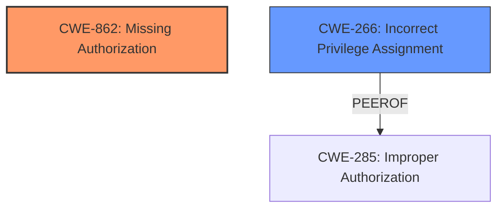

# Raw Analyzer Response for CVE-2025-28403

# Summary
| CWE ID | CWE Name | Confidence | CWE Abstraction Level | CWE Vulnerability Mapping Label | CWE-Vulnerability Mapping Notes |
|---|---|---|---|---|---|
| CWE-862 | Missing Authorization | 1.0 | Class | Allowed-with-Review | Primary CWE. The application **does not perform any authorization check** before allowing access to a critical function. |
| CWE-266 | Incorrect Privilege Assignment | 0.5 | Base | Allowed | Secondary Candidate. The application might be assigning incorrect admin privileges. |

## Evidence and Confidence

*   **Confidence Score:** 1.0
*   **Evidence Strength:** HIGH

## Relationship Analysis
The primary relationship influencing the decision is that CWE-862 is a Class-level CWE, and there might be a more specific Base-level CWE available, but due to the lack of details in the description, a more specific CWE cannot be confirmed. The other relationships considered were the parent-child relationships of other CWEs, to identify more specific variants if applicable.

## Vulnerability Chain
The chain of events starts with a **missing authorization** check (CWE-862) before modifying system configuration settings. This leads to an impact of privilege escalation, where a remote attacker can gain unauthorized access.

## Summary of Analysis
The initial assessment strongly points to CWE-862 as the primary weakness. The vulnerability description clearly states that the "editSave method **does not properly validate whether the requesting user has administrative privileges before allowing modifications to system configuration settings**," indicating a **missing authorization** check. This aligns directly with the definition of CWE-862. The retriever results also list CWE-862 as the top candidate.

The mapping guidance for privileges vs permissions helps solidify this selection, as the issue involves a missing check for administrative privileges. The evidence for this selection is the rootcause described in the "Vulnerability Description Key Phrases".

CWE-266 was also considered as a secondary candidate, as there may be an incorrect assignment of admin privileges, but the rootcause is a missing check.

Therefore, the selected CWEs are at the optimal level of specificity based on the available evidence.

Relevant CWE Information:

# Enhanced Context (25 CWEs)
The following CWEs were identified as potentially relevant to this vulnerability:

## CWE-266: Incorrect Privilege Assignment
**Abstraction Level**: Base
**Similarity Score**: 0.78
**Source**: dense

**Description**:
A product incorrectly assigns a privilege to a particular actor, creating an unintended sphere of control for that actor.

**Mapping Guidance**:
- Usage: Allowed
- Rationale: This CWE entry is at the Base level of abstraction, which is a preferred level of abstraction for mapping to the root causes of vulnerabilities.

## CWE-862: Missing Authorization
**Abstraction Level**: Class
**Similarity Score**: 1277.44
**Source**: sparse

**Description**:
The product **does not perform any authorization check** when an actor attempts to access a resource or perform an action.

**Mapping Guidance**:
- Usage: Allowed-with-Review
- Rationale: This CWE entry is a Class and might have Base-level children that would be more appropriate

CWEs considered but not used:

*   CWE-352: Cross-Site Request Forgery (CSRF) - Not applicable as there is no mention of CSRF in the vulnerability description.
*   CWE-306: Missing Authentication for Critical Function - Authentication might be present, but authorization is **missing**, making CWE-862 a better fit.
*   CWE-285: Improper Authorization - There is no indication that an authorization check exists but is performed incorrectly; rather, it is **missing** entirely.
*   CWE-269: Improper Privilege Management - Too general; CWE-862 is more specific.
*   CWE-863: Incorrect Authorization - Similar to CWE-285, this implies that an authorization check exists but is flawed, which is not the case here.
*   CWE-287: Improper Authentication - Not applicable, as the issue is with authorization, not authentication.
*   CWE-347: Improper Verification of Cryptographic Signature - Not applicable, as there is no mention of cryptographic signatures.
*   CWE-250: Execution with Unnecessary Privileges - Not the primary issue; the core problem is the **missing authorization** check.
*   CWE-613: Insufficient Session Expiration - Not relevant to the described vulnerability.