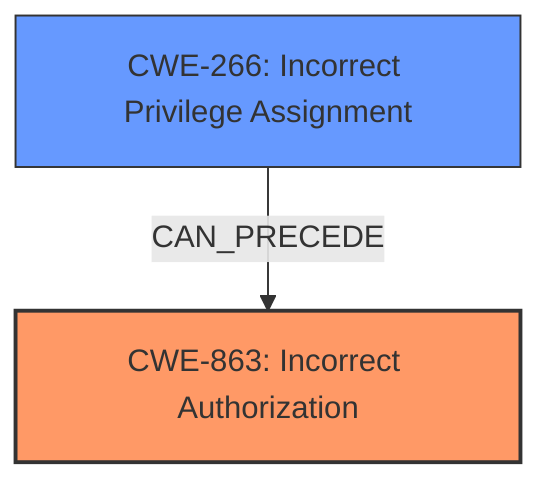

# Enhanced Analysis for CVE-2025-28405

# Summary
| CWE ID | CWE Name | Confidence | CWE Abstraction Level | CWE Vulnerability Mapping Label | CWE-Vulnerability Mapping Notes |
|---|---|---|---|---|---|
| CWE-863 | Incorrect Authorization | 0.8 | Class | Allowed-with-Review | Primary CWE: The product performs an authorization check when an actor attempts to access a resource or perform an action, but it does not correctly perform the check. |
| CWE-266 | Incorrect Privilege Assignment | 0.6 | Base | Allowed | Secondary Candidate: A product incorrectly assigns a privilege to a particular actor, creating an unintended sphere of control for that actor. |

## Evidence and Confidence

*   **Confidence Score:** 0.7
*   **Evidence Strength:** MEDIUM

## Relationship Analysis
The primary CWE, CWE-863 (Incorrect Authorization), is a Class-level CWE. A more specific child CWE could potentially be a better fit if more information was available. CWE-266 (Incorrect Privilege Assignment) is a Base-level CWE and a potential cause of incorrect authorization. The relationship between these two CWEs suggests that the incorrect authorization could stem from an underlying issue of privilege assignment.



## Vulnerability Chain
The vulnerability chain starts with a **flawed authorization** mechanism (CWE-863). This could be due to an underlying **incorrect privilege assignment** (CWE-266). The final impact is a remote attacker being able to escalate privileges.

## Summary of Analysis
The initial assessment points towards CWE-863 (Incorrect Authorization) as the primary weakness, aligning with the description of the vulnerability where a remote attacker can escalate privileges via the changeStatus method. This suggests that the authorization check is present but flawed.

The retriever results and the provided guidance both point to privilege and permission-related CWEs. The guidance emphasizes that CWE-269 (Improper Privilege Management) is discouraged and that a more specific CWE should be used.

CWE-863 is chosen because the vulnerability description highlights a **flawed authorization** mechanism that allows privilege escalation. CWE-266 (Incorrect Privilege Assignment) is also considered a secondary candidate, since the authorization flaw could result from misconfigured roles.

The evidence is somewhat limited, as the CVE Reference Links Content Summary is "UNRELATED". However, the vulnerability description and the retriever results provide enough information to make a reasonable assessment. A higher confidence score would be possible if there was more information about the root cause of the authorization flaw.

Relevant CWE Information:

# Enhanced Context (25 CWEs)
The following CWEs were identified as potentially relevant to this vulnerability:

## CWE-266: Incorrect Privilege Assignment
**Abstraction Level**: Base
**Similarity Score**: 0.79
**Source**: dense

**Description**:
A product incorrectly assigns a privilege to a particular actor, creating an unintended sphere of control for that actor.

**Mapping Guidance**:
- Usage: Allowed
- Rationale: This CWE entry is at the Base level of abstraction, which is a preferred level of abstraction for mapping to the root causes of vulnerabilities.

## CWE-863: Incorrect Authorization
**Abstraction Level**: Class
**Similarity Score**: 1267.89
**Source**: sparse

**Description**:
The product performs an authorization check when an actor attempts to access a resource or perform an action, but it does not correctly perform the check.

**Mapping Guidance**:
- Usage: Allowed-with-Review
- Rationale: This CWE entry is a Class and might have Base-level children that would be more appropriate


## CWE Relationship Analysis

Current CWEs represent these abstraction levels: .


### Vulnerability Chain Analysis

**Chain starting from CWE-863:**
- 863 (Incorrect Authorization) - ROOT


**Chain starting from CWE-269:**
- 269 (Improper Privilege Management) - ROOT


### CWE Relationship Diagram

```mermaid
graph TD
    classDef primary fill:#f96,stroke:#333,stroke-width:2px
    classDef secondary fill:#69f,stroke:#333
    classDef tertiary fill:#9e9,stroke:#333
```