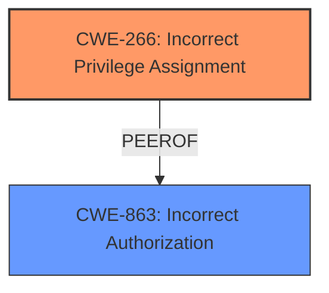

# Analysis for CVE-2025-28406

# Summary
| CWE ID  | CWE Name                                                                 | Confidence | CWE Abstraction Level | CWE Vulnerability Mapping Label | CWE-Vulnerability Mapping Notes |
| :------- | :----------------------------------------------------------------------- | :--------- | :-------------------- | :------------------------------ | :------------------------------ |
| CWE-266 | Incorrect Privilege Assignment                                           | 0.9        | Base                  | Primary                         | Allowed                       |
| CWE-863 | Incorrect Authorization                                                  | 0.7        | Class                 | Secondary                       | Allowed-with-Review           |

## Evidence and Confidence

*   **Confidence Score:** 0.8
*   **Evidence Strength:** LOW

## Relationship Analysis
The primary relationship that influences the selection is the hierarchical relationship where CWE-863 is a Class-level CWE, and CWE-266 is a Base-level CWE, providing more specificity. Additionally, the privilege escalation aspect of the vulnerability aligns well with the guidance provided for privileges vs. permissions.

## Vulnerability Chain
The vulnerability chain starts with an **incorrect privilege assignment** (CWE-266), leading to the ability for a remote attacker to **escalate privileges**. The **incorrect authorization** (CWE-863) could be a contributing factor or a consequence of the **incorrect privilege assignment**, where the system fails to properly validate the assigned privileges.

## Summary of Analysis
The analysis is based on the limited evidence provided in the vulnerability description, specifically the phrases "escalate privileges" and "jobLogId parameter". The key decision is to map this vulnerability to CWE-266 (Incorrect Privilege Assignment) as the primary root cause.

The retriever results suggested CWE-266 with a high score. The mapping guidance explicitly advises using CWE-266 when a user is assigned the wrong role, which aligns with the "escalate privileges" impact.

While CWE-863 (Incorrect Authorization) is also relevant, it is a broader class of weakness. The vulnerability description points to an **incorrect privilege assignment** as the initial cause, making CWE-266 a more specific and appropriate choice for the primary CWE. CWE-863 is kept as a secondary option because there is potentially a flaw in how authorization is implemented or checked, allowing the privilege escalation to occur.

The selected CWEs are at the optimal level of specificity. CWE-266 is a Base-level CWE, which is preferred for root cause analysis. CWE-863 is a Class-level CWE which could be related.
# Enhanced Context (25 CWEs)
The following CWEs were identified as potentially relevant to this vulnerability:

## CWE-266: Incorrect Privilege Assignment
**Abstraction Level**: Base
**Similarity Score**: 0.78
**Source**: dense

**Description**:
A product incorrectly assigns a privilege to a particular actor, creating an unintended sphere of control for that actor.

**Mapping Guidance**:
- Usage: Allowed
- Rationale: This CWE entry is at the Base level of abstraction, which is a preferred level of abstraction for mapping to the root causes of vulnerabilities.

## CWE-863: Incorrect Authorization
**Abstraction Level**: Class
**Similarity Score**: 1270.27
**Source**: sparse

**Description**:
The product performs an authorization check when an actor attempts to access a resource or perform an action, but it does not correctly perform the check.

**Mapping Guidance**:
- Usage: Allowed-with-Review
- Rationale: This CWE entry is a Class and might have Base-level children that would be more appropriate

# Summary
| CWE ID  | CWE Name                                                                 | Confidence | CWE Abstraction Level | CWE Vulnerability Mapping Label | CWE-Vulnerability Mapping Notes |
| :------- | :----------------------------------------------------------------------- | :--------- | :-------------------- | :------------------------------ | :------------------------------ |
| CWE-266 | Incorrect Privilege Assignment                                           | 0.9        | Base                  | Primary                         | Allowed                       |
| CWE-863 | Incorrect Authorization                                                  | 0.7        | Class                 | Secondary                       | Allowed-with-Review           |

## Evidence and Confidence

*   **Confidence Score:** 0.8
*   **Evidence Strength:** LOW

## Relationship Analysis
The primary relationship that influences the selection is the hierarchical relationship where CWE-863 is a Class-level CWE, and CWE-266 is a Base-level CWE, providing more specificity. Additionally, the privilege escalation aspect of the vulnerability aligns well with the guidance provided for privileges vs. permissions.

## Vulnerability Chain
The vulnerability chain starts with an **incorrect privilege assignment** (CWE-266), leading to the ability for a remote attacker to **escalate privileges**. The **incorrect authorization** (CWE-863) could be a contributing factor or a consequence of the **incorrect privilege assignment**, where the system fails to properly validate the assigned privileges.

## Summary of Analysis
The analysis is based on the limited evidence provided in the vulnerability description, specifically the phrases "escalate privileges" and "jobLogId parameter". The key decision is to map this vulnerability to CWE-266 (Incorrect Privilege Assignment) as the primary root cause.

The retriever results suggested CWE-266 with a high score. The mapping guidance explicitly advises using CWE-266 when a user is assigned the wrong role, which aligns with the "escalate privileges" impact.

While CWE-863 (Incorrect Authorization) is also relevant, it is a broader class of weakness. The vulnerability description points to an **incorrect privilege assignment** as the initial cause, making CWE-266 a more specific and appropriate choice for the primary CWE. CWE-863 is kept as a secondary option because there is potentially a flaw in how authorization is implemented or checked, allowing the privilege escalation to occur.

The selected CWEs are at the optimal level of specificity. CWE-266 is a Base-level CWE, which is preferred for root cause analysis. CWE-863 is a Class-level CWE which could be related.

**CWEs Considered But Not Used:**

*   **CWE-285 Improper Authorization**: This was considered but not chosen as primary since CWE-266 is more specific to the **privilege assignment** aspect of the vulnerability.
*   **CWE-269 Improper Privilege Management**: This was considered but is discouraged and less specific than CWE-266.
*   **CWE-250 Execution with Unnecessary Privileges**: This was considered, but it typically refers to code running with higher privileges than necessary. The primary issue here is the **incorrect assignment** of privileges.
*   **CWE-306 Missing Authentication for Critical Function**: This was considered but the vulnerability description does not indicate a missing authentication issue.