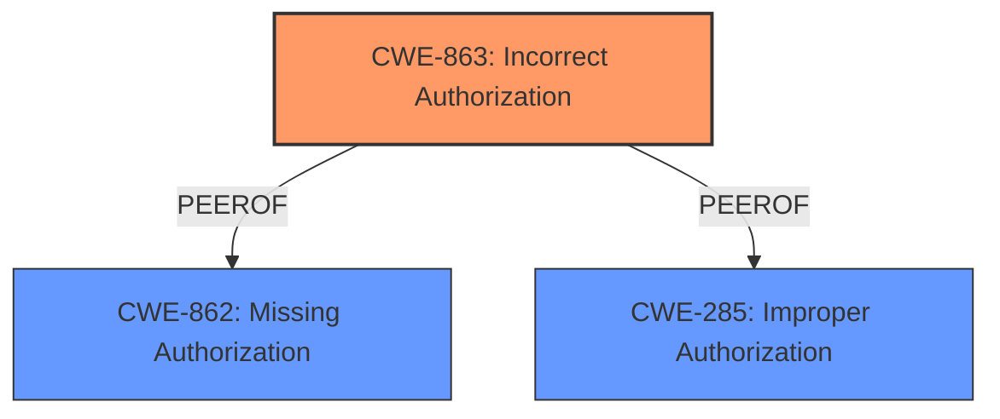

# Analysis for CVE-2025-28407

# Summary
| CWE ID | CWE Name | Confidence | CWE Abstraction Level | CWE Vulnerability Mapping Label | CWE-Vulnerability Mapping Notes |
|---|---|---|---|---|---|
| CWE-863 | Incorrect Authorization | 0.9 | Class | Allowed-with-Review | Primary CWE. Authorization logic is present but flawed. |
| CWE-862 | Missing Authorization | 0.7 | Class | Allowed-with-Review | Secondary candidate. Authorization logic is completely missing. |

## Evidence and Confidence

*   **Confidence Score:** 0.8
*   **Evidence Strength:** MEDIUM

## Relationship Analysis
The primary relationship that influenced my decision was the distinction between CWE-862 (Missing Authorization) and CWE-863 (Incorrect Authorization). Since the vulnerability description mentions **improper validation of permissions**, it suggests that there is an attempt at authorization, but it is flawed. This points to CWE-863 as the more appropriate choice.

## Vulnerability Chain
The vulnerability chain begins with the **improper validation of permissions** within the `/edit/{dictId}` endpoint. This **rootcause** leads to the **impact** of a remote attacker being able to escalate privileges. The chain is as follows:

1.  **Root Cause:** Improper Validation of Permissions (CWE-863)
2.  **Impact:** Privilege Escalation

## Summary of Analysis
The initial analysis focused on the provided vulnerability description and key phrases, specifically the **rootcause**: **improper validation of permissions**. This led to considering CWEs related to authorization and privilege management.

The Retriever Results highlighted several potential CWEs, including CWE-862 (Missing Authorization), CWE-267 (Privilege Defined With Unsafe Actions), CWE-285 (Improper Authorization), and CWE-863 (Incorrect Authorization).

The key factor in selecting CWE-863 was the phrase **improper validation of permissions**, which strongly suggests that an authorization mechanism exists but is flawed. If there was no authorization at all, CWE-862 would have been more appropriate.

The Complete CWE Specifications and Mapping Guidance further solidified this decision. The guidance clarifies the distinction between privileges and permissions, and highlights the use of CWE-863 when authorization logic is present but flawed.

The evidence, while concise, is sufficient to support this classification. The selected CWE is at the optimal level of specificity, as it directly addresses the **rootcause** described in the vulnerability description.

Relevant CWE Information:

# Enhanced Context (25 CWEs)
The following CWEs were identified as potentially relevant to this vulnerability:

## CWE-863: Incorrect Authorization
**Abstraction Level**: Class
**Similarity Score**: 1338.12
**Source**: sparse

**Description**:
The product performs an authorization check when an actor attempts to access a resource or perform an action, but it does not correctly perform the check.

**Mapping Guidance**:
- Usage: Allowed-with-Review
- Rationale: This CWE entry is a Class and might have Base-level children that would be more appropriate

## CWE-862: Missing Authorization
**Abstraction Level**: Class
**Similarity Score**: 0.264
**Source**: sparse

**Description**:
The product does not perform an authorization check when an actor attempts to access a resource or perform an action.

**Mapping Guidance**:
- Usage: Allowed-with-Review
- Rationale: This CWE entry is a Class and might have Base-level children that would be more appropriate

## CWE-285: Improper Authorization
**Abstraction Level**: Class
**Similarity Score**: 1315.19
**Source**: sparse

**Description**:
The product does not perform or incorrectly performs an authorization check when an actor attempts to access a resource or perform an action.

**Mapping Guidance**:
- Usage: Discouraged
- Rationale: CWE-285 is high-level and lower-level CWEs can frequently be used instead. It is a level-1 Class (i.e., a child of a Pillar).

## CWE-267: Privilege Defined With Unsafe Actions
**Abstraction Level**: Base
**Similarity Score**: 1302.72
**Source**: sparse

**Description**:
A particular privilege, role, capability, or right can be used to perform unsafe actions that were not intended, even when it is assigned to the correct entity.

**Mapping Guidance**:
- Usage: Allowed
- Rationale: This CWE entry is at the Base level of abstraction, which is a preferred level of abstraction for mapping to the root causes of vulnerabilities.

## CWE-1336: Improper Neutralization of Special Elements Used in a Template Engine
**Abstraction Level**: Base
**Similarity Score**: 0.232
**Source**: sparse

**Description**:
CWE-1336: Improper Neutralization of Special Elements Used in a Template Engine

**Mapping Guidance**:
- Usage: Allowed
- Rationale: This CWE entry is at the Base level of abstraction, which is a preferred level of abstraction for mapping to the root causes of vulnerabilities.

## CWE-306: Missing Authentication for Critical Function
**Abstraction Level**: base
**Similarity Score**: 2.40
**Source**: graph

**Description**:
CWE-306: Missing Authentication for Critical Function

**Mapping Guidance**:
- Usage: Allowed
- Rationale: This CWE entry is at the Base level of abstraction, which is a preferred level of abstraction for mapping to the root causes of vulnerabilities.

CWE-285 was considered but not used because CWE-863 provides more specificity in this context. The description for CWE-285 is:
> The product does not perform or incorrectly performs an authorization check when an actor attempts to access a resource or perform an action.
While the description does mention that the product "incorrectly performs" an authorization check, the mapping guidance indicates that it is high-level and lower-level CWEs should be used instead.

CWE-306 was considered, but it relates to missing authentication, which is not the primary issue described in the vulnerability. The core problem is that permissions are not correctly validated, not that authentication is missing altogether.