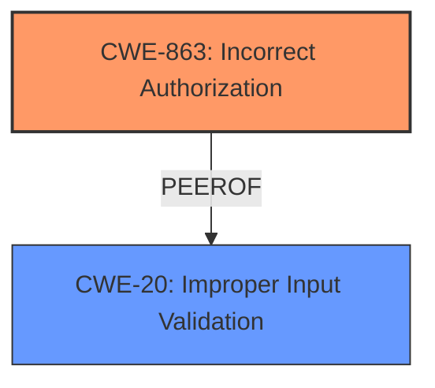

# Analysis Report for CVE-2025-28408

# Vulnerability Analysis Report: CVE-2025-28408

## Description

An issue in RUoYi v.4.8.0 allows a remote attacker to escalate privileges via the selectDeptTree method of the /selectDeptTree/{deptId} endpoint does not properly validate the deptId parameter

## Vulnerability Description Key Phrases

- **Rootcause:** improper validation of deptId parameter
- **Impact:** escalate privileges
- **Attacker:** remote attacker
- **Version:** RUoYi v.4.8.0
- **Component:** /selectDeptTree/{deptId} endpoint

## Analysis (with Relationship Data)

# Summary
| CWE ID    | CWE Name                                                        | Confidence | CWE Abstraction Level | CWE Vulnerability Mapping Label | CWE-Vulnerability Mapping Notes |
| :--------- | :-------------------------------------------------------------- | :--------- | :-------------------- | :------------------------------ | :------------------------------ |
| CWE-863     | Incorrect Authorization                                         | 0.9        | Class                 | Allowed-with-Review              | Primary CWE                     |
| CWE-20 | Improper Input Validation                                         | 0.7        | Class                 | Discouraged              | Secondary Candidate                     |

## Evidence and Confidence

*   **Confidence Score:** 0.8
*   **Evidence Strength:** MEDIUM

## Relationship Analysis
The primary relationship that influenced the decision was the parent-child relationship between CWE-863 (Incorrect Authorization) and its potential children, combined with the provided guidance on privileges and permissions. While the description indicates **improper validation of the deptId parameter**, leading to privilege escalation, the core issue is that the authorization check is not performed correctly. The retriever results and guidance on privileges/permissions pushed towards authorization related CWEs. The choice between CWE-20 and CWE-863 was influenced by the fact that the validation directly leads to a privilege escalation, suggesting an authorization bypass.



## Vulnerability Chain
The vulnerability chain starts with **improper validation of the deptId parameter**. This leads to **incorrect authorization**, allowing a remote attacker to **escalate privileges**.

## Summary of Analysis
The initial assessment focused on **improper validation of the deptId parameter** as the root cause. However, the impact of privilege escalation suggests that the authorization mechanism itself is flawed. The retriever results included CWEs related to both input validation and authorization. The provided guidance on privileges and permissions further clarified that privilege escalation scenarios often stem from incorrect authorization.

The selection of CWE-863 is based on the fact that the **improper validation** allows an attacker to bypass authorization checks. CWE-20 is included as a secondary candidate, as it represents the initial **improper validation** issue. The CWEs are at the Class level, because there isn't sufficient information to narrow it down to a base or variant.

Relevant CWE Information:

# Enhanced Context (25 CWEs)
The following CWEs were identified as potentially relevant to this vulnerability:

## CWE-266: Incorrect Privilege Assignment
**Abstraction Level**: Base
**Similarity Score**: 0.78
**Source**: dense

**Description**:
A product incorrectly assigns a privilege to a particular actor, creating an unintended sphere of control for that actor.

**Mapping Guidance**:
- Usage: Allowed
- Rationale: This CWE entry is at the Base level of abstraction, which is a preferred level of abstraction for mapping to the root causes of vulnerabilities.

## CWE-863: Incorrect Authorization
**Abstraction Level**: Class
**Similarity Score**: 1264.64
**Source**: sparse

**Description**:
The product performs an authorization check when an actor attempts to access a resource or perform an action, but it does not correctly perform the check.

**Mapping Guidance**:
- Usage: Allowed-with-Review
- Rationale: This CWE entry is a Class and might have Base-level children that would be more appropriate

# Complete CWE Specifications

CWE-130: Improper Handling of Length Parameter Inconsistency - Not Selected: While present in the retriever results, this CWE doesn't fit the vulnerability description, which relates to privilege escalation.

CWE-472: External Control of Assumed-Immutable Web Parameter - Not Selected: While present in the retriever results, there is no indication that immutable parameters are being controlled.

CWE-20: Improper Input Validation - Selected: This is a secondary CWE, because **improper validation** of the deptId parameter is part of the vulnerability, but is not the main weakness.

CWE-1287: Improper Validation of Specified Type of Input - Not Selected: While this is more specific than CWE-20, there is no information to indicate the type of input validation that failed.

CWE-116: Improper Encoding or Escaping of Output - Not Selected: The vulnerability description does not relate to output encoding or escaping.

CWE-23: Relative Path Traversal - Not Selected: The vulnerability description does not relate to path traversal.

CWE-138: Improper Neutralization of Special Elements - Not Selected: The vulnerability description does not relate to neutralization of special elements.

CWE-306: Missing Authentication for Critical Function - Not Selected: The vulnerability is about **improper validation** in a function, not missing authentication.

CWE-269: Improper Privilege Management - Not Selected: The description does not have enough information, and the mapping guidance discourages its use.

CWE-805: Buffer Access with Incorrect Length Value - Not Selected: This CWE relates to buffer access issues, which is not present in the description.


## CWE Relationship Analysis

Current CWEs represent these abstraction levels: .


### Vulnerability Chain Analysis

**Chain starting from CWE-863:**
- 863 (Incorrect Authorization) - ROOT


**Chain starting from CWE-130:**
- 130 (Improper Handling of Length Parameter Inconsistency) - ROOT


### CWE Relationship Diagram

```mermaid
graph TD
    classDef primary fill:#f96,stroke:#333,stroke-width:2px
    classDef secondary fill:#69f,stroke:#333
    classDef tertiary fill:#9e9,stroke:#333
```


*Report generated on 2025-07-14 15:58:06*
