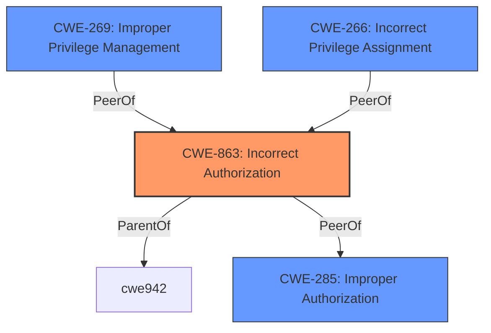

# Raw Analyzer Response for CVE-2025-28411

# Summary
| CWE ID | CWE Name | Confidence | CWE Abstraction Level | CWE Vulnerability Mapping Label | CWE-Vulnerability Mapping Notes |
|---|---|---|---|---|---|
| CWE-863 | Incorrect Authorization | 0.75 | Class | Allowed-with-Review | Primary CWE |

## Evidence and Confidence

*   **Confidence Score:** 0.75
*   **Evidence Strength:** LOW

## Relationship Analysis
The primary CWE identified is CWE-863 (**Incorrect Authorization**). While it is a Class-level CWE, the available evidence does not point to a more specific Base or Variant. Several related CWEs were considered, particularly those dealing with privilege management and access control. However, the lack of detailed information limits the ability to pinpoint the exact nature of the authorization failure.

## Vulnerability Chain
The vulnerability chain begins with an **incorrect authorization** (**CWE-863**) in the editSave method, leading to the impact of privilege escalation.

## Summary of Analysis
The vulnerability description indicates a privilege escalation issue due to a flaw in the `editSave` method of RUoYi v.4.8.0. The primary weakness is identified as **CWE-863 (Incorrect Authorization)**.

The evidence is based on the vulnerability description, which explicitly states that a remote attacker can escalate privileges. However, the lack of technical details about the **incorrect authorization** mechanism reduces confidence. The retriever results also point to several authorization and privilege-related CWEs, reinforcing the selection of **CWE-863**.

**CWE-863** is chosen because it directly addresses the **incorrect authorization** leading to privilege escalation. The provided evidence is limited, so a more specific CWE cannot be selected confidently. Other CWEs like **CWE-266** (Incorrect Privilege Assignment) and **CWE-269** (Improper Privilege Management) were considered but deemed less fitting due to the lack of information about how the privileges were incorrectly managed or assigned. **CWE-285 (Improper Authorization)** is a peer of **CWE-863**, and it's also a possibility. The description for **CWE-285** is "The product does not perform or incorrectly performs an authorization check when an actor attempts to access a resource or perform an action." The description for **CWE-863** is "The product performs an authorization check when an actor attempts to access a resource or perform an action, but it does not correctly perform the check." Given the information, it is unclear whether the authorization check is missing or present but incorrect. **CWE-863** was chosen because it has a higher sparse similarity score.
The "Privileges vs Permissions Guidance" does not indicate that **CWE-863** is incorrect.

Relevant CWE Information:
# Enhanced Context (25 CWEs)
The following CWEs were identified as potentially relevant to this vulnerability:

## CWE-863: Incorrect Authorization
**Abstraction Level**: Class
**Similarity Score**: 1264.00
**Source**: sparse

**Description**:
The product performs an authorization check when an actor attempts to access a resource or perform an action, but it does not correctly perform the check.

**Mapping Guidance**:
- Usage: Allowed-with-Review
- Rationale: This CWE entry is a Class and might have Base-level children that would be more appropriate