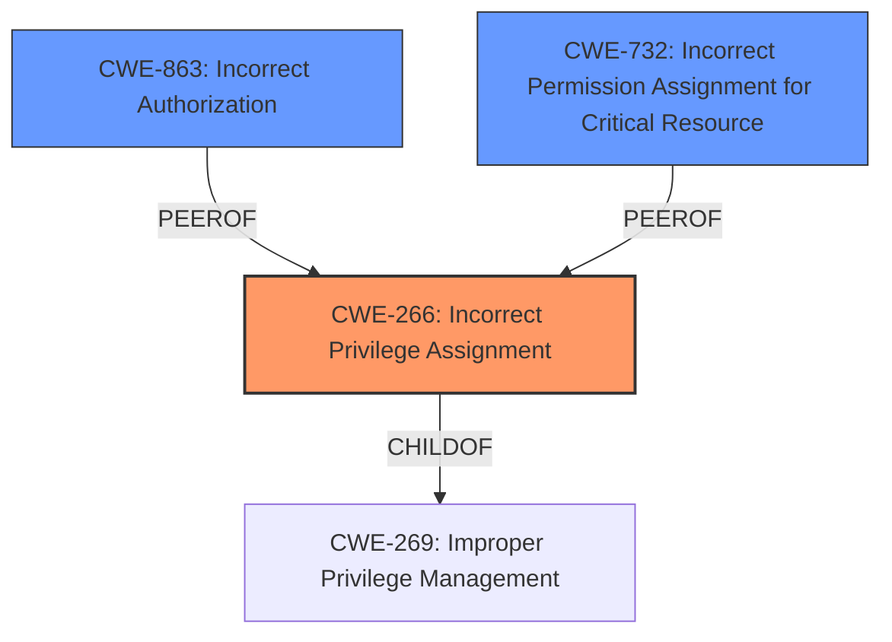

# Enhanced Analysis for CVE-2025-2842

# Summary
| CWE ID | CWE Name | Confidence | CWE Abstraction Level | CWE Vulnerability Mapping Label | CWE-Vulnerability Mapping Notes |
|---|---|---|---|---|---|
| CWE-266 | Incorrect Privilege Assignment | 0.8 | Base | Primary | Allowed |
| CWE-863 | Incorrect Authorization | 0.6 | Class | Secondary | Allowed-with-Review |
| CWE-732 | Incorrect Permission Assignment for Critical Resource | 0.5 | Class | Secondary | Allowed-with-Review |

## Evidence and Confidence

*   **Confidence Score:** 0.7
*   **Evidence Strength:** MEDIUM

## Relationship Analysis
The primary relationship influencing the selection is the parent-child relationship. CWE-266 "Incorrect Privilege Assignment" is a base CWE and a child of the class CWE-269 "Improper Privilege Management". The vulnerability description indicates the Operator assigns the Tempo instance's service account with cluster-monitoring-view ClusterRole which is an incorrect privilege assignment. This makes CWE-266 a better fit than its parent, CWE-269.

CWE-863 "Incorrect Authorization" and CWE-732 "Incorrect Permission Assignment for Critical Resource" are also considered because the vulnerability involves incorrect access control, but they are deemed less specific than CWE-266, which focuses on the **incorrect privilege assignment** itself.



## Vulnerability Chain
The vulnerability chain starts with the **incorrect privilege assignment** (CWE-266) by the Tempo Operator when enabling the Jaeger UI Monitor Tab. This allows a user with specific permissions ('create' on TempoStack and 'get' on Secret) to read the Tempo service account token, leading to unauthorized access to all cluster metrics.

CWE-266 (Incorrect Privilege Assignment) -> User with specific permissions gains access to service account token -> Unauthorized access to all cluster metrics.

## Summary of Analysis
The analysis is primarily based on the provided vulnerability description and CVE reference links content summary, focusing on the root cause identified in the bugzilla.redhat.com content: "When the Jaeger UI Monitor Tab functionality is enabled in a Tempo instance managed by the Tempo Operator, the operator creates a ClusterRoleBinding for the Service Account of the Tempo instance to grant the cluster-monitoring-view ClusterRole."

The graph relationships influenced the selection by highlighting the hierarchical structure and peer relationships between relevant CWEs. This aided in identifying the most specific and appropriate CWE to represent the vulnerability.

CWE-266 is at the optimal level of specificity because it directly addresses the **incorrect privilege assignment**, which is the root cause of the vulnerability. While CWE-863 and CWE-732 are related to authorization and permission issues, they are less specific to the initial **incorrect privilege assignment**.

Relevant CWE Information:

# Enhanced Context (25 CWEs)
The following CWEs were identified as potentially relevant to this vulnerability:

## CWE-266: Incorrect Privilege Assignment
**Abstraction Level**: Base
**Similarity Score**: 0.78
**Source**: dense

**Description**:
A product incorrectly assigns a privilege to a particular actor, creating an unintended sphere of control for that actor.

**Mapping Guidance**:
- Usage: Allowed
- Rationale: This CWE entry is at the Base level of abstraction, which is a preferred level of abstraction for mapping to the root causes of vulnerabilities.

## CWE-863: Incorrect Authorization
**Abstraction Level**: Class
**Similarity Score**: 1840.53
**Source**: sparse

**Description**:
The product performs an authorization check when an actor attempts to access a resource or perform an action, but it does not correctly perform the check.

**Mapping Guidance**:
- Usage: Allowed-with-Review
- Rationale: This CWE entry is a Class and might have Base-level children that would be more appropriate

## CWE-732: Incorrect Permission Assignment for Critical Resource
**Abstraction Level**: Class
**Similarity Score**: 1745.53
**Source**: sparse

**Description**:
The product specifies permissions for a security-critical resource in a way that allows that resource to be read or modified by unintended actors.

**Mapping Guidance**:
- Usage: Allowed-with-Review
- Rationale: While the name itself indicates an assignment of permissions for resources, this is often misused for vulnerabilities in which "permissions" are not checked, which is an "authorization" weakness (CWE-285 or descendants) within CWE's model [REF-1287].

## Technical Explanation for Selected CWEs:

*   **CWE-266: Incorrect Privilege Assignment**

    *   **Match:** The Tempo Operator **incorrectly assigns** the `cluster-monitoring-view` ClusterRole to the Tempo instance's service account, granting it broader access than intended.
    *   **Security Implications:** This allows unauthorized users with specific permissions to access sensitive cluster metrics.
    *   **Relationships:** Child of CWE-269 (Improper Privilege Management).
    *   **Usage:** The MITRE mapping guidance allows for the use of CWE-266.
    *   **Primary/Secondary:** Primary, as this is the root cause of the vulnerability.
*   **CWE-863: Incorrect Authorization**

    *   **Match:** The **authorization** check is present, but it is **incorrect**, leading to unauthorized access to cluster metrics.
    *   **Security Implications:** A user is able to read the token of the Tempo service account.
    *   **Relationships:** Class-level CWE, potentially related to more specific authorization flaws.
    *   **Usage:** Allowed-with-Review.
    *   **Primary/Secondary:** Secondary, as a potential consequence of the privilege assignment.
*   **CWE-732: Incorrect Permission Assignment for Critical Resource**

    *   **Match:** The ClusterRoleBinding for the service account can be considered an **incorrect permission assignment** for a critical resource, allowing unauthorized access.
    *   **Security Implications:** Access to all cluster metrics.
    *   **Relationships:** Class-level CWE.
    *   **Usage:** Allowed-with-Review, but the guidance notes potential for misuse if "permissions" are not checked.
    *   **Primary/Secondary:** Secondary, as it's a related aspect but not the primary root cause.

## CWEs Considered but Not Used:

*   **CWE-269: Improper Privilege Management:** While related, CWE-266 provides a more specific description of the vulnerability.
*   **CWE-285: Improper Authorization:** This is more generic than the specific issue of privilege assignment.
*   **CWE-306: Missing Authentication for Critical Function:** Authentication is not missing, but the authorization based on the assigned privileges is flawed.
*   **CWE-732: Incorrect Permission Assignment for Critical Resource:** While related to permission issues, it is more accurately described as a privilege assignment issue.


## CWE Relationship Analysis

Current CWEs represent these abstraction levels: .


### Vulnerability Chain Analysis

**Chain starting from CWE-863:**
- 863 (Incorrect Authorization) - ROOT


**Chain starting from CWE-732:**
- 732 (Incorrect Permission Assignment for Critical Resource) - ROOT


### CWE Relationship Diagram

```mermaid
graph TD
    classDef primary fill:#f96,stroke:#333,stroke-width:2px
    classDef secondary fill:#69f,stroke:#333
    classDef tertiary fill:#9e9,stroke:#333
```