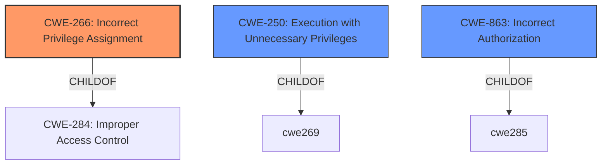

# Analysis for CVE-2025-2858

# Summary
| CWE ID | CWE Name | Confidence | CWE Abstraction Level | CWE Vulnerability Mapping Label | CWE-Vulnerability Mapping Notes |
|---|---|---|---|---|---|
| CWE-266 | Incorrect Privilege Assignment | 0.9 | Base |  Primary CWE | Allowed |
| CWE-250 | Execution with Unnecessary Privileges | 0.7 | Base | Secondary Candidate | Allowed |
| CWE-863 | Incorrect Authorization | 0.6 | Class | Secondary Candidate | Allowed-with-Review |

## Evidence and Confidence

*   **Confidence Score:** 0.9
*   **Evidence Strength:** HIGH

## Relationship Analysis
The primary CWE is CWE-266, Incorrect Privilege Assignment, which is a Base level CWE. The vulnerability involves an attacker with CLI access using the `nice` command to bypass restrictions and gain superuser privileges. This aligns with assigning incorrect privileges. CWE-250 (Execution with Unnecessary Privileges) and CWE-863 (Incorrect Authorization) were considered, but the specific scenario of the `nice` command being used to escalate privileges points more directly to an initial misconfiguration or **incorrect privilege assignment**. CWE-863 is less specific and more appropriate if the authorization check itself was flawed, but here, the **privilege was incorrectly granted initially**, bypassing the authorization checks. The other CWEs from the Retriever results were too general, and the CWE guidance on privileges vs. permissions suggests CWE-266 when roles are misassigned.

## Vulnerability Chain
The vulnerability chain starts with an **incorrect privilege assignment** (CWE-266), where the `nice` command, available to a CLI user, allows for privilege escalation. This bypasses authorization checks, leading to superuser privileges and bypassing restrictions. The root cause is the **incorrect privilege assignment** to the `nice` command. The impact is privilege escalation.

## Summary of Analysis
The analysis is heavily based on the provided evidence, particularly the "CVE Reference Links Content Summary", which highlights the use of the `nice` command for privilege escalation. The key phrase is "An attacker with access to the CLI of the device could use the `nice` command to bypass restrictions and elevate privileges to superuser." This explicitly indicates that the attacker is able to elevate privileges. The CWE guidance for privilege vs. permission issues also supports this selection, advising that when a user gets a higher privilege role by mistake, CWE-266 is the best choice. The other CWEs from the Retriever results were deemed less specific or not as well-aligned with the detailed vulnerability description. The selection of CWE-266 is at the optimal level of specificity, as it clearly defines the root cause of the privilege escalation.

Relevant CWE Information:

# Enhanced Context (25 CWEs)
The following CWEs were identified as potentially relevant to this vulnerability:

## CWE-266: Incorrect Privilege Assignment
**Abstraction Level**: Base
**Similarity Score**: 0.79
**Source**: dense

**Description**:
A product incorrectly assigns a privilege to a particular actor, creating an unintended sphere of control for that actor.

**Mapping Guidance**:
- Usage: Allowed
- Rationale: This CWE entry is at the Base level of abstraction, which is a preferred level of abstraction for mapping to the root causes of vulnerabilities.

## CWE-250: Execution with Unnecessary Privileges
**Abstraction Level**: base
**Similarity Score**: 2.47
**Source**: graph

**Description**:
CWE-250: Execution with Unnecessary Privileges

**Mapping Guidance**:
- Usage: Allowed
- Rationale: This CWE entry is at the Base level of abstraction, which is a preferred level of abstraction for mapping to the root causes of vulnerabilities.

## CWE-863: Incorrect Authorization
**Abstraction Level**: Class
**Similarity Score**: 1768.67
**Source**: sparse

**Description**:
The product performs an authorization check when an actor attempts to access a resource or perform an action, but it does not correctly perform the check.

**Mapping Guidance**:
- Usage: Allowed-with-Review
- Rationale: This CWE entry is a Class and might have Base-level children that would be more appropriate

## CWE-285: Improper Authorization
**Abstraction Level**: Class
**Similarity Score**: 1747.94
**Source**: sparse

**Description**:
The product does not perform or incorrectly performs an authorization check when an actor attempts to access a resource or perform an action.

**Mapping Guidance**:
- Usage: Discouraged
- Rationale: CWE-285 is high-level and lower-level CWEs can frequently be used instead. It is a level-1 Class (i.e., a child of a Pillar).

**CWEs Considered but Not Used:**

*   CWE-269: Improper Privilege Management - Discouraged due to being too general. It describes the impact (privilege escalation) but not the cause.
*   CWE-284: Improper Access Control - Too general; a more specific CWE is available.
*   CWE-20: Improper Input Validation - Not directly related to the root cause, as the issue is with privilege assignment, not input validation.
*   CWE-732: Incorrect Permission Assignment for Critical Resource - Close, but not as accurate as CWE-266, which refers to privileges in general.
*   CWE-119: Improper Restriction of Operations within the Bounds of a Memory Buffer - Irrelevant to the vulnerability.
*   CWE-78: Improper Neutralization of Special Elements used in an OS Command ('OS Command Injection') - The vulnerability is related to privilege escalation and not command injection.
*   CWE-22: Improper Limitation of a Pathname to a Restricted Directory ('Path Traversal') - Not relevant to the vulnerability description.