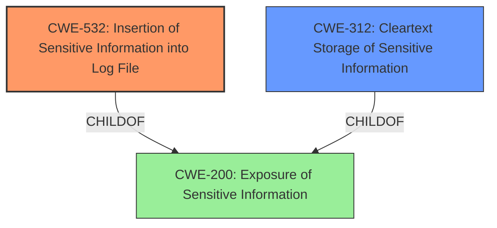

# Analysis for CVE-2025-2877

# Summary

| CWE ID  | CWE Name                                                 | Confidence | CWE Abstraction Level | CWE Vulnerability Mapping Label | CWE-Vulnerability Mapping Notes |
| :-------- | :------------------------------------------------------- | :--------- | :-------------------- | :------------------------------ | :------------------------------ |
| CWE-532 | Insertion of Sensitive Information into Log File      | 0.9        | Base                  | Primary CWE                     | Allowed                       |
| CWE-312 | Cleartext Storage of Sensitive Information | 0.6        | Base                  | Secondary Candidate                      | Allowed                       |

## Evidence and Confidence

*   **Confidence Score:** 0.9
*   **Evidence Strength:** HIGH

## Relationship Analysis

The primary CWE is CWE-532, which describes the insertion of sensitive information into a log file. Several other CWEs were considered due to their relevance to handling sensitive information, particularly passwords. The relationships between CWEs such as parent-child (e.g., CWE-532 being a child of CWE-200) and chain relationships (e.g., the potential for CWE-212 to precede CWE-201) helped to narrow down the most appropriate CWE. The base level of abstraction was preferred for specificity.

## Vulnerability Chain

The vulnerability chain starts with the **insertion of inventory passwords in plain text** into the log file when debug verbosity is enabled.

1.  **Root Cause:** **Inventory passwords are exposed in plain text** when starting a rulebook activation with verbosity set to debug.
2.  **Weakness:** CWE-532 Insertion of Sensitive Information into Log File due to debug settings causing passwords to be written in plaintext.
3.  **Impact:** Exposure of sensitive inventory passwords, potentially leading to unauthorized access or control.

## Summary of Analysis

The primary assessment is based on the provided evidence indicating that inventory passwords are being written in plain text to log files when debug verbosity is enabled. This aligns directly with CWE-532 (Insertion of Sensitive Information into Log File). The selection is further supported by the retriever results, which list CWE-532 as the top candidate.

The graph relationships helped to understand the context of CWE-532 within broader categories of information exposure. The decision to use CWE-532 is based on its specificity to the act of inserting sensitive information into log files, which is a direct match to the vulnerability description.

Relevant CWE Information:

*   CWE-532 (Insertion of Sensitive Information into Log File): The product writes sensitive information to a log file. This aligns directly with the vulnerability description.
*   CWE-312 (Cleartext Storage of Sensitive Information): The product stores sensitive information in cleartext within a resource that might be accessible to another control sphere. This is a closely related CWE, and could be considered a secondary weakness because the log file itself is a form of storage.

Other CWEs considered but not used:

*   CWE-256 (Plaintext Storage of a Password): While related, the specific issue is the logging of the password, not general storage.
*   CWE-522 (Insufficiently Protected Credentials): A more general class that doesn't specifically address the logging issue.
*   CWE-214 (Invocation of Process Using Visible Sensitive Information): Not directly applicable as the issue is not the invocation of a process, but the logging of sensitive data.
*   CWE-201 (Insertion of Sensitive Information Into Sent Data): This CWE is about sending data, not logging it.

The final selection of CWE-532 is at the optimal level of specificity, directly addressing the vulnerability of sensitive information being written to log files.