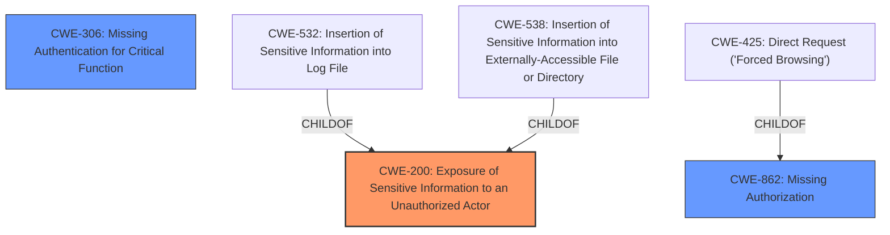

# Analysis for CVE-2025-2883

# Summary
| CWE ID | CWE Name | Confidence | CWE Abstraction Level | CWE Vulnerability Mapping Label | CWE-Vulnerability Mapping Notes |
|---|---|---|---|---|---|
| CWE-200 | Exposure of Sensitive Information to an Unauthorized Actor | 0.9 | Class | Primary CWE | Discouraged because it is a high level class, but in this case, it seems appropriate since the root cause is not clear from the provided evidence. |
| CWE-306 | Missing Authentication for Critical Function | 0.6 | Base | Secondary Candidate | Allowed, but less likely as the primary issue since the exposure is via a publicly accessible file. |
| CWE-862 | Missing Authorization | 0.5 | Class | Secondary Candidate | Allowed-with-Review, but less likely as the primary issue since the exposure is via a publicly accessible file. |

## Evidence and Confidence

*   **Confidence Score:** 0.7
*   **Evidence Strength:** MEDIUM

## Relationship Analysis
The primary CWE selected is CWE-200, which is a class-level CWE. The retriever results also suggested CWE-306 and CWE-862. CWE-306 and CWE-862 are related to authentication and authorization, respectively. The vulnerability description mentions unauthenticated attackers, which makes these CWEs plausible. However, the **sensitive information exposure** occurs through a publicly accessible `phpinfo.php` script, making the lack of access control the more direct cause, although it is not explicit.

## Vulnerability Chain
The vulnerability chain starts with a publicly accessible `phpinfo.php` script. Because the script is publicly accessible, unauthenticated attackers can view potentially **sensitive information**.

Vulnerability Chain:
1.  Publicly Accessible `phpinfo.php` script
2.  **Sensitive Information Exposure**

## Summary of Analysis
The initial analysis identified **Sensitive Information Exposure** as the primary **weakness**. The vulnerability occurs because of a publicly accessible `phpinfo.php` script. This allows unauthenticated attackers to view potentially **sensitive information**.

The retriever results suggested several CWEs, including CWE-200, CWE-306, and CWE-862. CWE-200 (Exposure of Sensitive Information to an Unauthorized Actor) is a class-level CWE that broadly describes the vulnerability. CWE-306 (Missing Authentication for Critical Function) and CWE-862 (Missing Authorization) are related to authentication and authorization, which are plausible given that the attackers are unauthenticated.

The final decision is to assign CWE-200 as the primary CWE, because the direct cause is the exposure itself, and not necessarily a **missing authentication** or **authorization**. Though **missing authentication** or **authorization** could be the root cause, the description does not provide enough detail to confirm. The evidence for this decision comes directly from the vulnerability description: "This makes it possible for unauthenticated attackers to view potentially **sensitive information** contained in the exposed file."

CWE-200 is chosen despite it being a class level CWE and discouraged. Without more information, this is the best fit.