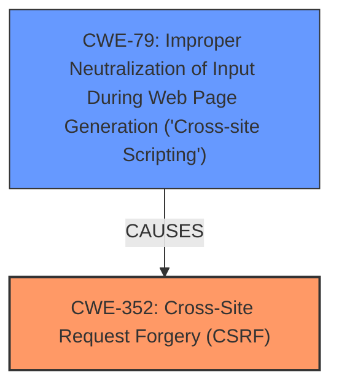

# Analysis Report for CVE-2025-28892

# Vulnerability Analysis Report: CVE-2025-28892

## Description

**Cross-Site Request Forgery** (CSRF) vulnerability in a2rocklobster FTP Sync allows Stored **XSS**. This issue affects FTP Sync from n/a through 1.1.6.

## Vulnerability Description Key Phrases

- **Rootcause:** Cross-Site Request Forgery
- **Weakness:** XSS
- **Product:** a2rocklobster FTP Sync
- **Version:** n/a through 1.1.6

## Analysis (with Relationship Data)

# Summary
| CWE ID | CWE Name | Confidence | CWE Abstraction Level | CWE Vulnerability Mapping Label | CWE-Vulnerability Mapping Notes |
|---|---|---|---|---|---|
| CWE-352 | Cross-Site Request Forgery (CSRF) | 1.0 | Compound | Primary | Allowed |
| CWE-79 | Improper Neutralization of Input During Web Page Generation ('Cross-site Scripting') | 1.0 | Base | Secondary | Allowed |

## Evidence and Confidence

*   **Confidence Score:** 1.0
*   **Evidence Strength:** HIGH

## Relationship Analysis
The primary weakness is identified as CWE-352 [Cross-Site Request Forgery (CSRF)]. The vulnerability description and CVE summary both explicitly mention CSRF as the root cause. CSRF can lead to other vulnerabilities. In this case, the vulnerability allows Stored **XSS**, which is represented by CWE-79 [Improper Neutralization of Input During Web Page Generation ('Cross-site Scripting')]. CWE-79 is a base level CWE. CWE-352 is a compound weakness.



## Vulnerability Chain
The vulnerability chain starts with the **Cross-Site Request Forgery** (CWE-352), which allows an attacker to force a user to perform actions they did not intend to. This, in turn, leads to Stored **XSS** (CWE-79), because the injected input is not properly neutralized.

CWE-352 (Root Cause) -> CWE-79 (Impact)

## Summary of Analysis
The initial assessment identified two CWEs based on the vulnerability description and supporting evidence. The primary focus was on identifying the root cause and any subsequent weaknesses.

The vulnerability description and CVE summary clearly state the presence of a **Cross-Site Request Forgery** (CSRF), indicating CWE-352 as the primary weakness. The description also mentions that the CSRF vulnerability allows for Stored **XSS**, suggesting that the lack of proper input neutralization (CWE-79) is a consequence of the CSRF.

The retriever results also support this assessment, with both CWE-79 and CWE-352 appearing as top candidates.

The final decision was to map CWE-352 as the primary weakness and CWE-79 as a secondary weakness. This mapping aligns with the vulnerability chain, where the CSRF vulnerability enables the exploitation of the **XSS** vulnerability. The selected CWEs are at the appropriate level of specificity, with CWE-352 being a compound weakness and CWE-79 being a base weakness.

The high confidence in this assessment is based on the explicit mention of CSRF and **XSS** in the vulnerability description and the supporting evidence from the CVE summary and retriever results.


## CWE Relationship Analysis

Current CWEs represent these abstraction levels: .


### Vulnerability Chain Analysis

**Chain starting from CWE-352:**
- 352 (Cross-Site Request Forgery (CSRF)) - ROOT


**Chain starting from CWE-79:**
- 79 (Improper Neutralization of Input During Web Page Generation ('Cross-site Scripting')) - ROOT


### CWE Relationship Diagram

```mermaid
graph TD
    classDef primary fill:#f96,stroke:#333,stroke-width:2px
    classDef secondary fill:#69f,stroke:#333
    classDef tertiary fill:#9e9,stroke:#333
```


*Report generated on 2025-07-14 16:08:58*
