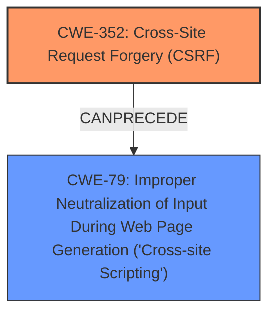

# Analysis Report for CVE-2025-28923

# Vulnerability Analysis Report: CVE-2025-28923

## Description

**Cross-Site Request Forgery** (CSRF) vulnerability in philippe No Disposable Email allows **Stored XSS**. This issue affects No Disposable Email from n/a through 2.5.1.

## Vulnerability Description Key Phrases

- **Rootcause:** Cross-Site Request Forgery
- **Weakness:** Stored XSS
- **Product:** philippe No Disposable Email
- **Version:** n/a through 2.5.1

## Analysis (with Relationship Data)

# Summary
| CWE ID | CWE Name | Confidence | CWE Abstraction Level | CWE Vulnerability Mapping Label | CWE-Vulnerability Mapping Notes |
|---|---|---|---|---|---|
| CWE-352 | Cross-Site Request Forgery (CSRF) | 0.9 | Compound | Primary | Allowed |
| CWE-79 | Improper Neutralization of Input During Web Page Generation ('Cross-site Scripting') | 0.9 | Base | Secondary | Allowed |

## Evidence and Confidence

*   **Confidence Score:** 0.9
*   **Evidence Strength:** HIGH

## Relationship Analysis
The primary weakness is identified as CWE-352, Cross-Site Request Forgery (CSRF), which allows for a secondary weakness, CWE-79, Improper Neutralization of Input During Web Page Generation ('Cross-site Scripting'), specifically Stored XSS. The relationship here is that successful exploitation of the CSRF vulnerability allows an attacker to inject malicious scripts that are then stored and executed in the context of other users.



## Vulnerability Chain
The vulnerability chain starts with:
1.  **Root Cause:** CWE-352, Cross-Site Request Forgery (CSRF) - The application **does not sufficiently verify** the origin of requests, allowing an attacker to forge requests on behalf of legitimate users.
2.  **Weakness:** CWE-79, Improper Neutralization of Input During Web Page Generation ('Cross-site Scripting') - The forged requests, due to the CSRF, can inject malicious scripts that are **not properly neutralized**, leading to Stored XSS.
3.  **Impact:** The injected scripts are stored and executed in the context of other users, leading to potential data theft, account takeover, or other malicious activities.

## Summary of Analysis
The analysis is based on the provided vulnerability description and the associated CVE reference. The key phrases "Cross-Site Request Forgery" and "Stored XSS" provide strong evidence for the selection of CWE-352 and CWE-79, respectively. The CVE reference confirms the CSRF vulnerability and its potential to allow malicious actions. The relationship analysis shows that the CSRF vulnerability can lead to Stored XSS by allowing an attacker to inject malicious scripts.

CWE-352 is selected as the primary CWE because it is the root cause of the vulnerability. The application's **failure to properly verify** the origin of requests allows an attacker to forge requests and inject malicious scripts. CWE-79 is selected as a secondary CWE because it describes the weakness that allows the injected scripts to be executed. The application **does not neutralize** the injected scripts, allowing them to be stored and executed in the context of other users. Both CWEs are at the Base level of abstraction, which is the preferred level for mapping vulnerabilities.

Other CWEs considered but not used:
*   CWE-89 (Improper Neutralization of Special Elements used in an SQL Command ('SQL Injection')): While SQL Injection is a common vulnerability, there's no evidence in the description suggesting SQLi. Therefore, it's not included.
*   CWE-93 (Improper Neutralization of CRLF Sequences ('CRLF Injection')): Similar to SQLi, there is no indication of CRLF injection in the description.
*   CWE-425 (Direct Request ('Forced Browsing')): While related to access control, CSRF is more specific to forged requests, making CWE-352 a better fit.
*   CWE-80 (Improper Neutralization of Script-Related HTML Tags in a Web Page (Basic XSS)): CWE-79 is a more general case of XSS and Stored XSS is mentioned so it is preferred.


## CWE Relationship Analysis

Current CWEs represent these abstraction levels: .


### Vulnerability Chain Analysis

**Chain starting from CWE-89:**
- 89 (Improper Neutralization of Special Elements used in an SQL Command ('SQL Injection')) - ROOT


**Chain starting from CWE-93:**
- 93 (Improper Neutralization of CRLF Sequences ('CRLF Injection')) - ROOT


### CWE Relationship Diagram

```mermaid
graph TD
    classDef primary fill:#f96,stroke:#333,stroke-width:2px
    classDef secondary fill:#69f,stroke:#333
    classDef tertiary fill:#9e9,stroke:#333
```


*Report generated on 2025-07-14 16:11:17*
