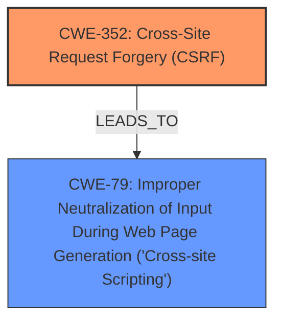

# Raw Analyzer Response for CVE-2025-28933

# Summary
| CWE ID | CWE Name | Confidence | CWE Abstraction Level | CWE Vulnerability Mapping Label | CWE-Vulnerability Mapping Notes |
|---|---|---|---|---|---|
| CWE-352 | Cross-Site Request Forgery (CSRF) | 0.9 | Compound | Allowed | Primary CWE |
| CWE-79 | Improper Neutralization of Input During Web Page Generation ('Cross-site Scripting') | 0.8 | Base | Allowed | Secondary |

## Evidence and Confidence

*   **Confidence Score:** 0.85
*   **Evidence Strength:** HIGH

## Relationship Analysis
The primary weakness is CWE-352 [Cross-Site Request Forgery (CSRF)], which allows the secondary weakness CWE-79 [Improper Neutralization of Input During Web Page Generation ('Cross-site Scripting')] to occur, leading to Stored XSS. CWE-352 is a compound weakness, while CWE-79 is a base weakness. This reflects that the CSRF vulnerability is a combination of multiple factors leading to the XSS. There isn't a direct relationship between these two, but CSRF can *lead* to other vulnerabilities such as XSS.

## Vulnerability Chain
The vulnerability chain starts with a **Cross-Site Request Forgery (CSRF)** vulnerability (CWE-352). Because of the **CSRF**, an attacker can inject malicious code. The application fails to properly neutralize this input, leading to **Stored XSS** (CWE-79).

## Summary of Analysis
The initial assessment considered the retriever results, which highly ranked CWE-79 [Improper Neutralization of Input During Web Page Generation ('Cross-site Scripting')] and CWE-352 [Cross-Site Request Forgery (CSRF)]. The vulnerability description explicitly mentions both **CSRF** and **Stored XSS**. The key is determining which is the root cause and which is a consequence.

The "Vulnerability Description Key Phrases" section identifies **Cross-Site Request Forgery (CSRF)** as the root cause and **Stored XSS** as a weakness. The "CVE Reference Links Content Summary" section confirms that the vulnerability is **Cross-Site Request Forgery (CSRF)**. A successful CSRF attack allows injection of malicious code, which the application does not properly neutralize leading to the **Stored XSS**.

Therefore, the primary CWE is CWE-352 [Cross-Site Request Forgery (CSRF)], and the secondary CWE is CWE-79 [Improper Neutralization of Input During Web Page Generation ('Cross-site Scripting')].

The selected CWEs are at the optimal level of specificity. CWE-352 [Cross-Site Request Forgery (CSRF)] is a compound weakness and represents the initial vulnerability that allows the subsequent XSS vulnerability. CWE-79 [Improper Neutralization of Input During Web Page Generation ('Cross-site Scripting')] is a base weakness and accurately reflects the **improper neutralization** of user-controllable input.

Other CWEs Considered:

*   CWE-80 [Improper Neutralization of Script-Related HTML Tags in a Web Page (Basic XSS)]: While related to XSS, CWE-79 is a more general and appropriate fit as it covers improper neutralization, not just specific HTML tags.
*   CWE-89 [Improper Neutralization of Special Elements used in an SQL Command ('SQL Injection')]: This is specific to SQL injection, which is not mentioned in the vulnerability description.
*   CWE-601 [URL Redirection to Untrusted Site ('Open Redirect')]: This is not relevant to the vulnerability description.
*   CWE-434 [Unrestricted Upload of File with Dangerous Type]: This is not relevant to the vulnerability description.
*   CWE-425 [Direct Request ('Forced Browsing')]: This is related to authorization bypass, which is not the primary issue here.
*   CWE-918 [Server-Side Request Forgery (SSRF)]: This is not relevant to the vulnerability description.