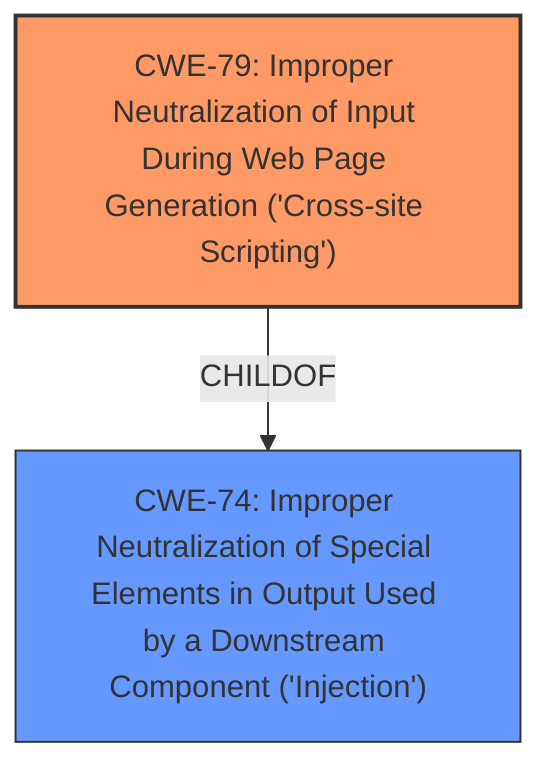

# Analysis for CVE-2025-2929

# Summary
| CWE ID | CWE Name | Confidence | CWE Abstraction Level | CWE Vulnerability Mapping Label | CWE-Vulnerability Mapping Notes |
|---|---|---|---|---|---|
| CWE-79 | Improper Neutralization of Input During Web Page Generation ('Cross-site Scripting') | 1.0 | Base | Allowed | Primary CWE. The vulnerability is a reflected XSS due to a parameter not being sanitized and escaped before being outputted. |

## Evidence and Confidence

*   **Confidence Score:** 1.0
*   **Evidence Strength:** HIGH

## Relationship Analysis
The primary relationship that influenced my decision was the parent-child relationship between CWE-74 (Improper Neutralization of Special Elements in Output Used by a Downstream Component ('Injection')) and CWE-79. While CWE-74 is a more general class of vulnerability, the specifics of this case clearly indicate a Cross-Site Scripting issue, making CWE-79 the more appropriate and specific choice.

## Vulnerability Chain
The vulnerability chain is straightforward:
1.  **Root Cause:** **Missing sanitization and escaping** of a parameter before output.
2.  **Weakness:** Reflected Cross-Site Scripting (XSS).
3.  **Impact:** An attacker can craft a malicious URL and trick an administrator into clicking it, potentially leading to account compromise or other malicious actions.

## Summary of Analysis
The analysis is based on the provided evidence, which includes a clear description of the vulnerability, the root cause (**missing sanitization and escaping**), and the resulting weakness (reflected XSS). The analysis of CVE-2025-2929 content also explicitly mentions CWE-79.

The vulnerability description states: "The Order Delivery Date WordPress plugin before 12.4.0 does not sanitise and escape a parameter before outputting it back in the page, leading to a Reflected **Cross-Site Scripting** which could be used against high privilege users such as admin."

The retriever results also listed CWE-79 as a strong candidate.

CWE-79 is at the optimal level of specificity because it directly describes the type of vulnerability (XSS) and the **root cause** (**improper neutralization of input**).

Relevant CWE Information:

# Enhanced Context (25 CWEs)
The following CWEs were identified as potentially relevant to this vulnerability:

## CWE-472: External Control of Assumed-Immutable Web Parameter
**Abstraction Level**: Base
**Similarity Score**: 0.80
**Source**: dense

**Description**:
The web application does not sufficiently verify inputs that are assumed to be immutable but are actually externally controllable, such as hidden form fields.

**Mapping Guidance**:
- Usage: Allowed
- Rationale: This CWE entry is at the Base level of abstraction, which is a preferred level of abstraction for mapping to the root causes of vulnerabilities.

## CWE-79: Improper Neutralization of Input During Web Page Generation ('Cross-site Scripting')
**Abstraction Level**: Base
**Similarity Score**: 1698.38
**Source**: sparse

**Description**:
The product does not neutralize or incorrectly neutralizes user-controllable input before it is placed in output that is used as a web page that is served to other users.

**Mapping Guidance**:
- Usage: Allowed
- Rationale: This CWE entry is at the Base level of abstraction, which is a preferred level of abstraction for mapping to the root causes of vulnerabilities.