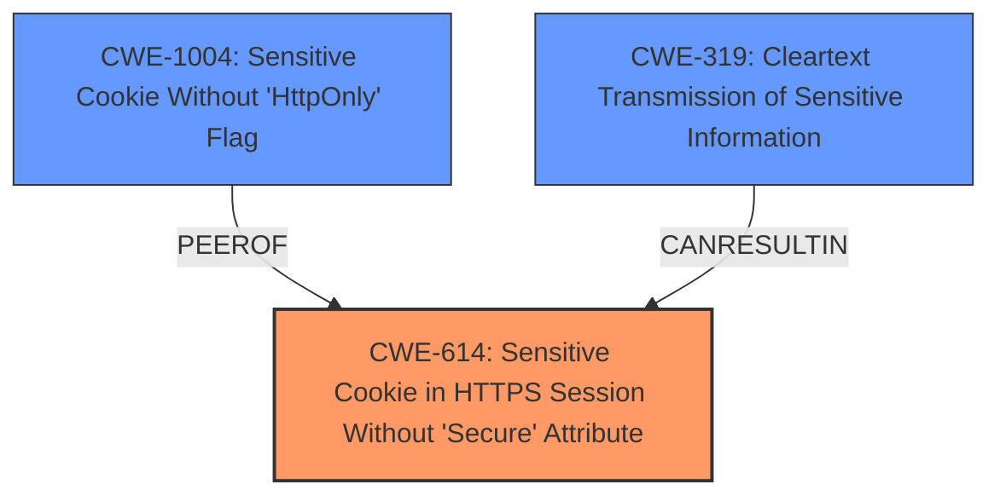

# Analysis for CVE-2025-29314

# Summary
| CWE ID | CWE Name | Confidence | CWE Abstraction Level | CWE Vulnerability Mapping Label | CWE-Vulnerability Mapping Notes |
|---|---|---|---|---|---|
| CWE-614 | Sensitive Cookie in HTTPS Session Without 'Secure' Attribute | 0.9 | Variant | Allowed | Primary CWE: **Insecure Shiro cookie configurations** lead to sensitive information exposure due to missing secure attribute. |
| CWE-1004 | Sensitive Cookie Without 'HttpOnly' Flag | 0.8 | Variant | Allowed | Secondary CWE: Missing HttpOnly flag allows client-side access to cookies. |
| CWE-319 | Cleartext Transmission of Sensitive Information | 0.7 | Base | Allowed | Secondary CWE: Cookies transmitted in cleartext can be intercepted in MITM attacks. |

## Evidence and Confidence

*   **Confidence Score:** 0.8
*   **Evidence Strength:** HIGH

## Relationship Analysis
The primary weakness is the **insecure configuration of Shiro cookies**, specifically the absence of the "Secure" attribute, which leads to **CWE-614** (Sensitive Cookie in HTTPS Session Without 'Secure' Attribute). A related issue is the absence of the "HttpOnly" flag (**CWE-1004**), which allows client-side scripts to access the cookie. The absence of the Secure attribute can also lead to **CWE-319** (Cleartext Transmission of Sensitive Information) when the cookie is transmitted over an unencrypted channel, making it vulnerable to man-in-the-middle attacks.

## Vulnerability Chain
The vulnerability chain starts with **insecure cookie configurations** (**CWE-614**). This leads to the potential exposure of session IDs, which, if transmitted in cleartext (**CWE-319**), can be intercepted in a man-in-the-middle attack. The missing HttpOnly flag (**CWE-1004**) further exacerbates the issue by allowing client-side scripts to steal the session ID. This allows attackers to access sensitive information.

## Summary of Analysis
The initial assessment correctly identifies the root cause as **insecure Shiro cookie configurations**. The primary CWE, **CWE-614**, accurately reflects the absence of the Secure attribute for sensitive cookies. The supporting evidence comes from the vulnerability description key phrases, which highlights the root cause, and the CVE reference links content summary, which specifies the disabled Secure/HttpOnly cookie flags. Additionally, **CWE-1004** (Sensitive Cookie Without 'HttpOnly' Flag) is included to address the missing HttpOnly attribute, and **CWE-319** (Cleartext Transmission of Sensitive Information) is included because a man-in-the-middle attack is listed as the attack vector, therefore cookies are transmitted in clear text. These CWEs are at the appropriate level of specificity (Variant and Base).

Relevant CWE Information:
- **CWE-614:** Captures the core problem of transmitting sensitive cookies without the "Secure" attribute.
- **CWE-1004:** Accounts for the risk of client-side script access due to the missing "HttpOnly" flag.
- **CWE-319:** Accounts for the man-in-the-middle attack vector, where cookies are transmitted in cleartext.
- **CWE-522 Insufficiently Protected Credentials:** This was considered but deemed less specific than the chosen CWEs as it is a broader class. The vulnerability is more directly related to the cookie configuration issues.
- **CWE-784 Reliance on Cookies without Validation and Integrity Checking in a Security Decision:** This was considered, but the core issue isn't the reliance on the cookie, but the insecure configuration.
- **CWE-330 Use of Insufficiently Random Values:** This was not a good fit because there was no evidence in the summary to indicate this was happening.