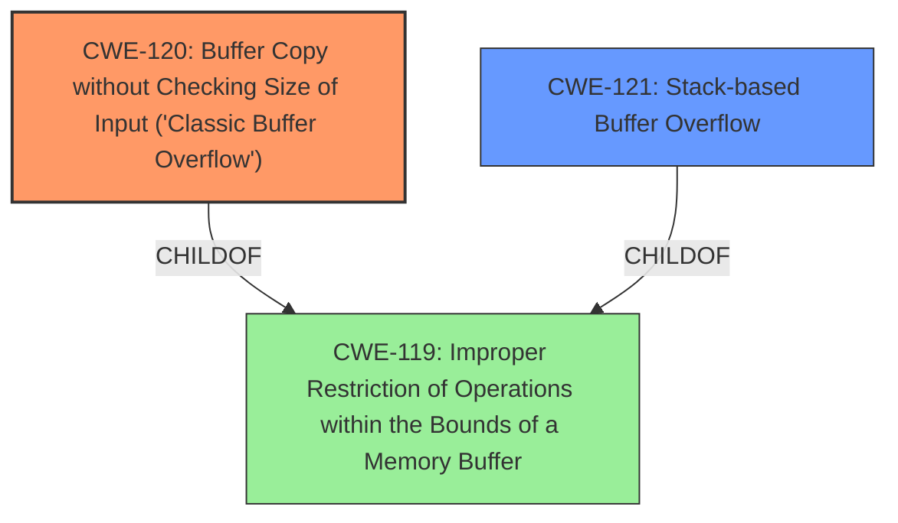

# Analysis Report for CVE-2025-29357

# Vulnerability Analysis Report: CVE-2025-29357

## Description

Tenda RX3 US_RX3V1.0br_V16.03.13.11_multi_TDE01 is vulnerable to Buffer Overflow via the startIp and endIp parameters at /goform/SetPptpServerCfg. This vulnerability allows attackers to cause a Denial of Service (DoS) via a crafted packet.

## Vulnerability Description Key Phrases

- **Weakness:** buffer overflow
- **Impact:** denial of service
- **Vector:** crafted packet
- **Attacker:** attackers
- **Product:** Tenda RX3 US_RX3V1.0br_V16.03.13.11_multi_TDE01
- **Component:** /goform/SetPptpServerCfg

## Analysis (with Relationship Data)

# Summary
| CWE ID | CWE Name | Confidence | CWE Abstraction Level | CWE Vulnerability Mapping Label | CWE-Vulnerability Mapping Notes |
|---|---|---|---|---|---|
| CWE-120 | Buffer Copy without Checking Size of Input ('Classic Buffer Overflow') | 0.8 | Base | Allowed-with-Review | Primary CWE. The vulnerability is caused by copying a buffer without checking its size, which leads to a buffer overflow. |
| CWE-121 | Stack-based Buffer Overflow | 0.6 | Variant | Allowed | Secondary candidate. The description implies the buffer is on the stack. |
| CWE-119 | Improper Restriction of Operations within the Bounds of a Memory Buffer | 0.5 | Class | Discouraged | Secondary candidate. It's a general case of buffer overflow. |

## Evidence and Confidence

*   **Confidence Score:** 0.7
*   **Evidence Strength:** MEDIUM

## Relationship Analysis
The primary CWE is CWE-120, which is a base-level CWE that describes the classic buffer overflow condition where a buffer is copied without checking the size of the input. This leads to writing past the end of the buffer. CWE-121 is a variant of buffer overflow that specifically occurs on the stack. CWE-119 is a more general class that encompasses all improper restrictions of operations within the bounds of a memory buffer.



## Vulnerability Chain
The vulnerability chain starts with the **buffer overflow** (**weakness**), which is caused by copying data without checking the size of the input. This leads to writing past the end of the buffer, resulting in a denial of service (**impact**).

## Summary of Analysis
The vulnerability description states a **buffer overflow** exists in Tenda RX3 due to improper handling of the `startIp` and `endIp` parameters in `/goform/SetPptpServerCfg`. This allows attackers to cause a Denial of Service (DoS) via a crafted packet.

The primary CWE is CWE-120, as it is the most specific and accurate representation of the vulnerability. The "Retriever Results" lists CWE-120 with a good score. The description clearly indicates a buffer is being copied without checking the size, leading to the overflow.

CWE-121 is considered as a secondary candidate because the vulnerability occurs in the stack. The "Retriever Results" lists CWE-121 also with a good score.

CWE-119 is a more general case. The "Retriever Results" lists CWE-119 with the highest score. However, the description is more specific than the general case, so it is not the best choice.

The final selection is based on the evidence provided in the vulnerability description and the relationships between the CWEs. CWE-120 provides the optimal level of specificity.


## CWE Relationship Analysis

Current CWEs represent these abstraction levels: .


### Vulnerability Chain Analysis

**Chain starting from CWE-119:**
- 119 (Improper Restriction of Operations within the Bounds of a Memory Buffer) - ROOT


**Chain starting from CWE-121:**
- 121 (Stack-based Buffer Overflow) - ROOT


### CWE Relationship Diagram

```mermaid
graph TD
    classDef primary fill:#f96,stroke:#333,stroke-width:2px
    classDef secondary fill:#69f,stroke:#333
    classDef tertiary fill:#9e9,stroke:#333
```


*Report generated on 2025-07-14 16:23:55*
