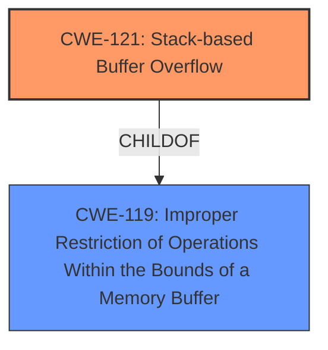

# Enhanced Analysis for CVE-2025-29385

# Summary
| CWE ID | CWE Name | Confidence | CWE Abstraction Level | CWE Vulnerability Mapping Label | CWE-Vulnerability Mapping Notes |
|---|---|---|---|---|---|
| CWE-121 | Stack-based Buffer Overflow | 1.0 | Variant | Primary | Allowed |

## Evidence and Confidence

*   **Confidence Score:** 1.0
*   **Evidence Strength:** HIGH

## Relationship Analysis
The primary relationship that influenced the decision was the direct match of the vulnerability description to the definition of CWE-121. CWE-121 is a variant of buffer overflow, specifically occurring on the stack, aligning perfectly with the provided information. Other CWEs related to buffer overflows were considered, but CWE-121 was the most specific and accurate representation.



## Vulnerability Chain
The vulnerability chain starts with the **stack overflow** in the `cloneType` parameter of `/goform/AdvSetMacMtuWan`, leading to remote arbitrary code execution. The root cause is the **lack of proper bounds checking**, resulting in the overflow.

## Summary of Analysis
The analysis is based on the vulnerability description indicating a **stack overflow** in the `cloneType` parameter. The description directly aligns with CWE-121, "Stack-based Buffer Overflow." The high retriever score and the explicit mention of "stack overflow" provide strong evidence for this classification. The retriever results confirm that CWE-121 is the best match. The CWE is at the Variant level of abstraction, which is the most specific level applicable based on the available information.

Relevant CWE Information:

# Enhanced Context (25 CWEs)
The following CWEs were identified as potentially relevant to this vulnerability:

## CWE-121: Stack-based Buffer Overflow
**Abstraction Level**: Variant
**Similarity Score**: 0.72
**Source**: dense

**Description**:
A stack-based buffer overflow condition is a condition where the buffer being overwritten is allocated on the stack (i.e., is a local variable or, rarely, a parameter to a function).

**Mapping Guidance**:
- Usage: Allowed
- Rationale: This CWE entry is at the Variant level of abstraction, which is a preferred level of abstraction for mapping to the root causes of vulnerabilities.

## CWE-190: Integer Overflow or Wraparound
**Abstraction Level**: Base
**Similarity Score**: 464.42
**Source**: sparse

**Description**:
The product performs a calculation that can
         produce an integer overflow or wraparound when the logic
         assumes that the resulting value will always be larger than
         the original value. This occurs when an integer value is
         incremented to a value that is too large to store in the
         associated representation. When this occurs, the value may
         become a very small or negative number.

**Mapping Guidance**:
- Usage: Allowed
- Rationale: This CWE entry is at the Base level of abstraction, which is a preferred level of abstraction for mapping to the root causes of vulnerabilities.

## CWE-120: Buffer Copy without Checking Size of Input ('Classic Buffer Overflow')
**Abstraction Level**: base
**Similarity Score**: 3.57
**Source**: graph

**Description**:
CWE-120: Buffer Copy without Checking Size of Input ('Classic Buffer Overflow')

**Mapping Guidance**:
- Usage: Allowed-with-Review
- Rationale: There are some indications that this CWE ID might be misused and selected simply because it mentions "buffer overflow" - an increasingly vague term. This CWE entry is only appropriate for "Buffer Copy" operations (not buffer reads), in which where there is no "Checking [the] Size of Input", and (by implication of the copy) writing past the end of the buffer.

## CWE-787: Out-of-bounds Write
**Abstraction Level**: base
**Similarity Score**: 2.72
**Source**: graph

**Description**:
CWE-787: Out-of-bounds Write

**Mapping Guidance**:
- Usage: Allowed
- Rationale: This CWE entry is at the Base level of abstraction, which is a preferred level of abstraction for mapping to the root causes of vulnerabilities.

### Detailed Justification for CWE-121:

The vulnerability description explicitly states a "**stack overflow**" in the `cloneType` parameter.
CWE-121 (Stack-based Buffer Overflow) is the most accurate and specific classification because it directly addresses buffer overflows that occur on the stack.
The impact, remote arbitrary code execution, is a typical consequence of stack-based buffer overflows, where attackers can overwrite return addresses to redirect control flow.
The retriever results list CWE-121 as the top combined result, further supporting its selection.
Other CWEs like CWE-120 (Buffer Copy without Checking Size of Input) and CWE-787 (Out-of-bounds Write) are related to buffer overflows, but they are less specific than CWE-121 because they don't explicitly mention the stack.
CWE-190 (Integer Overflow or Wraparound) was considered but deemed irrelevant because the core issue is a buffer overflow, not an integer handling problem.
The mapping guidance for CWE-121 allows its use, and it is at the Variant level of abstraction, which is a preferred level.

### CWEs Considered but Not Used:

*   **CWE-120: Buffer Copy without Checking Size of Input ('Classic Buffer Overflow')**: Considered, but not as specific as CWE-121 since the description explicitly mentions a stack overflow.
*   **CWE-787: Out-of-bounds Write**: Considered, but CWE-121 is more specific as it identifies the location of the overflow as the stack.
*   **CWE-190: Integer Overflow or Wraparound**: Ruled out as the vulnerability is a buffer overflow, not an integer overflow issue.


## CWE Relationship Analysis

Current CWEs represent these abstraction levels: .


### Vulnerability Chain Analysis

**Chain starting from CWE-121:**
- 121 (Stack-based Buffer Overflow) - ROOT


**Chain starting from CWE-787:**
- 787 (Out-of-bounds Write) - ROOT


### CWE Relationship Diagram

```mermaid
graph TD
    classDef primary fill:#f96,stroke:#333,stroke-width:2px
    classDef secondary fill:#69f,stroke:#333
    classDef tertiary fill:#9e9,stroke:#333
```