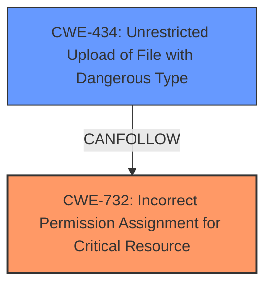

# Analysis Report for CVE-2025-29394

# Vulnerability Analysis Report: CVE-2025-29394

## Description

An **insecure permissions** vulnerability in verydows v2.0 allows a remote attacker to execute arbitrary code by uploading a file type.

## Vulnerability Description Key Phrases

- **Rootcause:** insecure permissions
- **Impact:** execute arbitrary code
- **Vector:** uploading a file type
- **Attacker:** remote attacker
- **Product:** verydows
- **Version:** v2.0

## Analysis (with Relationship Data)

# Summary
| CWE ID    | CWE Name                                                        | Confidence | CWE Abstraction Level | CWE Vulnerability Mapping Label | CWE-Vulnerability Mapping Notes |
| :-------- | :-------------------------------------------------------------- | :--------- | :-------------------- | :------------------------------ | :------------------------------ |
| CWE-732   | Incorrect Permission Assignment for Critical Resource         | 0.9        | Class                 | Allowed-with-Review             | Primary CWE                     |
| CWE-434 | Unrestricted Upload of File with Dangerous Type | 0.7        | Base                 | Allowed             | Secondary CWE                     |

## Evidence and Confidence

*   **Confidence Score:** 0.8
*   **Evidence Strength:** MEDIUM

## Relationship Analysis
The primary CWE is CWE-732, which is a Class-level CWE. While less specific than a Base or Variant, it accurately reflects the core issue: an **incorrect permission assignment** for a critical resource. CWE-434 is related because the incorrect permissions allows an unrestricted upload of dangerous file types.



## Vulnerability Chain
The chain of events is as follows:
1.  **Root Cause:** **Insecure Permissions** (CWE-732) on a critical resource, specifically the file upload directory.
2.  An attacker uploads a file with a dangerous type (e.g., PHP script) (CWE-434) because of the incorrect permission assignment.
3.  The server executes the malicious code, leading to remote code execution.

## Summary of Analysis
The initial assessment was based on the provided evidence, which clearly points to an **insecure permissions** vulnerability. The key phrase "insecure permissions" directly supports the selection of CWE-732. The reference content summary further reinforces this by highlighting the lack of proper file type validation and insufficient permission checks on uploaded files.

CWE-732 is selected because the description speaks to incorrect permission assignments, which is the root cause. CWE-434 is selected because it's a weakness in the system, allowing an attacker to upload files with dangerous types.

The graph relationships influenced the final selection by providing context on how these CWEs relate to each other. The selected CWEs are at an appropriate level of specificity, representing the root cause and a contributing factor to the vulnerability.

Relevant CWE Information:

# Enhanced Context (25 CWEs)
The following CWEs were identified as potentially relevant to this vulnerability:

## CWE-266: Incorrect Privilege Assignment
**Abstraction Level**: Base
**Similarity Score**: 0.79

## CWE-267: Privilege Defined With Unsafe Actions
**Abstraction Level**: Base
**Similarity Score**: 0.79

## CWE-280: Improper Handling of Insufficient Permissions or Privileges
**Abstraction Level**: Base
**Similarity Score**: 0.78

## CWE-59: Improper Link Resolution Before File Access ('Link Following')
**Abstraction Level**: Base
**Similarity Score**: 0.78

## CWE-276: Incorrect Default Permissions
**Abstraction Level**: Base
**Similarity Score**: 0.78

## CWE-41: Improper Resolution of Path Equivalence
**Abstraction Level**: Base
**Similarity Score**: 0.78

## CWE-274: Improper Handling of Insufficient Privileges
**Abstraction Level**: Base
**Similarity Score**: 0.77

## CWE-552: Files or Directories Accessible to External Parties
**Abstraction Level**: Base
**Similarity Score**: 0.77

## CWE-668: Exposure of Resource to Wrong Sphere
**Abstraction Level**: Class
**Similarity Score**: 0.77

## CWE-73: External Control of File Name or Path
**Abstraction Level**: Base
**Similarity Score**: 0.77

## CWE-863: Incorrect Authorization
**Abstraction Level**: Class
**Similarity Score**: 1743.09

## CWE-732: Incorrect Permission Assignment for Critical Resource
**Abstraction Level**: Class
**Similarity Score**: 1702.52

## CWE-285: Improper Authorization
**Abstraction Level**: Class
**Similarity Score**: 1688.67

## CWE-269: Improper Privilege Management
**Abstraction Level**: Class
**Similarity Score**: 1680.41

## CWE-434: Unrestricted Upload of File with Dangerous Type
**Abstraction Level**: Base
**Similarity Score**: 1671.37

## CWE-363: Race Condition Enabling Link Following
**Abstraction Level**: base
**Similarity Score**: 4.33

## CWE-59: Improper Link Resolution Before File Access ('Link Following')
**Abstraction Level**: Base
**Similarity Score**: 2.91

## CWE-942: Permissive Cross-domain Policy with Untrusted Domains
**Abstraction Level**: variant
**Similarity Score**: 2.68

## CWE-434: Unrestricted Upload of File with Dangerous Type
**Abstraction Level**: Base
**Similarity Score**: 2.50

## CWE-250: Execution with Unnecessary Privileges
**Abstraction Level**: base
**Similarity Score**: 2.47

## CWE-379: Creation of Temporary File in Directory with Insecure Permissions
**Abstraction Level**: base
**Similarity Score**: 2.47

## CWE-22: Improper Limitation of a Pathname to a Restricted Directory ('Path Traversal')
**Abstraction Level**: base
**Similarity Score**: 2.42

## CWE-306: Missing Authentication for Critical Function
**Abstraction Level**: base
**Similarity Score**: 2.40

## CWE-183: Permissive List of Allowed Inputs
**Abstraction Level**: base
**Similarity Score**: 2.21

## CWE-184: Incomplete List of Disallowed Inputs
**Abstraction Level**: base
**Similarity Score**: 2.21

CWE-732: Incorrect Permission Assignment for Critical Resource
The product specifies permissions for a security-critical resource in a way that allows that resource to be read or modified by unintended actors. This aligns directly with the vulnerability description of **insecure permissions** leading to arbitrary code execution. The security implication is unauthorized access and modification of critical resources, leading to potential system compromise. This is the primary weakness. Confidence 0.9

CWE-434: Unrestricted Upload of File with Dangerous Type
The product allows the upload or transfer of dangerous file types that are automatically processed within its environment. In this case, the **insecure permissions** allow the upload of a PHP file, which is then executed by the server. This is a secondary weakness. Confidence 0.7

CWE-266, CWE-267, CWE-280, CWE-274, CWE-269: These relate to privileges, but the vulnerability is more about permissions on a resource. These are not used because the problem is not related to the privileges of a user, but rather the permissions of a resource.
CWE-59, CWE-363: Improper link resolution is not the primary issue, but a related one if symlinks are involved. These are not used.
CWE-276, CWE-277: Incorrect default or inherited permissions are similar, but less specific than CWE-732. These are not used.
CWE-668: Exposure of resource to wrong sphere is too general. Not used.
CWE-73: External control of file name/path is relevant if the file name is used to execute commands. This is not used.
CWE-863, CWE-285: Incorrect/Improper authorization is about the system incorrectly allowing an action based on flawed checking of permissions. The problem is more about the incorrect assignment of permissions in the first place, which is why CWE-732 is preferred. These are not used.
CWE-379: Creation of Temporary File in Directory with Insecure Permissions. While the uploaded file might be treated as temporary, the core issue is the initial permission assignment. Not used.
CWE-22: Improper Limitation of a Pathname to a Restricted Directory ('Path Traversal'). The vulnerable code doesn't seem to be performing path traversal, which makes CWE-22 less relevant. Not used.
CWE-306: Missing Authentication for Critical Function. The attacker appears to be authenticated, so the issue is not missing authentication, so CWE-306 is not used.
CWE-183, CWE-184: These CWEs relate to the lists of allowed or disallowed inputs. The description suggests that the issue is not with input validation. Not used.


## CWE Relationship Analysis

Current CWEs represent these abstraction levels: .


### Vulnerability Chain Analysis

**Chain starting from CWE-274:**
- 274 (Improper Handling of Insufficient Privileges) - ROOT


**Chain starting from CWE-363:**
- 363 (Race Condition Enabling Link Following) - ROOT


### CWE Relationship Diagram

```mermaid
graph TD
    classDef primary fill:#f96,stroke:#333,stroke-width:2px
    classDef secondary fill:#69f,stroke:#333
    classDef tertiary fill:#9e9,stroke:#333
```


*Report generated on 2025-07-14 16:25:21*
