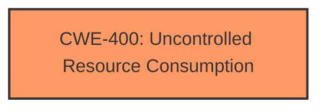

# Raw Analyzer Response for CVE-2025-29478

# Summary

| CWE ID  | CWE Name                                               | Confidence | CWE Abstraction Level | CWE Vulnerability Mapping Label | CWE-Vulnerability Mapping Notes |
| :------- | :----------------------------------------------------- | :--------- | :---------------------- | :------------------------------ | :------------------------------ |
| CWE-400 | Uncontrolled Resource Consumption                      | 0.75       | Class                   | Primary                         | Discouraged                   |

## Evidence and Confidence

*   **Confidence Score:** 0.75
*   **Evidence Strength:** LOW

## Relationship Analysis

The primary relationship considered was the parent-child relationship between CWE-400 and more specific resource exhaustion CWEs. Due to the lack of specific information about the resource being exhausted, the higher-level CWE-400 was selected.

## Vulnerability Chain

The vulnerability chain starts with a local attacker exploiting a flaw in `cfl_list_size` which leads to uncontrolled resource consumption and ultimately a denial of service. Due to the limited details, the specific resource consumption type is unknown.

## Summary of Analysis

The analysis is based on the limited information available in the vulnerability description. The primary evidence is the reported "denial of service" caused by an issue in `cfl_list_size`. This points towards a resource consumption issue.

CWE-400 [Uncontrolled Resource Consumption] is selected because the vulnerability description mentions a denial of service, which is a common impact of uncontrolled resource consumption. The description indicates that the vulnerability is related to `cfl_list_size`, suggesting a problem with how list sizes are handled, potentially leading to excessive resource usage.

Other CWEs were considered but not selected:

*   CWE-789 [Memory Allocation with Excessive Size Value]: While a memory allocation issue could be the root cause, the description doesn't explicitly mention memory allocation.
*   CWE-770 [Allocation of Resources Without Limits or Throttling]: Similar to CWE-789, this is a possibility, but there's no specific mention of resource allocation without limits.
*   CWE-121 [Stack-based Buffer Overflow] and CWE-122 [Heap-based Buffer Overflow]: These are potential vulnerabilities, but the description focuses on resource consumption leading to denial of service, rather than buffer overflows specifically.
*   CWE-190 [Integer Overflow or Wraparound]: An integer overflow could lead to an excessive size value, but again, the description doesn't explicitly mention it.
*   CWE-401 [Missing Release of Memory after Effective Lifetime]: This could also be a cause of the DoS, but there isn't enough information.

The final decision is based on the high-level symptom (denial of service) and the component involved (`cfl_list_size`), which points towards uncontrolled resource consumption. Since the evidence is limited, a lower confidence score is assigned.

Relevant CWE Information: