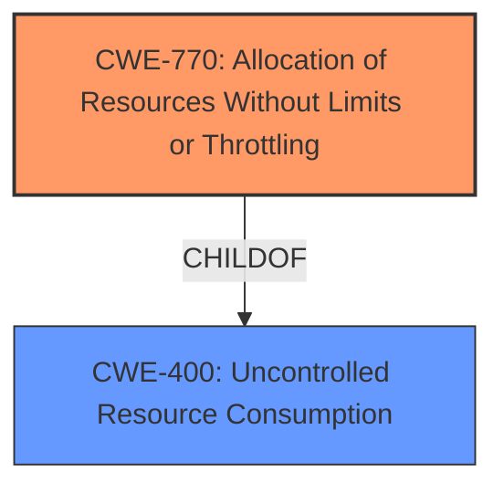

# Raw Analyzer Response for CVE-2025-29484

# Summary
| CWE ID | CWE Name | Confidence | CWE Abstraction Level | CWE Vulnerability Mapping Label | CWE-Vulnerability Mapping Notes |
|---|---|---|---|---|---|
| CWE-770 | Allocation of Resources Without Limits or Throttling | 0.9 | Base | Allowed | Primary CWE - Root cause is **allocation of resources without limits**. |
| CWE-400 | Uncontrolled Resource Consumption | 0.7 | Class | Discouraged | Secondary CWE - Impact of the vulnerability is **uncontrolled resource consumption** leading to DoS. |

## Evidence and Confidence

*   **Confidence Score:** 0.8
*   **Evidence Strength:** HIGH

## Relationship Analysis
The primary CWE is CWE-770, which represents the **unlimited allocation of resources**. CWE-400 is a parent of CWE-770, representing the broader category of uncontrolled resource consumption. However, since the specific issue is related to allocation, CWE-770 is more appropriate.

## Vulnerability Chain
The vulnerability chain starts with the **uncontrolled allocation of memory** (CWE-770). This leads to **resource exhaustion** and ultimately a Denial of Service (CWE-400).

## Summary of Analysis
The initial assessment identified the **out-of-memory error** as the root cause. The content summary confirmed that the **root cause** is attempting to allocate a large block of memory during parsing of ABC data leading to allocator exhaustion. The primary weakness is **insufficient memory allocation handling**. This closely aligns with CWE-770 (Allocation of Resources Without Limits or Throttling), as the system is not limiting the amount of memory being allocated, leading to the exhaustion of available memory. The impact of this vulnerability is a denial of service, which maps to CWE-400 (Uncontrolled Resource Consumption).

The choice of CWE-770 is preferred over others because it accurately captures the specific mechanism of the vulnerability: the lack of limits on resource allocation. Although other CWEs such as CWE-789 (Memory Allocation with Excessive Size Value) are related, CWE-770 is a more direct representation of the weakness as the size isn't validated.

The mapping guidance for both CWE-770 and CWE-400 allows their usage. CWE-400 is generally discouraged but can be used to denote the impact.

Relevant CWE Information:

# Enhanced Context (25 CWEs)
The following CWEs were identified as potentially relevant to this vulnerability:

## CWE-125: Out-of-bounds Read
**Abstraction Level**: Base
**Similarity Score**: 0.77

## CWE-789: Memory Allocation with Excessive Size Value
**Abstraction Level**: Variant
**Similarity Score**: 0.77

## CWE-788: Access of Memory Location After End of Buffer
**Abstraction Level**: Base
**Similarity Score**: 0.75

## CWE-126: Buffer Over-read
**Abstraction Level**: Variant
**Similarity Score**: 0.74

## CWE-476: NULL Pointer Dereference
**Abstraction Level**: Base
**Similarity Score**: 0.74

## CWE-193: Off-by-one Error
**Abstraction Level**: Base
**Similarity Score**: 0.73

## CWE-131: Incorrect Calculation of Buffer Size
**Abstraction Level**: Base
**Similarity Score**: 0.73

## CWE-401: Missing Release of Memory after Effective Lifetime
**Abstraction Level**: Variant
**Similarity Score**: 0.73

## CWE-909: Missing Initialization of Resource
**Abstraction Level**: Class
**Similarity Score**: 0.72

## CWE-119: Improper Restriction of Operations within the Bounds of a Memory Buffer
**Abstraction Level**: Class
**Similarity Score**: 0.72

## CWE-789: Memory Allocation with Excessive Size Value
**Abstraction Level**: Variant
**Similarity Score**: 1971.46

## CWE-1284: Improper Validation of Specified Quantity in Input
**Abstraction Level**: Base
**Similarity Score**: 1859.20

## CWE-125: Out-of-bounds Read
**Abstraction Level**: Base
**Similarity Score**: 1837.19

## CWE-770: Allocation of Resources Without Limits or Throttling
**Abstraction Level**: Base
**Similarity Score**: 1738.60

## CWE-476: NULL Pointer Dereference
**Abstraction Level**: Base
**Similarity Score**: 1690.25

## CWE-1325: Improperly Controlled Sequential Memory Allocation
**Abstraction Level**: base
**Similarity Score**: 5.03

## CWE-1284: Improper Validation of Specified Quantity in Input
**Abstraction Level**: base
**Similarity Score**: 4.33

## CWE-252: Unchecked Return Value
**Abstraction Level**: base
**Similarity Score**: 4.33

## CWE-789: Memory Allocation with Excessive Size Value
**Abstraction Level**: Variant
**Similarity Score**: 3.03

## CWE-476: NULL Pointer Dereference
**Abstraction Level**: Base
**Similarity Score**: 2.90

## CWE-770: Allocation of Resources Without Limits or Throttling
**Abstraction Level**: base
**Similarity Score**: 2.47

## CWE-125: Out-of-bounds Read
**Abstraction Level**: Base
**Similarity Score**: 2.40

## CWE-787: Out-of-bounds Write
**Abstraction Level**: base
**Similarity Score**: 2.28

## CWE-823: Use of Out-of-range Pointer Offset
**Abstraction Level**: base
**Similarity Score**: 2.21

## CWE-822: Untrusted Pointer Dereference
**Abstraction Level**: base
**Similarity Score**: 2.21

**CWEs Considered But Not Used:**

*   **CWE-789 (Memory Allocation with Excessive Size Value):** While the vulnerability does involve memory allocation, the core issue is not necessarily the size being excessive, but rather the lack of any limits on the allocation. Therefore, CWE-770 is more appropriate.
*   **CWE-125 (Out-of-bounds Read):** This is not relevant as the vulnerability concerns allocation, not reading out of bounds.
*   **CWE-476 (NULL Pointer Dereference):** This is not relevant to the described vulnerability.
*   **CWE-1284 (Improper Validation of Specified Quantity in Input):** Similar to CWE-789, the lack of validation of input size is a contributing factor, but CWE-770 captures the broader issue of unlimited allocation more accurately.