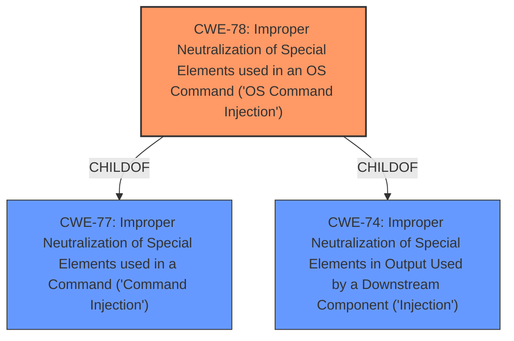

# Raw Analyzer Response for CVE-2025-29659

# Summary
| CWE ID | CWE Name | Confidence | CWE Abstraction Level | CWE Vulnerability Mapping Label | CWE-Vulnerability Mapping Notes |
|---|---|---|---|---|---|
| CWE-78 | Improper Neutralization of Special Elements used in an OS Command ('OS Command Injection') | 0.9 | Base | Allowed | Primary CWE. The **lack of proper input validation** in the `daemon` process allows for command injection. |

## Evidence and Confidence

*   **Confidence Score:** 0.9
*   **Evidence Strength:** HIGH

## Relationship Analysis
The primary relationship impacting the decision is the ChildOf relationship between CWE-78 and its parent CWE-77. While CWE-77 is a broader "Command Injection" class, the vulnerability description specifically mentions "OS Command Execution", making CWE-78 a more precise classification.

## Vulnerability Chain
The vulnerability chain starts with the **lack of proper input validation** in the `daemon` process, leading to OS command injection and ultimately resulting in Remote Command Execution (RCE) with root privileges.

## Summary of Analysis
The primary factor influencing the selection of CWE-78 is the explicit mention of "Remote Command Execution" in the vulnerability description and the **lack of proper input validation** as the root cause in the CVE Reference Links Content Summary.

The evidence supporting this decision is derived from:
*   "Yi IOT XY-3820 6.0.24.10 is vulnerable to Remote Command Execution via the cmd_listen function located in the cmd binary."
*   "Root cause of vulnerability: The `daemon` process in Yi IOT XY-3820 cameras **lacks proper input validation**."
*   "Impact of exploitation: ...allows attackers to gain `root` access and execute arbitrary commands..."

CWE-78 aligns precisely with this scenario, as it describes a situation where externally influenced input is used to construct an OS command without proper neutralization of special elements. The mitigations suggested (restricting network access, isolating affected devices, monitoring network traffic) are consistent with preventing or detecting OS command injection attacks.

The retriever results also support this decision, with CWE-78 being the top-ranked CWE.

Other CWEs Considered:

*   CWE-20: Improper Input Validation - While input validation is the root cause, CWE-20 is a high-level class. CWE-78 is more specific, describing the vulnerability as OS command injection.
*   CWE-77: Improper Neutralization of Special Elements used in a Command ('Command Injection') - While related, CWE-78 is more specific by indicating that it is an OS Command.
*   CWE-74: Improper Neutralization of Special Elements in Output Used by a Downstream Component ('Injection') - This is more generic, and the root cause is the construction of a command.
*   CWE-134: Use of Externally-Controlled Format String - This is not a format string vulnerability.
*   CWE-88: Improper Neutralization of Argument Delimiters in a Command ('Argument Injection') - This is more about the arguments and not command injection.
*   CWE-93: Improper Neutralization of CRLF Sequences ('CRLF Injection') - This is CRLF injection and not command injection.
*   CWE-117: Improper Output Neutralization for Logs - This is related to logs and not command injection.
*   CWE-120: Buffer Copy without Checking Size of Input ('Classic Buffer Overflow') - This is not a buffer overflow issue.
*   CWE-367: Time-of-check Time-of-use (TOCTOU) Race Condition - This is not a TOCTOU issue.
*   CWE-425: Direct Request ('Forced Browsing') - This is not related to forced browsing.
*   CWE-497: Exposure of Sensitive System Information to an Unauthorized Control Sphere - This is not related to sensitive information exposure.
*   CWE-755: Improper Handling of Exceptional Conditions - This is a more generic error.
*   CWE-781: Improper Address Validation in IOCTL with METHOD_NEITHER I/O Control Code - This is related to IOCTL which is not what is happening here.
*   CWE-782: Exposed IOCTL with Insufficient Access Control - This is related to IOCTL which is not what is happening here.
*   CWE-790: Improper Filtering of Special Elements - This is too generic.
*   CWE-1284: Improper Validation of Specified Quantity in Input - This is about validating the quantity of the input.
*   CWE-170: Improper Null Termination - This is about null termination issues.
*   CWE-126: Buffer Over-read - This is a buffer over-read issue.