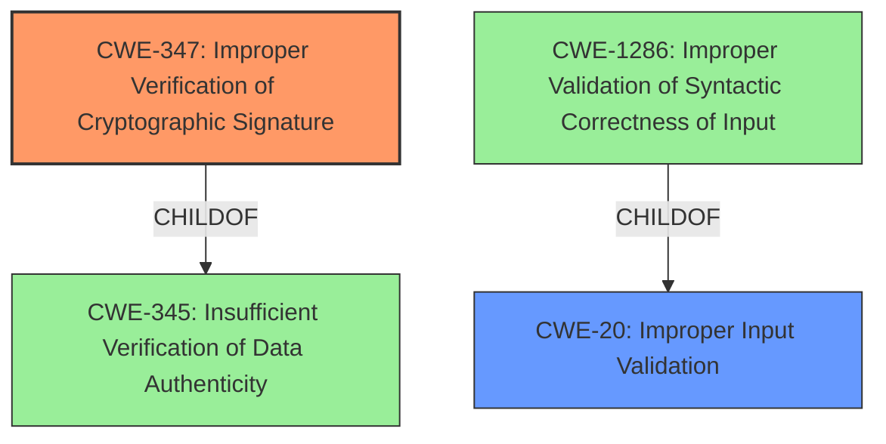

# Enhanced Analysis for CVE-2025-29778

# Summary
| CWE ID | CWE Name | Confidence | CWE Abstraction Level | CWE Vulnerability Mapping Label | CWE-Vulnerability Mapping Notes |
|---|---|---|---|---|---|
| CWE-347 | Improper Verification of Cryptographic Signature | 0.9 | Base | Primary | Allowed |
| CWE-20 | Improper Input Validation | 0.7 | Class | Secondary | Allowed |

## Evidence and Confidence

*   **Confidence Score:** 0.8
*   **Evidence Strength:** HIGH

## Relationship Analysis
The primary CWE, CWE-347 (Improper Verification of Cryptographic Signature), is a Base level CWE, which is preferred. CWE-347 is a child of CWE-345 (Insufficient Verification of Data Authenticity), a Class level CWE. This relationship suggests that a more specific type of data authenticity issue is present, namely one related to cryptographic signatures.

The relationship of CWE-20 to CWE-1286 is that CWE-20 is the parent, and CWE-1286 is a child.



## Vulnerability Chain
The vulnerability chain starts with **improper verification of cryptographic signatures** (CWE-347). This leads to the acceptance of artifacts signed by unexpected certificates, which then results in the ability to deploy unauthorized Kubernetes resources. The ultimate impact is a full compromise of the Kubernetes cluster.

## Summary of Analysis
The primary weakness is that Kyverno **ignores subjectRegExp and IssuerRegExp while verifying artifacts sign with keyless mode**.

The evidence for CWE-347 is that "Kyverno did not consider the `subjectRegExp` and `issuerRegExp` fields when verifying artifact signatures in keyless mode. It only checked the `subject` and `issuer` fields."

CWE-20 is included as a secondary weakness because the vulnerability description and CVE reference content summarize that there was insufficient input validation of the regular expressions.

CWE-295, CWE-923, CWE-285 and CWE-863 were considered but not used.

*   CWE-295 (Improper Certificate Validation) - While related, CWE-347 is more specific to the signature verification aspect, which is the core issue here.
*   CWE-923 (Improper Restriction of Communication Channel to Intended Endpoints) - This is not directly related to the described vulnerability. The problem is not about restricting communication channels, but about the verification of signatures.
*   CWE-285 (Improper Authorization) and CWE-863 (Incorrect Authorization) - These are too high-level and don't capture the specific flaw of improper cryptographic signature verification.

The selected CWEs are at the optimal level of specificity, with CWE-347 pinpointing the cryptographic signature verification failure and CWE-20 capturing the insufficient input validation aspect.

Relevant CWE Information:

# Enhanced Context (25 CWEs)
The following CWEs were identified as potentially relevant to this vulnerability:

## CWE-347: Improper Verification of Cryptographic Signature
**Abstraction Level**: Base
**Similarity Score**: 0.70
**Source**: dense

**Description**:
The product does not verify, or incorrectly verifies, the cryptographic signature for data.

**Mapping Guidance**:
- Usage: Allowed
- Rationale: This CWE entry is at the Base level of abstraction, which is a preferred level of abstraction for mapping to the root causes of vulnerabilities.

**Technical Explanation**: The vulnerability description states that Kyverno ignores subjectRegExp and IssuerRegExp while verifying artifacts sign with keyless mode. This directly matches the description of CWE-347, which is that the product does not verify or incorrectly verifies the cryptographic signature for data.
**Security Implications**: Allows the attacker to deploy kubernetes resources with the artifacts that were signed by unexpected certificate. Deploying these unauthorized kubernetes resources can lead to full compromise of kubernetes cluster.
**Relationship to Other CWEs**: CWE-347 is a child of CWE-345 (Insufficient Verification of Data Authenticity). This parent-child relationship indicates that the specific type of data authenticity issue is related to cryptographic signatures.
**Primary or Secondary Weakness**: Primary
**Official Mapping Guidance**: The mapping guidance allows the usage of this CWE.

## CWE-20: Improper Input Validation
**Abstraction Level**: Class
**Similarity Score**: N/A
**Source**: Manual Analysis of CVE Reference

**Description**:
The product does not validate, or incorrectly validates, input that it receives.

**Mapping Guidance**:
- Usage: Allowed
- Rationale: This CWE entry is a Class level and can have children that are more appropriate.

**Technical Explanation**: The vulnerability description states that Kyverno ignores subjectRegExp and IssuerRegExp while verifying artifacts sign with keyless mode. The CVE Reference content summary mentions "Insufficient input validation: Kyverno failed to validate the regular expressions provided in `subjectRegExp` and `issuerRegExp`."
**Security Implications**: Allows the attacker to deploy kubernetes resources with the artifacts that were signed by unexpected certificate. Deploying these unauthorized kubernetes resources can lead to full compromise of kubernetes cluster.
**Relationship to Other CWEs**: CWE-20 is a parent of CWE-1286.
**Primary or Secondary Weakness**: Secondary
**Official Mapping Guidance**: The mapping guidance allows the usage of this CWE.


## CWE Relationship Analysis

Current CWEs represent these abstraction levels: .


### Vulnerability Chain Analysis

**Chain starting from CWE-863:**
- 863 (Incorrect Authorization) - ROOT


**Chain starting from CWE-345:**
- 345 (Insufficient Verification of Data Authenticity) - ROOT


### CWE Relationship Diagram

```mermaid
graph TD
    classDef primary fill:#f96,stroke:#333,stroke-width:2px
    classDef secondary fill:#69f,stroke:#333
    classDef tertiary fill:#9e9,stroke:#333
```