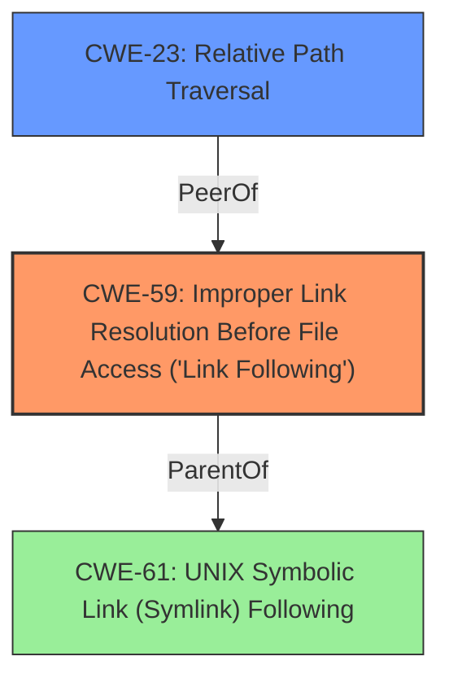

# Analysis Report for CVE-2025-29787

# Vulnerability Analysis Report: CVE-2025-29787

## Description

`zip` is a zip library for rust which supports reading and writing of simple ZIP files. In the archive extraction routine of affected versions of the `zip` crate starting with version 1.3.0 and prior to version 2.3.0, symbolic links earlier in the archive are allowed to be used for later files in the archive without validation of the final canonicalized path, allowing maliciously crafted archives to overwrite arbitrary files in the file system when extracted. Users who extract untrusted archive files using the following high-level API method may be affected and critical files on the system may be overwritten with arbitrary file permissions, which can potentially lead to code execution. Version 2.3.0 fixes the issue.

## Vulnerability Description Key Phrases

- **Weakness:** symbolic link overwrite
- **Impact:** overwrite arbitrary files
- **Vector:** maliciously crafted archives
- **Product:** zip crate
- **Version:** 1.3.0 to 2.2.2
- **Component:** archive extraction routine

## Analysis (with Relationship Data)

# Summary
| CWE ID | CWE Name | Confidence | CWE Abstraction Level | CWE Vulnerability Mapping Label | CWE-Vulnerability Mapping Notes |
|---|---|---|---|---|---|
| CWE-59 | Improper Link Resolution Before File Access ('Link Following') | 0.9 | Base | Allowed | Primary CWE. The vulnerability involves the use of symbolic links to overwrite arbitrary files. |
| CWE-23 | Relative Path Traversal | 0.7 | Base | Allowed | Secondary CWE. Although not explicitly stated, the symbolic link can resolve to a location outside the restricted directory. |

## Evidence and Confidence

*   **Confidence Score:** 0.8
*   **Evidence Strength:** MEDIUM

## Relationship Analysis
The primary weakness is CWE-59 Improper Link Resolution Before File Access ('Link Following'). The description explicitly states that symbolic links are used to overwrite arbitrary files. CWE-23 Relative Path Traversal is related, as the symbolic link can resolve to a location outside the intended directory, but this is not as direct a match as CWE-59.



## Vulnerability Chain
The vulnerability chain involves a malicious zip archive containing symbolic links. The **weakness** is that these symbolic links are not validated, allowing them to point to arbitrary files. When the archive is extracted, these links are used to **overwrite arbitrary files**, leading to potential code execution.

## Summary of Analysis
The analysis is primarily based on the provided vulnerability description, which explicitly mentions the use of symbolic links to overwrite files. The key phrase is "**symbolic link overwrite**". The CVE description states: "symbolic links earlier in the archive are allowed to be used for later files in the archive without validation of the final canonicalized path." This directly aligns with CWE-59, which describes the improper resolution of links before file access.

CWE-23 is a potential secondary weakness, as the symbolic links may resolve to locations outside the intended directory. The retriever results also suggest CWE-22 Improper Limitation of a Pathname to a Restricted Directory ('Path Traversal'), however CWE-23 is more appropriate because of the Relative path traversal via the link.

The selected CWEs are at the base level of abstraction, providing a precise representation of the vulnerability.

Relevant CWE Information:

# Enhanced Context (25 CWEs)
The following CWEs were identified as potentially relevant to this vulnerability:

## CWE-59: Improper Link Resolution Before File Access ('Link Following')
**Abstraction Level**: Base
**Similarity Score**: 0.81
**Source**: dense

**Description**:
The product attempts to access a file based on the filename, but it does not properly prevent that filename from identifying a link or shortcut that resolves to an unintended resource.

**Mapping Guidance**:
- Usage: Allowed
- Rationale: This CWE entry is at the Base level of abstraction, which is a preferred level of abstraction for mapping to the root causes of vulnerabilities.

## CWE-23: Relative Path Traversal
**Abstraction Level**: Base
**Similarity Score**: 0.75
**Source**: dense

**Description**:
The product uses external input to construct a pathname that should be within a restricted directory, but it does not properly neutralize sequences such as ".." that can resolve to a location that is outside of that directory.

**Mapping Guidance**:
- Usage: Allowed
- Rationale: This CWE entry is at the Base level of abstraction, which is a preferred level of abstraction for mapping to the root causes of vulnerabilities.


## CWE Relationship Analysis

Current CWEs represent these abstraction levels: .


### Vulnerability Chain Analysis

**Chain starting from CWE-59:**
- 59 (Improper Link Resolution Before File Access ('Link Following')) - ROOT


**Chain starting from CWE-23:**
- 23 (Relative Path Traversal) - ROOT


### CWE Relationship Diagram

```mermaid
graph TD
    classDef primary fill:#f96,stroke:#333,stroke-width:2px
    classDef secondary fill:#69f,stroke:#333
    classDef tertiary fill:#9e9,stroke:#333
```


*Report generated on 2025-07-14 16:37:55*
