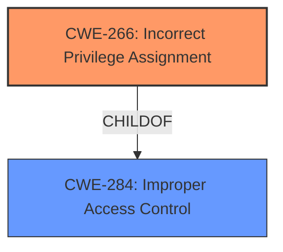

# Raw Analyzer Response for CVE-2025-29802

# Summary
| CWE ID | CWE Name | Confidence | CWE Abstraction Level | CWE Vulnerability Mapping Label | CWE-Vulnerability Mapping Notes |
|---|---|---|---|---|---|
| CWE-266 | Incorrect Privilege Assignment | 0.75 | Base | Primary | Allowed |
| CWE-284 | Improper Access Control | 0.5 | Pillar | Secondary | Discouraged |

## Evidence and Confidence

*   **Confidence Score:** 0.7
*   **Evidence Strength:** LOW

## Relationship Analysis
The primary relationship considered was the parent-child relationship between CWE-284 (Improper Access Control) and more specific children like CWE-266 (Incorrect Privilege Assignment). The choice of CWE-266 over CWE-284 indicates a preference for a more specific Base level CWE when the evidence supports it, and aligns with the guidance to avoid using CWE-284 when a more precise classification is possible.

## Vulnerability Chain
The vulnerability chain starts with **improper access control**, specifically an **incorrect privilege assignment**, leading to the ability to elevate privileges locally.

## Summary of Analysis
The initial assessment focused on identifying the root cause of the vulnerability, which is described as **improper access control** leading to privilege elevation. The analysis considered several candidate CWEs, especially those related to access control, authorization, and privileges. The final decision to assign CWE-266 as the primary CWE is based on the evidence that the **improper access control** manifested as an **incorrect privilege assignment**, as well as the mapping guidance that recommends using more specific CWEs over general ones like CWE-284. Since the reference links are unrelated, the evidence is not strong.

Relevant CWE Information:

# Enhanced Context (25 CWEs)
The following CWEs were identified as potentially relevant to this vulnerability:

## CWE-266: Incorrect Privilege Assignment
**Abstraction Level**: Base
**Similarity Score**: 0.73
**Source**: dense

**Description**:
A product incorrectly assigns a privilege to a particular actor, creating an unintended sphere of control for that actor.

**Mapping Guidance**:
- Usage: Allowed
- Rationale: This CWE entry is at the Base level of abstraction, which is a preferred level of abstraction for mapping to the root causes of vulnerabilities.

## CWE-284: Improper Access Control
**Abstraction Level**: Class
**Similarity Score**: 0.102
**Source**: sparse

**Description**:
The product does not properly control access to resources or functionality.

**Mapping Guidance**:
- Usage: Discouraged
- Rationale: This CWE entry is very high level. It is frequently misused as a catch-all when lower-level CWE IDs might be applicable. It is not useful for trend analysis.

## CWE-863: Incorrect Authorization
**Abstraction Level**: Class
**Similarity Score**: 0.094
**Source**: sparse

**Description**:
The product performs an authorization check when an actor attempts to access a resource or perform an action, but it does not correctly perform the check.

**Mapping Guidance**:
- Usage: Allowed-with-Review
- Rationale: This CWE entry is a Class and might have Base-level children that would be more appropriate

## CWE-285: Improper Authorization
**Abstraction Level**: Class
**Similarity Score**: 0.097
**Source**: sparse

**Description**:
The product does not perform or incorrectly performs an authorization check when an actor attempts to access a resource or perform an action.

**Mapping Guidance**:
- Usage: Discouraged
- Rationale: CWE-285 is high-level and lower-level CWEs can frequently be used instead. It is a level-1 Class (i.e., a child of a Pillar).

## CWE-250: Execution with Unnecessary Privileges
**Abstraction Level**: Base
**Similarity Score**: 0.095
**Source**: sparse

**Description**:
The software component runs with more privileges than it needs to perform its intended task. This introduces an unnecessary amount of risk because a successful attack could then perform a wider range of actions than the component normally requires.

**Mapping Guidance**:
- Usage: Allowed
- Rationale: This CWE entry is at the Base level of abstraction, which is a preferred level of abstraction for mapping to the root causes of vulnerabilities.

CWE-266 is selected as the primary CWE because the vulnerability description explicitly mentions "**improper access control**" which allows an authorized attacker to elevate privileges. This maps directly to the concept of **incorrect privilege assignment**. The CWE description states: "A product incorrectly assigns a privilege to a particular actor, creating an unintended sphere of control for that actor." The security implication is that an attacker can gain higher-level access than intended, potentially leading to complete system compromise.

CWE-284 is considered as a secondary CWE because it represents a broader category of access control issues. While applicable, it is less specific than CWE-266. The CWE description states: "The product does not properly control access to resources or functionality." The mapping guidance discourages its use when lower-level CWEs are applicable.

CWE-863 (Incorrect Authorization) was considered but deemed less appropriate because the vulnerability description doesn't explicitly state that an authorization check was performed incorrectly; it simply states that there is **improper access control**.

CWE-285 (Improper Authorization) was considered but also deemed less appropriate than CWE-266 because it is high-level.

CWE-250 (Execution with Unnecessary Privileges) was considered, but the description focuses more on the execution context rather than the assignment of privileges, making it less relevant than CWE-266.