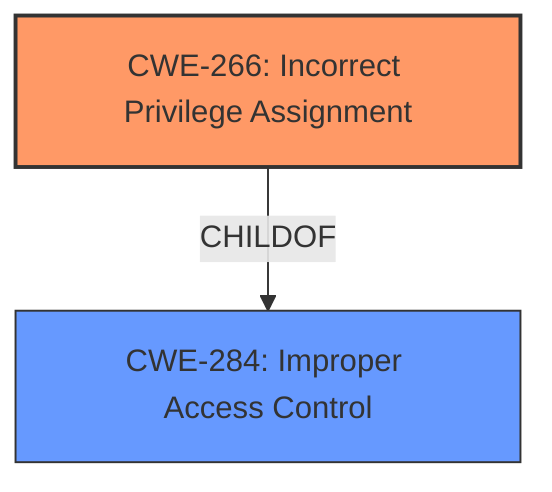

# Analysis for CVE-2025-29804

# Summary
| CWE ID | CWE Name | Confidence | CWE Abstraction Level | CWE Vulnerability Mapping Label | CWE-Vulnerability Mapping Notes |
|---|---|---|---|---|---|
| CWE-266 | Incorrect Privilege Assignment | 0.75 | Base | Primary | Allowed |
| CWE-284 | Improper Access Control | 0.5 | Secondary | Allowed | Discouraged due to more specific options existing but possible |

## Evidence and Confidence

*   **Confidence Score:** 0.7
*   **Evidence Strength:** MEDIUM

## Relationship Analysis
The primary relationship influencing my decision is the hierarchical relationship between CWE-284 (Improper Access Control) and its child CWE-266 (Incorrect Privilege Assignment). Given the vulnerability description's focus on **improper access control** leading to privilege elevation, CWE-266 offers a more specific and accurate representation of the root cause. While CWE-284 is a broader category, CWE-266 directly addresses the misassignment of privileges. The other relationships did not strongly influence the selection.

## Vulnerability Chain
The vulnerability chain is relatively simple:

1.  **Root Cause:** **Incorrect Privilege Assignment** (CWE-266)
2.  **Impact:** Privilege Elevation

## Summary of Analysis
The initial analysis focused on identifying the root cause of the vulnerability. The description clearly states that "**Improper access control**" is the issue, leading to privilege elevation. Given the available information and the guidance provided, the most accurate CWE appears to be CWE-266 (Incorrect Privilege Assignment). This is supported by the fact that the description explicitly mentions an elevation of privileges, which aligns well with the concept of misassigned privileges.

The alternative, CWE-284 (Improper Access Control), is a broader category. While it could technically apply, it's less specific than CWE-266. The analysis of the retriever results and the relationship between CWE-284 and CWE-266 further solidified the decision to prioritize CWE-266.

The chosen CWEs are at the optimal level of specificity because CWE-266 directly addresses the root cause. The evidence provided points strongly towards a privilege misassignment, making CWE-266 a better fit than the more general CWE-284.

Relevant CWE Information:

# Enhanced Context (25 CWEs)
The following CWEs were identified as potentially relevant to this vulnerability:

## CWE-266: Incorrect Privilege Assignment
**Abstraction Level**: Base
**Similarity Score**: 0.73
**Source**: dense

**Description**:
A product incorrectly assigns a privilege to a particular actor, creating an unintended sphere of control for that actor.

**Mapping Guidance**:
- Usage: Allowed
- Rationale: This CWE entry is at the Base level of abstraction, which is a preferred level of abstraction for mapping to the root causes of vulnerabilities.

**CWE-266 Justification:**
The vulnerability description indicates that "**Improper access control** in Visual Studio allows an authorized attacker to elevate privileges locally." This strongly suggests that the attacker is gaining more privileges than they should have, which aligns directly with the description of CWE-266: "A product incorrectly assigns a privilege to a particular actor, creating an unintended sphere of control for that actor."
The impact of privilege elevation supports this.

## CWE-284: Improper Access Control
**Abstraction Level**: Pillar
**Similarity Score**: 2098.03
**Source**: sparse

**Description**:
The product does not properly control access to resources, which allows unintended access.

**Mapping Guidance**:
- Usage: Discouraged
- Rationale: This CWE entry is a Pillar and might have Class-level children that would be more appropriate

**CWE-284 Justification:**
The vulnerability description mentions "**Improper access control**". CWE-284 is a general category for access control issues. However, the guidance suggests using more specific child CWEs when possible. While CWE-284 is applicable as a high-level classification, CWE-266 provides a more precise description of the underlying weakness, which is the **incorrect assignment of privileges**.