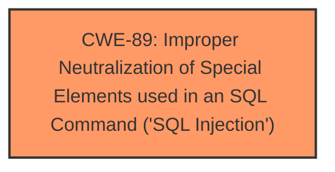

# Raw Analyzer Response for CVE-2025-2985

# Summary
| CWE ID | CWE Name | Confidence | CWE Abstraction Level | CWE Vulnerability Mapping Label | CWE-Vulnerability Mapping Notes |
|---|---|---|---|---|---|
| CWE-89 | Improper Neutralization of Special Elements used in an SQL Command ('SQL Injection') | 1.0 | Base | Allowed | Primary CWE. The vulnerability description states that the manipulation of the argument deduction leads to **SQL Injection**. |

## Evidence and Confidence

*   **Confidence Score:** 1.0
*   **Evidence Strength:** HIGH

## Relationship Analysis
The primary identified CWE is CWE-89, which stands alone based on the provided information. All other CWEs are not related.

## Vulnerability Chain
The vulnerability chain consists of a single step:

1.  **Root Cause:** **SQL Injection** (**CWE-89**) due to **improper neutralization** of input in the `update_account.php` file.

## Summary of Analysis
The vulnerability description clearly states that the **weakness** is **SQL injection** due to the manipulation of the `deduction` argument in the `update_account.php` file. This directly maps to CWE-89 (Improper Neutralization of Special Elements used in an SQL Command ('SQL Injection')).

The Retriever Results also lists CWE-89 as the top result with a score of 1.0, further supporting this classification. The abstraction level is Base, which is the preferred level.

CWE-79 (Improper Neutralization of Input During Web Page Generation ('Cross-site Scripting')), CWE-434 (Unrestricted Upload of File with Dangerous Type), CWE-1336 (Improper Neutralization of Special Elements Used in a Template Engine), CWE-99 (Improper Control of Resource Identifiers ('Resource Injection')), CWE-352 (Cross-Site Request Forgery (CSRF)), CWE-74 (Improper Neutralization of Special Elements in Output Used by a Downstream Component ('Injection')), CWE-117 (Improper Output Neutralization for Logs), CWE-96 (Improper Neutralization of Directives in Statically Saved Code ('Static Code Injection')), and CWE-73 (External Control of File Name or Path) were considered but are not relevant because the vulnerability is explicitly described as an **SQL injection** issue.