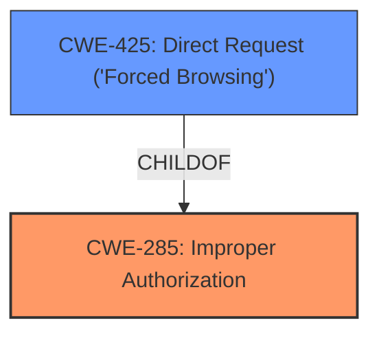

# Raw Analyzer Response for CVE-2025-2989

# Summary

| CWE ID | CWE Name | Confidence | CWE Abstraction Level | CWE Vulnerability Mapping Label | CWE-Vulnerability Mapping Notes |
|---|---|---|---|---|---|
| CWE-285 | Improper Authorization | 0.9 | Class | Primary CWE | Allowed-with-Review |
| CWE-425 | Direct Request ('Forced Browsing') | 0.7 | Base | Secondary Candidate | Allowed |

## Evidence and Confidence

*   **Confidence Score:** 0.8
*   **Evidence Strength:** MEDIUM

## Relationship Analysis

The primary relationship that influenced the decision was the parent-child relationship between CWE-285 (Improper Authorization) and CWE-425 (Direct Request ('Forced Browsing')). CWE-285 is a Class, while CWE-425 is a Base. Since the vulnerability description explicitly mentions "**improper access controls**", CWE-285 aligns well as the primary weakness. CWE-425 represents a specific type of improper authorization, where an attacker directly requests a resource without proper authorization.

## Vulnerability Chain

The vulnerability chain starts with the **improper access controls** (CWE-285), which allows for direct requests (CWE-425) to sensitive resources, potentially leading to unauthorized data access or modification.

## Summary of Analysis

The initial analysis focused on identifying the root cause of the vulnerability, which is explicitly stated as "**improper access controls**". The Retriever Results suggested several CWEs related to authorization and access control.

CWE-285 (Improper Authorization) stands out as the most relevant primary weakness because it directly reflects the **improper access controls** identified in the vulnerability description. It's a Class-level CWE, but in this case, it accurately represents the general weakness without needing a more specific Base variant as the description doesn't provide granular information on the exact type of authorization failure.

CWE-425 (Direct Request ('Forced Browsing')) is a strong secondary candidate, it represents a specific case of improper authorization. It is selected as a secondary candidate, but not the primary because the description does not have enough detail to determine that this is specifically a forced browsing issue.

The relationship graph reinforces this selection, showing how CWE-425 is a specific type of CWE-285.

Relevant CWE Information:

# Enhanced Context (25 CWEs)
The following CWEs were identified as potentially relevant to this vulnerability:

## CWE-425: Direct Request ('Forced Browsing')
**Abstraction Level**: Base
**Similarity Score**: 0.76
**Source**: dense

**Description**:
The web application does not adequately enforce appropriate authorization on all restricted URLs, scripts, or files.

**Mapping Guidance**:
- Usage: Allowed
- Rationale: This CWE entry is at the Base level of abstraction, which is a preferred level of abstraction for mapping to the root causes of vulnerabilities.

### Top Combined Results

| Rank | CWE ID | Name | Abstraction | Usage  | Retrievers | Individual Scores |
|------|--------|------|-------------|-------|------------|-------------------|
| 3 | 285 | Improper Authorization | Class | Discouraged | sparse | 0.355 |
| 10 | 425 | Direct Request ('Forced Browsing') | Base | Allowed | graph | 0.002 |

CWE-285 is used because the vulnerability is directly related to **improper access controls**. CWE-425 is related to the missing authorization on URLs, scripts or files.