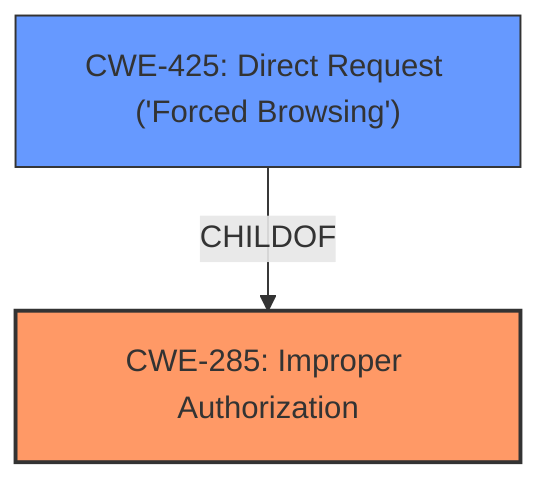

# Analysis for CVE-2025-2992

# Summary
| CWE ID | CWE Name | Confidence | CWE Abstraction Level | CWE Vulnerability Mapping Label | CWE-Vulnerability Mapping Notes |
|---|---|---|---|---|---|
| CWE-285 | Improper Authorization | 0.75 | Class | Primary | Allowed-with-Review |
| CWE-425 | Direct Request ('Forced Browsing') | 0.6 | Base | Secondary Candidate | Allowed |

## Evidence and Confidence

*   **Confidence Score:** 0.7
*   **Evidence Strength:** MEDIUM

## Relationship Analysis
The primary CWE is CWE-285, which is a Class-level CWE. Its child CWE, CWE-425, is a Base-level CWE and captures the direct request ('forced browsing') scenario, which aligns with the vulnerability description. CWE-425 is more specific than CWE-285.

## Vulnerability Chain
The chain of events is:
1.  **Root Cause:** **Improper Access Controls** (CWE-285)
2.  Impact: Unknown functionality of the /goform/AdvSetWrlsafeset component is affected.

## Summary of Analysis
The vulnerability description indicates **improper access controls** in the Web Management Interface of Tenda FH1202. The primary weakness is CWE-285, "Improper Authorization," as it broadly describes the **lack of sufficient access control**. However, since the vulnerability is accessible remotely and affects a specific URL without proper authorization checks, CWE-425 "Direct Request ('Forced Browsing')" is considered as a secondary candidate, representing a more specific case of **improper authorization**.

The selection of CWE-285 is based on the explicit mention of "**improper access controls**" in the vulnerability description. The retriever results also list CWE-285 as a potential candidate.
CWE-425 is a more specific child of CWE-285, and the vulnerability can be viewed as a case of forced browsing.

Relevant CWE Information:

# Enhanced Context (25 CWEs)
The following CWEs were identified as potentially relevant to this vulnerability:

## CWE-425: Direct Request ('Forced Browsing')
**Abstraction Level**: Base
**Similarity Score**: 0.77
**Source**: dense

**Description**:
The web application does not adequately enforce appropriate authorization on all restricted URLs, scripts, or files.

**Mapping Guidance**:
- Usage: Allowed
- Rationale: This CWE entry is at the Base level of abstraction, which is a preferred level of abstraction for mapping to the root causes of vulnerabilities.

#
Here is a discussion of why other CWEs from the **Complete CWE Specifications** were considered but not used:

*   CWE-89 (Improper Neutralization of Special Elements used in an SQL Command ('SQL Injection')), CWE-79 (Improper Neutralization of Input During Web Page Generation ('Cross-site Scripting')), CWE-78 (Improper Neutralization of Special Elements used in an OS Command ('OS Command Injection')), CWE-80 (Improper Neutralization of Script-Related HTML Tags in a Web Page (Basic XSS)), and CWE-434 (Unrestricted Upload of File with Dangerous Type): These CWEs relate to input validation and injection vulnerabilities, which are not explicitly mentioned in the vulnerability description. The description focuses on **improper access controls**, not on how input is handled.
*   CWE-306 (Missing Authentication for Critical Function) and CWE-266 (Incorrect Privilege Assignment): While related to access control, these are not as directly relevant as CWE-285. CWE-306 implies a complete lack of authentication, and CWE-266 implies incorrect assignment, whereas CWE-285 covers the general case of **improper authorization**.
*   CWE-425 (Direct Request ('Forced Browsing')): This CWE is considered a secondary candidate since it describes a specific instance of **improper authorization**. It is not chosen as the primary CWE since the description only states "**improper access controls**" and does not confirm if the request was direct.