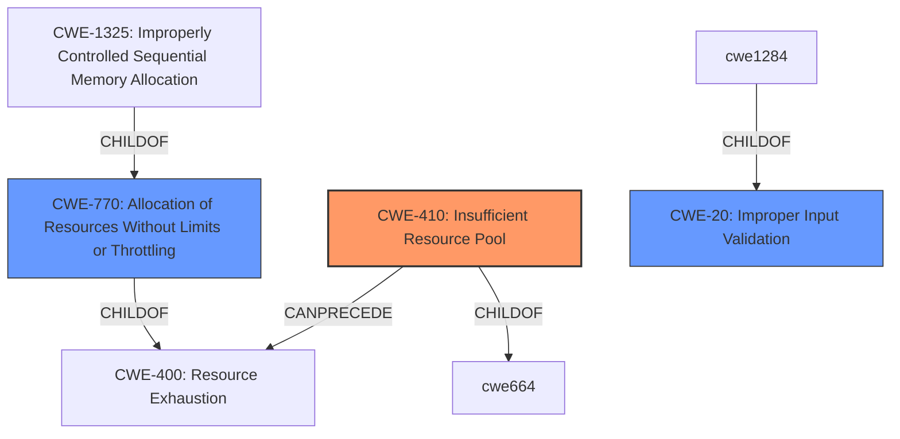

# Analysis Report for CVE-2025-29923

# Vulnerability Analysis Report: CVE-2025-29923

## Description

go-redis is the official Redis client library for the Go programming language. Prior to 9.5.5, 9.6.3, and 9.7.3, go-redis potentially responds out of order when `CLIENT SETINFO` times out during connection establishment. This can happen when the client is configured to transmit its identity, there are network connectivity issues, or the client was configured with aggressive timeouts. The problem occurs for multiple use cases. For sticky connections, you receive persistent out-of-order responses for the lifetime of the connection. All commands in the pipeline receive incorrect responses. When used with the default ConnPool once a connection is returned after use with ConnPool#Put the read buffer will be checked and the connection will be marked as bad due to the unread data. This means that at most one out-of-order response before the connection is discarded. This issue is fixed in 9.5.5, 9.6.3, and 9.7.3. You can prevent the vulnerability by setting the flag DisableIndentity to true when constructing the client instance.

## Vulnerability Description Key Phrases

- **Rootcause:** Network connectivity issues
- **Weakness:** Connection instability
- **Impact:** potentially responds out of order
- **Vector:** CLIENT SETINFO times out
- **Product:** go-redis
- **Version:** prior to 9.5.5, 9.6.3, and 9.7.3

## Analysis (with Relationship Data)

# Summary
| CWE ID | CWE Name | Confidence | CWE Abstraction Level | CWE Vulnerability Mapping Label | CWE-Vulnerability Mapping Notes |
|---|---|---|---|---|---|
| **CWE-410** | **Insufficient Resource Pool** | 0.7 | Base | Primary | Allowed |
| CWE-770 | Allocation of Resources Without Limits or Throttling | 0.5 | Base | Secondary Candidate | Allowed |
| CWE-20 | Improper Input Validation | 0.3 | Class | Secondary Candidate | Allowed |

## Evidence and Confidence

*   **Confidence Score:** 0.7
*   **Evidence Strength:** MEDIUM

## Relationship Analysis
The primary CWE is CWE-410, which relates to insufficient resources. CWE-770, allocation of resources without limits, is a parent of CWE-1325 (Improperly Controlled Sequential Memory Allocation) and is a child of CWE-400 (Resource Exhaustion), suggesting a potential resource exhaustion issue. CWE-20 is a higher level class related to the weaknesses from the CVE Reference Links.



## Vulnerability Chain
The vulnerability chain starts with **network connectivity issues** or aggressive timeouts. This leads to `CLIENT SETINFO` timing out, resulting in out-of-order responses. With the default connection pool, this leads to the connection being discarded. For sticky connections and pipelines, this leads to persistent incorrect responses.

## Summary of Analysis
The primary assessment is based on the vulnerability description and the CVE reference links content summary. The **rootcause** is network connectivity issues and aggressive timeouts, leading to `CLIENT SETINFO` timing out. This leads to out-of-order responses. The CVE reference links content summary confirms this. The vulnerability can be prevented by setting `DisableIndentity` to `true`.

CWE-410 (Insufficient Resource Pool) is chosen as the primary CWE because the issue stems from a timing out issue which prevents the server from allocating resources correctly. The "Insufficient Resource Pool" is a better fit than any of the others.

CWE-770 (Allocation of Resources Without Limits or Throttling) was considered because of the potential for resource exhaustion if the client retries the connection frequently, but it is not the main issue.

CWE-20 (Improper Input Validation) was mentioned in the CVE Reference Links content summary. It is related because the `CLIENT SETINFO` command is timing out, leading to invalid state and out-of-order responses, but it's a less direct cause.

The selected CWEs are at the optimal level of specificity because CWE-410 addresses the timing issue preventing resource allocation. CWE-770 and CWE-20 are contributing factors or higher-level classifications.


## CWE Relationship Analysis

Current CWEs represent these abstraction levels: .


### Vulnerability Chain Analysis

**Chain starting from CWE-400:**
- 400 (Uncontrolled Resource Consumption) - ROOT


**Chain starting from CWE-770:**
- 770 (Allocation of Resources Without Limits or Throttling) - ROOT


### CWE Relationship Diagram

```mermaid
graph TD
    classDef primary fill:#f96,stroke:#333,stroke-width:2px
    classDef secondary fill:#69f,stroke:#333
    classDef tertiary fill:#9e9,stroke:#333
```


*Report generated on 2025-07-14 16:49:20*
